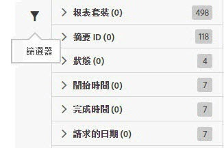

# 篩選工作清單

搜尋和篩選有助於找出清單中的工作。

1. 按一下「篩選」圖示或暫留於圖示上方可檢視篩選選項。

   

   可用的篩選選項有數個:

   * 報表套裝
   * 摘要 ID
   * 狀態
   * 開始時間
   * 完成時間
   * 請求的日期

1. 輸入搜尋詞以搜尋工作清單。

   

您可以結合篩選和搜尋以協助尋找工作。多個篩選和搜尋詞可透過 AND 運算子連結。
