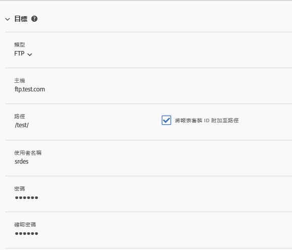
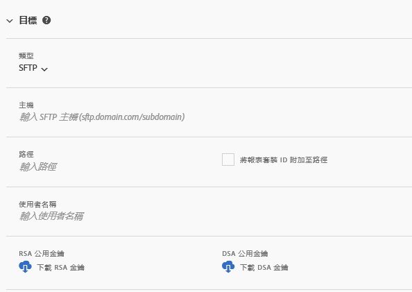
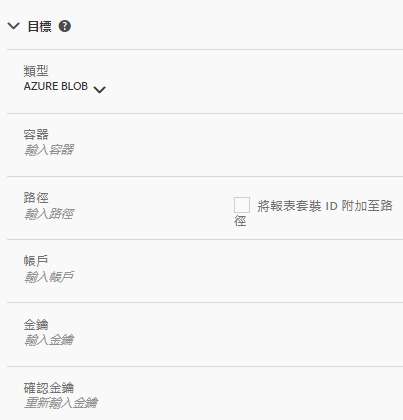

# 建立或編輯資料饋送

建立資料饋送可讓Adobe知道要在何處傳送原始資料檔案，以及您要在每個檔案中加入什麼。 此頁面列出您在建立資料饋送時可自訂的個別設定。

在閱讀本頁面之前，建議您先瞭解資料饋送的基本知識。 請參 [閱資料饋送概觀](data-feed-overview.md) ，以確保您符合建立資料饋送的需求。

## 摘要資訊欄位

* **名稱**:資料饋送的名稱。 在選取的報表套裝中必須是唯一的，且長度最多可達255個字元。
* **** 報表套裝：資料饋送所依據的報表套裝。 如果為相同報表套裝建立多個資料饋送，則它們必須有不同的欄定義。 只有來源報表套裝支援資料饋送；不支援虛擬報表套裝。
* **完成時以電子郵件寄送**:當動態消息處理完成時要通知的電子郵件地址。 電子郵件地址必須正確格式化。
* **饋送間隔**:每小時動態消息包含一小時的資料。 每日動態消息包含一整天的資料。
* **延遲處理**:在處理資料饋送檔案之前，請等待指定的時間。 延遲對於讓行動裝置有機會離線裝置上線並傳送資料非常有用。 它也可用於容納組織在管理先前處理的檔案時的伺服器端程式。 在大多數情況下，不需要延遲。 動態消息最多可延遲120分鐘。
* **開始和結束日期**:開始日期會指出您想要資料饋送的第一個日期。 將此日期設為過去，可立即開始處理歷史資料的資料饋送。 動態消息會繼續處理，直到達到結束日期為止。
* **持續動態消息**:此核取方塊會移除結束日期，允許動態消息無限期執行。 當動態消息完成處理歷史資料時，動態消息會等待資料完成特定小時或天的收集。 當目前的小時或日結束時，處理會在指定的延遲後開始。

## 目標欄位

目標欄位下可用的欄位取決於目標類型。

### FTP

資料饋送資料可以傳送至 Adobe 或客戶託管的 FTP 位置。需要FTP主機、使用者名稱和密碼。 使用路徑欄位將動態消息檔案置入檔案夾。 資料夾必須已存在；如果指定的路徑不存在，饋送會擲回錯誤。

### SFTP

SFTP支援資料饋送。 需要SFTP主機、用戶名和目標站點才能包含有效的RSA或DSA公鑰。 建立動態消息時，您可以下載適當的公開金鑰。

### S3

您可以直接傳送動態消息至Amazon S3儲存貯體。 需要儲存貯體名稱、存取金鑰ID和機密金鑰。 如需詳 [細資訊，請參閱](https://docs.aws.amazon.com/awscloudtrail/latest/userguide/cloudtrail-s3-bucket-naming-requirements.html) Amazon S3檔案中的Amazon S3儲存貯體命名需求。

支援下列11個標準AWS區域（視需要使用適當的簽名演算法）:

* us-east-1
* us-west-1
* us-west-2
* ap-south-1
* ap-northeast-2
* ap-southeast-1
* ap-southeast-2
* ap-northeast-1
* eu-central-1
* eu-west-1
* sa-east-1

> [!NOTE] 不支援cn-north-1地區。

### Azure Blob

資料饋送支援Azure Blob目標。 需要容器、帳戶和金鑰。 Amazon會自動加密閒置的資料。 下載資料時，則會自動解密。如需 [詳細資訊，請參閱](https://docs.microsoft.com/en-us/azure/storage/common/storage-quickstart-create-account?tabs=azure-portal#view-and-copy-storage-access-keys) Microsoft Azure檔案中的建立儲存帳戶。

> [!NOTE] 您必須實作您自己的程式，才能管理饋送目的地的磁碟空間。 Adobe不會從伺服器刪除任何資料。

## 資料欄定義

所有欄（無論其是否有資料）皆可使用。 資料饋送必須至少包含一欄。

* **移除逸出字元**:在收集資料時，有些字元（例如新行）可能會造成問題。 如果您想要從動態消息檔案移除這些字元，請勾選此方塊。
* **壓縮格式**:使用的壓縮類型。 Gzip會輸出格式 `.tar.gz` 的檔案。 Zip輸出格式 `.zip` 的檔案。
* **封裝類型**:單一檔案將檔案輸 `hit_data.tsv` 出為單一、可能大量的檔案。 多個檔案會將您的資料分頁為2GB的區塊（未壓縮）。 如果選取多個檔案，而報告視窗的解壓縮資料少於2GB，則會傳送一個檔案。 Adobe建議針對大部分資料饋送使用多個檔案。
* **欄範本**:建立許多資料饋送時，Adobe建議建立欄範本。 選取欄範本會自動在範本中包含指定的欄。 Adobe也預設提供數個範本。
* **可用欄**:Adobe Analytics中所有可用的資料欄。 按一 [!UICONTROL 下「全部新增] 」，將所有欄加入資料饋送中。
* **包含的欄**:要包含在資料饋送中的欄。 按一 [!UICONTROL 下「全部移除] 」，從資料饋送移除所有欄。
* **下載CSV**:下載包含所有內含欄的CSV檔案。
