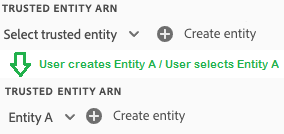
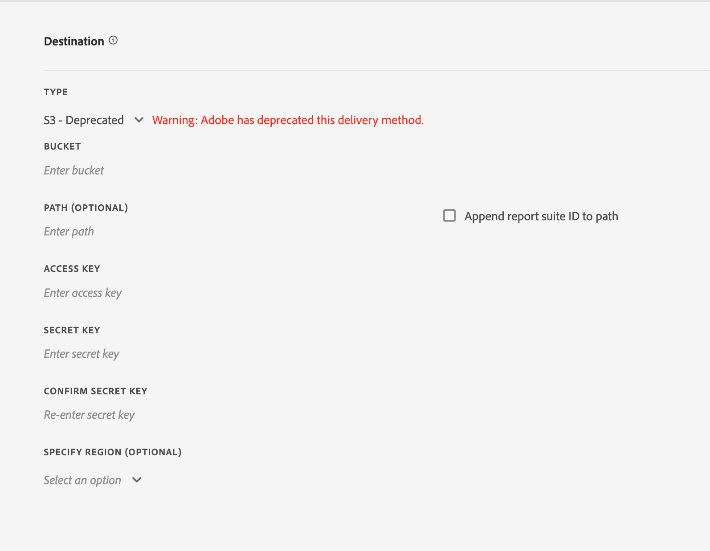
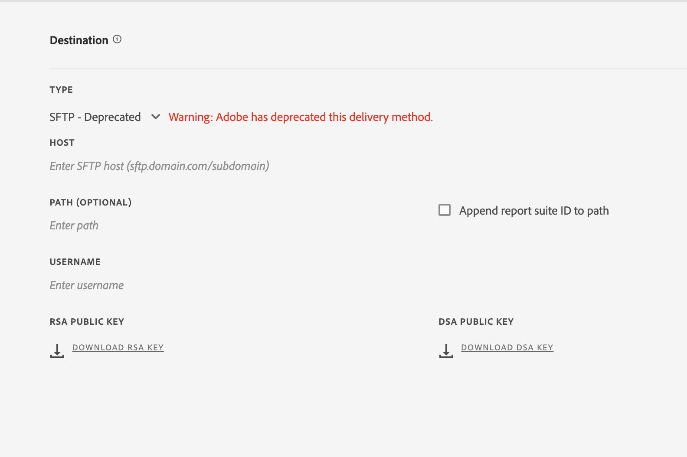

# 建立或編輯資料摘要

建立資料摘要，Adobe 就能知道要將原始資料檔案傳送至何處，以及您想在每個檔案中納入哪些資料。本頁面列出您在建立資料摘要時可自訂的各個設定。

在閱讀本頁之前，建議您先瞭解資料摘要的基本知識。請參閱[資料摘要概觀](data-feed-overview.md)，確認您符合建立資料摘要的需求。

## 摘要資訊欄位

* **名稱**: 資料摘要的名稱。在選取的報表套裝內不可重複，長度上限為 255 個字元。
* **報表套裝**: 資料摘要所在的報表套裝。如果相同報表套裝中建立了多個資料摘要，它們必須各有不同的欄定義。只有來源報表套裝支援資料摘要，虛擬報表套裝並不受支援。
* **完成時收到通知的電子郵件**: 要在摘要處理完畢時收到通知的電子郵件地址。電子郵件地址的格式必須正確。
* **摘要間隔**: 每小時的摘要包含一個小時內的資料量，每日摘要包含一整天的資料；其中包含報表套裝時區的兩個午夜之間的資料。
* **延遲處理**: 在處理資料摘要檔案之前，必須等候一段特定時間。延遲的作用在於，在行動裝置實作中讓離線裝置得以上線並傳送資料。在管理舊的已處理檔案時，它也可用於容納組織的伺服器端處理程序。多數情況下延遲並不會發生。摘要最多可延遲 120 分鐘。
* **開始和結束日期**: 開始日期指的是您想要取得資料摘要的初始日期。將此日期設為過去，系統就會立即開始處理歷史資料的資料摘要。摘要會一直處理到結束日期為止。 開始和結束日期取決於報表套裝的時區。
* **持續摘要**: 這個核取方塊會移除結束日期，使摘要無限期進行處理。當摘要完成處理歷史資料後，就會等待資料完成指定小時或當天的資料收集。一旦當前的小時或當天結束，處理程序就會在指定的延遲後開始。

## 目標欄位

目的地欄位下可用的欄位取決於目的地類型。

### Google雲平台

將GCP儲存桶作為安全目標訪問

**欄位**
* *類型：* Google雲平台的目標類型
* *項目ID:* 儲存桶所在的GCP項目ID
* *儲存桶名稱：* 不帶點的桶名稱限制為3-63個字元。 包含點的名稱最多可包含222個字元，但每個點分隔的元件不能超過63個字元。
* *路徑（可選）:* &amp; *將報表套件ID追加到路徑：* 要檢索或儲存的資源的位置


**服務帳戶建立過程**

用戶需要為已選擇的Google雲平台目標建立服務帳戶。

每個分析組織只允許一個GCP服務帳戶。 為資料源建立服務帳戶後，組織中的所有其他資料源都將預先填充服務帳戶。


### Amazon S3

AmazonS3儲存桶儲存通過受信任實體中的IAM角色訪問。

**欄位**

* *類型：* AmazonS3的目標類型
* *儲存段：* S3儲存段名稱
* *受信任實體ARN:* AWSIAM實體ARN `arn:aws:iam::<12 digit account number>:user/<username>`
* *角色ARN:* AWSIAM角色ARN `arn:aws:iam::<12 digit account number>:role/<role name>`
* *路徑（可選）:* &amp; *將報表套件ID追加到路徑：* 要檢索或儲存的資源的位置
* *指定區域（可選）:* 下拉所有可用AWS區域，包括CN區域


**建立和選擇受信任實體**

用戶可以從下拉清單中列出的任何選項中選擇受信任實體，或者通過按一下 `Create Entity` 按鈕

按一下 `Create Entity` 按鈕，用戶將被重定向到驗證進程。 用戶驗證後，將建立受信任實體並將其添加到下拉清單中的選項。

下拉清單列出了此用戶在組織中建立的所有受信任實體。



您可以通過舊式方法將源直接發送到AmazonS3儲存桶。 如需詳細資訊，請參閱 Amazon S3 文件中的 [Amazon S3 貯體命名規定](https://docs.aws.amazon.com/awscloudtrail/latest/userguide/cloudtrail-s3-bucket-naming-requirements.html)。

**欄位 — 已棄用**

* *類型：* 不建議使用的S3方法的目標類型
* *儲存段：* AmazonS3儲存段名稱
* *路徑（可選）:* &amp; *將報表套件ID追加到路徑：* 要檢索或儲存的資源的位置
* *訪問密鑰：* 訪問AWS用戶的密鑰ID
* *密鑰：* AWS用戶的密鑰
* *確認密鑰：* 重新輸入AWS用戶的密鑰



您提供來上傳資料摘要的使用者必須具備以下[權限](https://docs.aws.amazon.com/AmazonS3/latest/API/API_Operations_Amazon_Simple_Storage_Service.html)：

* s3:GetObject
* s3:PutObject
* s3:PutObjectAcl

對於要上傳到 Amazon S3 貯體的每一項作業，[!DNL Analytics] 都會新增貯體所有者到 BucketOwnerFullControl ACL，無論該貯體是否有需要它的原則。 如需詳細資訊，請參閱「[什麼是 Amazon S3 資料摘要適用的 BucketOwnerFullControl 設定？](df-faq.md#BucketOwnerFullControl)」

**支援的AWS地區**:
* us-east-2
* us-east-1
* us-west-1
* us-west-2
* ap-south-1
* ap-northeast-2
* ap-southeast-1
* ap-southeast-2
* ap-northeast-1
* ca-central-1
* eu-central-1
* eu-west-1
* eu-west-2
* eu-west-3
* eu-north-1
* sa-east-1
* cn-north-1
* cn — 西北–1


### Azure Blob

使用基於角色的訪問控制(RBAC)或共用訪問簽名(SAS)的Azure Blob安全目標。 選擇訪問控制後，將更新面板的內容以反映相應的欄位。

**欄位 — RBAC**
* *類型：* Azure Blob的目標類型
* *訪問控制：* 使用RBAC或SAS的選項
* *Active Directory租戶ID:* Azure帳戶的組織ID
* *應用程式ID:* Active Directory適配器的應用程式ID
* *客戶端密碼：* Azure客戶端密碼
* *儲存帳戶名：* 包含資料對象的帳戶名稱
* *容器名稱：* 屬於給定儲存帳戶的容器。
* *路徑（可選）:* &amp; *將報表套件ID追加到路徑：* 要檢索或儲存的資源的位置


**欄位 — SAS**
* *類型：* Azure Blob的目標類型
* *訪問控制：* 使用RBAC或SAS的選項
* *Active Directory租戶ID:* Azure Active Directory實例的ID
* *應用程式ID:* Active Directory適配器的應用程式ID
* *客戶端密碼：* Azure客戶端密碼
* *密鑰保管庫URI:* Azure密鑰保管庫的位置
* *密鑰保管庫密鑰名稱：* 訪問安全密鑰保管庫的密鑰名稱
* *路徑（可選）:* &amp; *將報表套件ID追加到路徑：* 要檢索或儲存的資源的位置


**欄位 — 已棄用**
* *類型：* Azure Blob的目標類型
* *容器：* Azure容器的名稱
* *路徑（可選）:* &amp; *將報表套件ID追加到路徑：* 要檢索或儲存的資源的位置
* *帳戶：* Azure帳戶密碼
* *密鑰保管庫URI:* Azure密鑰保管庫的位置
* *密鑰保管庫密鑰名稱：* 訪問安全密鑰保管庫的密鑰名稱

您必須實作自己的處理程序，才能管理摘要目的地的磁碟空間。Adobe 不會從伺服器刪除任何資料。如需詳細資訊，請參閱 Microsoft Azure 文件中的[建立儲存帳戶](https://docs.microsoft.com/zh-tw/azure/storage/common/storage-quickstart-create-account?tabs=azure-portal#view-and-copy-storage-access-keys)。


>[!NOTE]
>
>您必須實作自己的處理程序，才能管理摘要目的地的磁碟空間。Adobe 不會從伺服器刪除任何資料。

### FTP — 不建議使用

**欄位**
* *類型：* FTP的目標類型
* *主機：* 訪問主機的終結點
* *路徑（可選）:* &amp; *將報表套件ID追加到路徑：* 要檢索或儲存的資源的位置
* *用戶名：* 主機用戶名
* *密碼：* 主機密碼
* *確認密碼：* 重新輸入並驗證主機的密碼


### SFTP - 已過時

SFTP 可支援資料摘要。必須填入 SFTP 主機、使用者名和目的地站點，才能包含有效的 RSA 或 DSA 公開金鑰。建立摘要時，您可以下載相關的公開金鑰。

**欄位**
* *類型：* SFTP的目標類型
* *主機：* 訪問主機的終結點
* *路徑（可選）:* &amp; *將報表套件ID追加到路徑：* 要檢索或儲存的資源的位置
* *RSA公鑰：* 或 *DSA公鑰：* 訪問主機的公鑰



## 資料欄定義

所有欄 (無論是否有資料) 皆可使用。資料摘要必須至少包含一個欄。

* **移除逸出字元**: 在收集資料時，有些字元 (例如新的行) 可能會造成問題。如果您想要從摘要檔案中移除這些字元，請勾選此方塊。
* **壓縮格式**: 使用的壓縮類型。Gzip 會輸出 `.tar.gz` 格式的檔案。Zip 會輸出 `.zip` 格式的檔案。
* **封裝類型**: 單一檔案會以單一形式輸出 `hit_data.tsv` 檔案，且可能會成為大型檔案。多個檔案會將您的資料分頁為 2GB 的大檔案 (未壓縮)。如果您選取了多個檔案，且報表回溯期的未壓縮資料少於 2GB，系統只會傳送一個檔案。Adobe 建議您在大部分資料摘要中都使用多個檔案。
* **資訊清單**：當在摘要間隔內未收集資料時，Adobe 是否應將[資訊清單檔案](c-df-contents/datafeeds-contents.md#feed-manifest)傳送到目的地。如果選擇「資訊清單檔案」，則在未收集資料時，您將收到類似於以下內容的資訊清單檔案：

```text
   Datafeed-Manifest-Version: 1.0
    Lookup-Files: 0
    Data-Files: 0
    Total-Records: 0
```

* **欄範本**: 建立多個資料摘要時，Adobe 建議您建立欄範本。選取欄範本就會自動在範本中加入指定的欄。Adobe 也提供數個預設範本。
* **可用欄**: Adobe Analytics 中所有可用的資料欄。按一下[!UICONTROL 全部新增]，將所有欄加入資料摘要中。
* **已包括的欄**: 要包括在資料摘要中的欄。按一下[!UICONTROL 全部移除]，從資料摘要中移除所有欄。
* **下載 CSV**: 下載包含所有已包括欄的 CSV 檔案。
