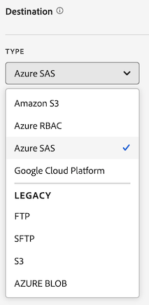

# 建立資料摘要

建立資料摘要時，您需要向 Adobe 提供：

* 關於原始資料檔案傳送目標的相關資訊
* 您要在每個檔案中包含的資料

在建立資料摘要之前，務必先對資料摘要有基本的了解，並確認您已滿足所有先決條件。如需詳細資訊，請參閱[資料摘要概觀](data-feed-overview.md)。

## 建立並設定資料摘要 {#create-and-configure-data-feed}

<!-- markdownlint-disable MD034 -->

>[!CONTEXTUALHELP]
>id="aa_datafeed_os_strings"
>title="取代作業系統字串"
>abstract="此選項會透過偵測內嵌於客戶資料中的下列字串序列，並將其取代為空格，以清理資料輸出： Windows：CRLF、CR 或 TAB Mac 與 Linux：\n、\r 或 \t"

<!-- markdownlint-enable MD034 -->

<!-- markdownlint-disable MD034 -->

>[!CONTEXTUALHELP]
>id="aa_datafeed_export_file"
>title="manifest"
>abstract="選擇是否在每次傳送資料摘要時包含資訊清單檔案。資訊清單檔案包含資料摘要中所包含每個檔案的資訊。 在以單一封裝傳送資料摘要的資料時，您也可以選擇包含完成檔案，但建議包含資訊清單檔案。 "

<!-- markdownlint-enable MD034 -->

<!-- markdownlint-disable MD034 -->

>[!CONTEXTUALHELP]
>id="aa_datafeed_notify"
>title="完成時通知"
>abstract="指定一或多個電子郵件地址，在傳送資料摘要後，應傳送通知。 多個電子郵件地址必須以逗號分隔。"

<!-- markdownlint-enable MD034 -->

<!-- added help for Dynamic lookups to this page: help/export/analytics-data-feed/c-df-contents/dynamic-lookups.md -->

1. 使用您的 Adobe ID 認證登入 [experiencecloud.adobe.com](https://experiencecloud.adobe.com)。

1. 在右上角選取九宮格圖示，然後選取&#x200B;[!UICONTROL **「Analytics」**]。

1. 在頂端導覽列中，前往&#x200B;[!UICONTROL **「管理」**]>[!UICONTROL **「資料摘要」**]。

1. 選取&#x200B;[!UICONTROL **建立資料摘要**]。

   會顯示具有下列類別的頁面： [!UICONTROL **詳細資料**]、[!UICONTROL **資料格式**]、[!UICONTROL **資料結構**]、[!UICONTROL **排程**]&#x200B;以及&#x200B;[!UICONTROL **目的地**]。

   

1. 在&#x200B;[!UICONTROL **詳細資料**]&#x200B;區段中，完成下列欄位：

   | 欄位 | 函數 |
   |---------|----------|
   | [!UICONTROL **名稱**] | 資料摘要的名稱名稱在選取的報表套裝中必須是唯一的，且長度最多可為255個字元。 [了解更多](/help/export/analytics-data-feed/df-faq.md#must-feed-names-be-unique) |
   | [!UICONTROL **標記**] | 將任何標籤套用到資料摘要以方便分類。 您可以依照[中所述的標籤進行篩選，並在](/help/export/analytics-data-feed/df-manage-feeds.md#filter-and-search-the-list-of-data-feeds)管理資料摘要[中搜尋資料摘要](/help/export/analytics-data-feed/df-manage-feeds.md)的清單。 |
   | [!UICONTROL **說明**] | 指定資料摘要的說明。 編輯資料摘要時，會顯示您新增的說明。 |

1. 在&#x200B;[!UICONTROL **資料格式**]&#x200B;區段中，指定下列資訊：

   | 欄位 | 函數 |
   |---------|----------|
   | [!UICONTROL **壓縮格式**] | 使用的壓縮類型。**Gzip** 會輸出 `.tar.gz` 格式的檔案。**Zip** 會輸出 `.zip` 格式的檔案。 |
   | [!UICONTROL **封裝類型**] | 若需最多的資料摘要，請選取&#x200B;[!UICONTROL **「多個檔案」**]。此選項會將您的資料分頁為未壓縮的 2GB 區塊。(如果選取&#x200B;[!UICONTROL **「多個檔案」**]&#x200B;選項，且報告時間範圍的未壓縮資料小於 2GB，則會傳送一個檔案)。選取&#x200B;**「單一檔案」**&#x200B;則會將 `hit_data.tsv` 檔案輸出為單一檔案，可能會非常龐大。 |
   | [!UICONTROL **資訊清單**] | 選擇是否在每次資料摘要傳遞時都包含資訊清單檔案。 
您可以從下列選項中選擇：
<ul><li>**[!UICONTROL 資訊清單檔案]**：包含資料摘要中所含每個檔案的資訊。</li><li>**[!UICONTROL 完成檔案（舊版）]**：表示資料摘要已成功完成。 不包含其他資訊。 此選項適用於原本使用此選項但需要重新處理的現有摘要。 它僅適用於以單一套件傳送資料摘要資料時。 </li><li>**[!UICONTROL 無]**：不包含任何檔案</li></ul> |
   | [!UICONTROL **即使沒有資料也傳送資訊清單**] | 當某個資料摘要時間間隔未收集到資料時，決定 Adobe 是否應將[資訊清單檔案](/help/export/analytics-data-feed/c-df-contents/datafeeds-contents.md#feed-manifest)傳送至目標。如果您選取&#x200B;**資訊清單檔案**，則在未收集資料時，您會收到類似下列的資訊清單檔案：
`text`

`Datafeed-Manifest-Version: 1.0`

`Lookup-Files: 0`

`Data-Files: 0`

 `Total-Records: 0`
 |
   | [!UICONTROL **取代作業系統字串**] | 收集資料時，有些字元（例如新的行）可能會造成問題。 選取此選項可移除摘要檔案中的這些字元。
此選項會偵測以下內嵌於客戶資料中的字串序列，並以空格取代：
 <ul><li>**Windows：** CRLF、CR或TAB</li><li>**Mac和Linux：** \n、\r或\t</li></ul> |
   | [!UICONTROL **啟用動態查詢**] | 動態查閱可讓您在資料摘要中接收其他無法使用的查閱檔案。 此設定可讓以下查閱表格隨每個資料摘要檔案一起傳送：<ul><li> **電信業者名稱**</li><li>**行動屬性**</li><li>**作業系統型別**</li></ul>
如需詳細資訊，請參閱[動態查詢](/help/export/analytics-data-feed/c-df-contents/dynamic-lookups.md)。
 |
   | **允許延遲送達點選** | 歷史資料可能會在資料摘要工作完成特定小時或當天的處理後送達，例如透過時間戳記點選或資料來源。
選取此選項，可在設定的報告頻率內（通常是每日或每小時），包含資料摘要工作完成資料處理之後抵達的資料。 啟用此選項後，每次資料摘要處理資料時，都會檢視任何已送達的延遲點選，並將它們與下一個已傳送的資料摘要檔案批次處理。

如需詳細資訊，請參閱[延遲送達點選](/help/export/analytics-data-feed/c-df-contents/late-arriving-hits.md)。
 |
   | **回顧期間** （適用於延遲送達的點選） | 啟用選項&#x200B;**[!UICONTROL 允許延遲點選]**&#x200B;時，會顯示此選項。 選取回顧期間以限制包括的延遲點選的時間範圍。 若要允許所有延遲送達點選，不論延遲多久，請選取&#x200B;**[!UICONTROL 無限制]**。 您可以選擇預設間隔，例如&#x200B;**[!UICONTROL 1小時]**、**[!UICONTROL 2小時]**、**[!UICONTROL 1週]**、**[!UICONTROL 2週]**&#x200B;等。 或者，選取&#x200B;**[!UICONTROL 自訂回顧期間]**，然後在&#x200B;**[!UICONTROL 自訂回顧]**&#x200B;欄位中指定最多26,280小時的回顧期間。 |

1. 在&#x200B;[!UICONTROL **資料結構**]&#x200B;區段的&#x200B;**[!UICONTROL 報表套裝]**&#x200B;欄位中，選取包含您要匯出之資料的來源報表套裝。 
選取報表套裝時，請考量下列事項：
 <ul><li>如果相同報表套裝中建立了多個資料摘要，則每個資料摘要都必須有不同的欄定義。</li><li>只有來源報表套裝支援資料摘要，虛擬報表套裝並不受支援。</li><li>可用欄的清單取決於所選報表套裝所屬的登入公司。 如果您變更報表套裝，可用欄的清單可能會變更。 </li></ul>

1. 請使用下列其中一種或兩種方法來決定要將哪些資料欄包含在摘要中：

   * **個別新增欄：**&#x200B;在左側的&#x200B;**[!UICONTROL 可用]**&#x200B;區段中，選取您要包含的任何欄，然後選取&#x200B;**[!UICONTROL 包含]**。 Adobe Analytics中的所有資料欄皆可使用。 您可以按住&#x200B;**[!UICONTROL Shift]**&#x200B;或按住&#x200B;**[!UICONTROL Command]** (在macOS上)或&#x200B;**[!UICONTROL Ctrl]** （在Windows上）來選取多個欄。 按一下&#x200B;**[!UICONTROL 「全部新增」]**，將所有欄加入資料摘要中。

     您新增的欄會出現在右側的&#x200B;**[!UICONTROL 已包含]**&#x200B;區段中。

   * **新增欄範本：**&#x200B;在&#x200B;**[!UICONTROL 欄範本]**&#x200B;欄位中，選取要新增的欄範本。 欄範本是預先定義的欄群組，Adobe預設會提供數個欄群組。

     範本中包含的所有資料行都會出現在右側的&#x200B;**[!UICONTROL 包含]**&#x200B;區段中。

1. （選擇性）若要根據您目前建立的資料摘要建立欄範本，請選取&#x200B;**[!UICONTROL 另存為範本]**，指定範本的名稱，然後選取&#x200B;**[!UICONTROL 儲存]**。 如果您打算建立包含相同欄的其他資料摘要，此選項會很有用。

   在建立資料摘要時建立

1. （選擇性）若要下載.csv格式內含欄的清單，請選取&#x200B;**[!UICONTROL 下載欄]**。 此選項適用於有大量欄的資料摘要。

1. 在&#x200B;[!UICONTROL **排程**]&#x200B;區段中，指定下列資訊：

   | 欄位 | 函數 |
   |---------|----------|
   | [!UICONTROL **頻率**] | 選取資料摘要的傳送頻率。 可用選項會根據您的報表套裝設定動態填入。 
下列為常用選項：
<ul><li>**每日**：摘要包含一整天的資料，從報表套裝時區的午夜到午夜。 此選項可用於回填或歷史資料，或用於繼續摘要。</li><li>**小時**：摘要包含一個小時的資料量。 使用此選項繼續摘要。</li></ul>
匯出頻率可以是15分鐘，但預設無法使用。 若要讓此選項在您的環境中可用，您必須先聯絡Adobe客戶服務，要求將您的報表套裝設定為支援15分鐘匯出。
 |
   | [!UICONTROL **處理延遲**] | 選擇是否在處理資料摘要檔案之前等候特定時間。 延遲的作用在於，在行動裝置實作中讓離線裝置得以上線並傳送資料。在管理舊的已處理檔案時，它也可用於容納組織的伺服器端處理程序。多數情況下延遲並不會發生。摘要最多可延遲8小時（480分鐘），或如果選取自訂時間量（延遲9,999分鐘或約1週），延遲時間甚至更長。 |
   | [!UICONTROL **連續資料摘要**] | 選取後，此選項會移除結束日期，使摘要無限期進行處理。 當摘要完成處理歷史資料後，就會等待資料完成指定小時或當天的資料收集。當目前小時或當天結束時，處理會在指定的延遲後開始。 |
   | [!UICONTROL **開始日期**] | 指定資料摘要的開始日期。 若要立即開始處理歷史資料的資料摘要，將此日期設定為過去收集資料的任何日期。開始日期取決於報表套裝的時區。 |
   | [!UICONTROL **結束日期**] | 指定資料摘要的結束日期。 結束日期取決於報表套裝的時區。 |

1. 在&#x200B;[!UICONTROL **目的地**]&#x200B;區段中，設定您要傳送資料的目的地。

   >[!NOTE]
   >
   >設定報告目標時，請考慮以下事項：
   >
   >* Adobe建議您為報表目的地使用雲端帳戶。 可以使用[舊版 FTP 和 SFTP 帳戶](#legacy-destinations)，但不建議使用。
   >* 您先前設定的任何雲端帳戶都可用於資料摘要。 您可以透過以下任一方式設定雲端帳戶：
   >
   >   * 在設定[資料倉儲](/help/export/data-warehouse/create-request/dw-request-report-destinations.md)的雲端帳戶時
   >   
   >   * 在[匯入 Adobe Analytics 分類資料](/help/components/locations/locations-manager.md)時 (不可以使用任何已設定用於匯入分類資料的位置)。
   >   
   >   * 從位置管理器，在[「元件」>「位置」](/help/components/locations/configure-import-accounts.md)中
   >
   >* 雲端帳戶與您的 Adob&#x200B;&#x200B;e Analytics 使用者帳戶有關聯。其他使用者無法使用或檢視您設定的雲端帳戶，除非您提供這些帳戶給組織中的所有使用者。
   >
   >* 您可以在「[元件 > 位置](/help/components/locations/configure-import-accounts.md)」中，編輯從「位置」管理員建立的任何位置

   填入下列欄位：

   | 欄位 | 函數 |
   |---------|----------|
   | [!UICONTROL **帳戶**] | 進行下列一項：<ul><li>**使用現有帳戶：**&#x200B;選取&#x200B;**[!UICONTROL 帳戶]**&#x200B;欄位旁的下拉式功能表。 或者，開始輸入帳戶名稱，然後從下拉式選單中選取。 
只有在您已設定帳戶，或帳戶與您所屬的某個組織共用時，您才可使用帳戶。
</li><li>**建立新帳戶：**&#x200B;在&#x200B;**[!UICONTROL 帳戶]**&#x200B;欄位下選取&#x200B;**[!UICONTROL 新增]**。 如需有關如何設定帳戶的資訊，請參閱[設定雲端匯入和匯出帳戶](/help/components/locations/configure-import-accounts.md#configure-a-location-account)中的[設定位置帳戶](/help/components/locations/configure-import-accounts.md)。</li></ul> |
   | [!UICONTROL **位置**] | 進行下列一項：<ul><li>**使用現有的位置：**&#x200B;選取&#x200B;**[!UICONTROL 位置]**&#x200B;欄位旁的下拉式功能表。 或者，開始輸入位置名稱，然後從下拉式選單中選取它。</li><li>**建立新位置：**&#x200B;在&#x200B;**[!UICONTROL 位置]**&#x200B;欄位下選取&#x200B;**[!UICONTROL 新增]**。 如需有關如何設定位置的資訊，請參閱[設定雲端匯入和匯出位置](/help/components/locations/configure-import-locations.md#configure-a-location)中的[設定位置](/help/components/locations/configure-import-locations.md)。 |
   | [!UICONTROL **完成時通知**] | 指定一或多個電子郵件地址，在資料摘要成功傳送或無法傳送後，應傳送通知。 多個電子郵件地址必須以逗號分隔。 |

1. 選取&#x200B;**[!UICONTROL 「儲存」]**。

## 管理欄範本

範本可讓您對您建立的未來資料摘要重複使用相同的欄。

管理範本時，您可以建立新範本、使用已建立的範本、複製範本、編輯範本及刪除範本。

[!UICONTROL **管理員**] > [!UICONTROL **資料摘要**] > **[!UICONTROL 管理範本]**

### 建立欄範本

在建立多個使用相同欄的資料摘要時，Adobe建議您建立欄範本。 您建立的任何欄範本均可供貴組織中的任何人使用。

若要建立欄範本，請執行下列動作：

1. 在Adobe Analytics中，移至&#x200B;[!UICONTROL **管理員**] > [!UICONTROL **資料摘要**] > **[!UICONTROL 管理範本]**。

1. 選取&#x200B;**[!UICONTROL 建立新範本]**&#x200B;以建立新的資料行範本。

   

1. 在&#x200B;**[!UICONTROL 範本名稱]**&#x200B;欄位中，指定範本的名稱。

1. 在左側的&#x200B;**[!UICONTROL 可用]**&#x200B;區段中，選取您要包含的任何欄，然後選取&#x200B;**[!UICONTROL 包含]**。 Adobe Analytics中的所有可用資料欄皆可使用。 您可以按住&#x200B;**[!UICONTROL Shift]**&#x200B;或按住&#x200B;**[!UICONTROL Command]** (在macOS上)或&#x200B;**[!UICONTROL Ctrl]** （在Windows上）來選取多個欄。 按一下&#x200B;**[!UICONTROL 「全部新增」]**，將所有欄加入資料摘要中。

   您新增的欄會出現在右側的&#x200B;**[!UICONTROL 已包含]**&#x200B;區段中。

1. 選取&#x200B;**[!UICONTROL 「儲存」]**。

### 編輯欄範本

1. 在Adobe Analytics中，移至&#x200B;[!UICONTROL **管理員**] > [!UICONTROL **資料摘要**] > **[!UICONTROL 管理範本]**。

1. 選取您要編輯的範本，然後選取&#x200B;**[!UICONTROL 編輯]**。

1. 進行任何編輯，然後選取&#x200B;**[!UICONTROL 儲存]**。

### 複製欄範本

1. 在Adobe Analytics中，移至&#x200B;[!UICONTROL **管理員**] > [!UICONTROL **資料摘要**] > **[!UICONTROL 管理範本]**。

1. 選取您要複製的範本，然後選取&#x200B;**[!UICONTROL 複製]**。

1. 在&#x200B;**[!UICONTROL 範本名稱]**&#x200B;欄位中，指定範本的名稱。

1. 進行任何其他變更，然後選取&#x200B;**[!UICONTROL 儲存]**。

### 刪除欄範本

1. 在Adobe Analytics中，移至&#x200B;[!UICONTROL **管理員**] > [!UICONTROL **資料摘要**] > **[!UICONTROL 管理範本]**。

1. 選取一或多個要刪除的範本，然後選取&#x200B;**[!UICONTROL 刪除]**。

<!-- why would you want to do this? -->

<!-- I don't think we need anything after this, but saving here just in case:

1. In the [!UICONTROL **Feed Information**] section, complete the following fields:
   
   | Field | Function |
   |---------|----------|
   | [!UICONTROL **Name**] | The name of the data feed. Must be unique within the selected report suite, and can be up to 255 characters in length. [Learn more](/help/export/analytics-data-feed/df-faq.md#must-feed-names-be-unique) |
   | [!UICONTROL **Report suite**] | The report suite that the data feed is based on. If multiple data feeds are created for the same report suite, they must have different column definitions. Only source report suites support data feeds; virtual report suites are not supported. |
   | [!UICONTROL **Email when complete**] | The email address to be notified when a feed finishes processing. The email address must be properly formatted. |
   | [!UICONTROL **Feed interval**] | Select **Daily** for backfill or historical data. Daily feeds contain a full day's worth of data, from midnight to midnight in the report suite's time zone. Select **Hourly** for continuing data (Daily is also available for continuing feeds if you prefer). Hourly feeds contain a single hour's worth of data. |
   | [!UICONTROL **Delay processing**] | Wait a given amount of time before processing a data feed file. A delay can be useful to give mobile implementations an opportunity for offline devices to come online and send data. It can also be used to accommodate your organization's server-side processes in managing previously processed files. In most cases, no delay is needed. A feed can be delayed by up to 120 minutes. |
   | [!UICONTROL **Start & end dates**] | The start date indicates the date when you want the data feed to begin. To immediately begin processing data feeds for historical data, set this date to any date in the past when data is being collected. The start and end dates are based on the report suite's time zone. |
   | [!UICONTROL **Continuous feed**] | This checkbox removes the end date, allowing a feed to run indefinitely. When a feed finishes processing historical data, a feed waits for data to finish collecting for a given hour or day. Once the current hour or day concludes, processing begins after the specified delay. |
   
1. In the [!UICONTROL **Destination**] section, in the [!UICONTROL **Type**] drop-down menu, select the destination where you want the data to be sent. 

   >[!NOTE]
   >
   >Consider the following when configuring a report destination:
   >
   >* We recommend using a cloud account for your report destination. [Legacy FTP and SFTP accounts](#legacy-destinations) are available, but are not recommended.
   >* Any cloud accounts that you previously configured are available to use for Data Feeds. You can configure cloud accounts in any of the following ways:
   >
   >   * When configuring cloud accounts for [Data Warehouse](/help/export/data-warehouse/create-request/dw-request-report-destinations.md) 
   >   
   >   * When [importing Adobe Analytics classification data](/help/components/locations/locations-manager.md) (Any locations that are configured for importing classification data cannot be used.)
   >   
   >   * From the Locations manager, in [Components > Locations](/help/components/locations/configure-import-accounts.md) 
   >
   >* Cloud accounts are associated with your Adobe Analytics user account. Other users cannot use or view cloud accounts that you configure.
   >
   >* You can edit any locations that you create from the Locations manager in [Components > Locations](/help/components/locations/configure-import-accounts.md)

   

   Use any of the following destination types when creating a data feed. For configuration instructions, expand the destination type. (Additional [legacy destinations](#legacy-destinations) are also available, but are not recommended.)

   +++Amazon S3

   You can send feeds directly to Amazon S3 buckets. This destination type requires only your Amazon S3 account and the location (bucket). 

   Adobe Analytics uses cross-account authentication to upload files from Adobe Analytics to the specified location in your Amazon S3 instance.

   When using Amazon S3 with Data Feeds, only SSE-S3 encryption is supported.

   To configure an Amazon S3 bucket as the destination for a data feed:

   1. Begin creating a data feed as described in [Create and configure a data feed](#create-and-configure-a-data-feed).
   
   1. In the [!UICONTROL **Destination**] section, in the [!UICONTROL **Type**] drop-down menu, select [!UICONTROL **Amazon S3**].

      

   1. Select [!UICONTROL **Select location**].

      The Amazon S3 Export Locations page is displayed.

   1. (Conditional) If an Amazon S3 account (and a location on that account) has already been configured in Adobe Analytics, you can use it as your data feed destination: 

      >[!NOTE]
      >
      >Accounts are available to you only if you configured them or if they were shared with an organization you are a part of.
   
      1. Select the account from the [!UICONTROL **Select account**] drop-down menu.

         Any cloud accounts that were configured in any of the following areas of Adobe Analytics are available to use:
      
         * When importing Adobe Analytics classification data, as described in [Schema](/help/components/classifications/sets/manage/schema.md).
      
           However, any locations that are configured for importing classification data cannot be used. Instead, add a new destination as described below.

         * When configuring accounts and locations in the Locations area, as described in [Configure cloud import and export accounts](/help/components/locations/configure-import-accounts.md) and [Configure cloud import and export locations](/help/components/locations/configure-import-locations.md).
   
      1. Select the location from the [!UICONTROL **Select location**] drop-down menu.

      1. Select [!UICONTROL **Save**] > [!UICONTROL **Save**].

      The destination is now configured to send data to the Amazon S3 location that you specified.
   
   1. (Conditional) If you have not previously added an Amazon S3 account:

      1. Select [!UICONTROL **Add account**], then specify the following information:
   
         |Field | Function |
         |---------|----------|
         | [!UICONTROL **Account name**] | A name for the account. This can be any name you choose. |
         | [!UICONTROL **Account description**] | A description for the account. |
         | [!UICONTROL **Role ARN**] | You must provide a Role ARN (Amazon Resource Name) that Adobe can use to gain access to the Amazon S3 account. To do this, you create an IAM permission policy for the source account, attach the policy to a user, and then create a role for the destination account. For specific information, see [this AWS documentation](https://aws.amazon.com/premiumsupport/knowledge-center/cross-account-access-iam/). |
         | [!UICONTROL **User ARN**] | The User ARN (Amazon Resource Name) is provided by Adobe. You must attach this user to the policy you created. |

         {style="table-layout:auto"}

      1. Select [!UICONTROL **Add location**], then specify the following information:
   
         |Field | Function |
         |---------|----------|
         | [!UICONTROL **Name**] | A name for the account.  |
         | [!UICONTROL **Description**] | A description for the account. |
         | [!UICONTROL **Bucket**] | The bucket within your Amazon S3 account where you want Adobe Analytics data to be sent. 
Ensure that the User ARN that was provided by Adobe has the `S3:PutObject` permission in order to upload files to this bucket. This permission allows the User ARN to upload initial files and overwrite files for subsequent uploads.

Bucket names must meet specific naming rules. For example, they must be between 3 to 63 characters long, can consist only of lowercase letters, numbers, dots (.), and hyphens (-), and must begin and end with a letter or number. [A complete list of naming rules are available in the AWS documentation](https://docs.aws.amazon.com/AmazonS3/latest/userguide/bucketnamingrules.html). 
 |
         | [!UICONTROL **Prefix**] | The folder within the bucket where you want to put the data. Specify a folder name, then add a backslash after the name to create the folder. For example, `folder_name/` |

         {style="table-layout:auto"}

      1. Select [!UICONTROL **Create**] > [!UICONTROL **Save**].

         The destination is now configured to send data to the Amazon S3 location that you specified.

      1. (Conditional) If you need to manage the destination (account and location) that you just created, it is available in the [Locations manager](/help/components/locations/locations-manager.md).
   
   +++

   +++Azure RBAC

   You can send feeds directly to an Azure container by using RBAC authentication. This destination type requires an Application ID, Tenant ID, and Secret. 

   To configure an Azure RBAC account as the destination for a data feed:

   1. If you haven't already, create an Azure application that Adobe Analytics can use for authentication, then grant access permissions in access control (IAM). 
   
      For information, refer to the [Microsoft Azure documentation about how to create an Azure Active Directory application](https://learn.microsoft.com/en-us/azure/active-directory/develop/howto-create-service-principal-portal). 
   
   1. In the Adobe Analytics admin console, in the [!UICONTROL **Destination**] section, in the [!UICONTROL **Type**] drop-down menu, select [!UICONTROL **Azure RBAC**].

      

   1. Select [!UICONTROL **Select location**].

      The Azure RBAC Export Locations page is displayed.

   1. (Conditional) If an Azure RBAC account (and a location on that account) has already been configured in Adobe Analytics, you can use it as your data feed destination: 

      >[!NOTE]
      >
      >Accounts are available to you only if you configured them or if they were shared with an organization you are a part of.
   
      1. Select the account from the [!UICONTROL **Select account**] drop-down menu.

      Any cloud accounts that you configured in any of the following areas of Adobe Analytics are available to use:
      
         * When importing Adobe Analytics classification data, as described in [Schema](/help/components/classifications/sets/manage/schema.md).
      
           However, any locations that are configured for importing classification data cannot be used. Instead, add a new destination as described below.

         * When configuring accounts and locations in the Locations area, as described in [Configure cloud import and export accounts](/help/components/locations/configure-import-accounts.md) and [Configure cloud import and export locations](/help/components/locations/configure-import-locations.md).

      1. Select the location from the [!UICONTROL **Select location**] drop-down menu.

      1. Select [!UICONTROL **Save**] > [!UICONTROL **Save**].

         The destination is now configured to send data to the Azure RBAC location that you specified.

   1. (Conditional) If you have not previously added an Azure RBAC account:

      1. Select [!UICONTROL **Add account**], then specify the following information:
   
         |Field | Function |
         |---------|----------|
         | [!UICONTROL **Account name**] | A name for the Azure RBAC account. This name displays in the [!UICONTROL **Select account**] drop-down field and can be any name you choose. |
         | [!UICONTROL **Account description**] | A description for the Azure RBAC account. This description displays in the [!UICONTROL **Select account**] drop-down field and can be any name you choose.  |
         | [!UICONTROL **Application ID**] | Copy this ID from the Azure application that you created. In Microsoft Azure, this information is located on the **Overview** tab within your application. For more information, see the [Microsoft Azure documentation about how to register an application with the Microsoft identity platform](https://learn.microsoft.com/en-us/azure/active-directory/develop/quickstart-register-app). |
         | [!UICONTROL **Tenant ID**] | Copy this ID from the Azure application that you created. In Microsoft Azure, this information is located on the **Overview** tab within your application. For more information, see the [Microsoft Azure documentation about how to register an application with the Microsoft identity platform](https://learn.microsoft.com/en-us/azure/active-directory/develop/quickstart-register-app). |
         | [!UICONTROL **Secret**] | Copy the secret from the Azure application that you created. In Microsoft Azure, this information is located on the **Certificates & secrets** tab within your application. For more information, see the [Microsoft Azure documentation about how to register an application with the Microsoft identity platform](https://learn.microsoft.com/en-us/azure/active-directory/develop/quickstart-register-app). |

         {style="table-layout:auto"}

      1. Select [!UICONTROL **Add location**], then specify the following information: 
   
         |Field | Function |
         |---------|----------|
         | [!UICONTROL **Name**] | A name for the location. This name displays in the [!UICONTROL **Select location**] drop-down field and can be any name you choose. |
         | [!UICONTROL **Description**] | A description for the location. This description displays in the [!UICONTROL **Select location**] drop-down field and can be any name you choose. |
         | [!UICONTROL **Account**] | The Azure storage account. |
         | [!UICONTROL **Container**] | The container within the account you specified where you want Adobe Analytics data to be sent. Ensure that you grant permissions to upload files to the Azure application that you created earlier. |
         | [!UICONTROL **Prefix**] | The folder within the container where you want to put the data. Specify a folder name, then add a backslash after the name to create the folder. For example, `folder_name/`
Make sure the Application ID that you specified when configuring the Azure RBAC account has been granted the `Storage Blob Data Contributor` role in order to access the container (folder).
 
For more information, see [Azure built-in roles](https://learn.microsoft.com/en-us/azure/role-based-access-control/built-in-roles).
 |

         {style="table-layout:auto"}

      1. Select [!UICONTROL **Create**] > [!UICONTROL **Save**].

         The destination is now configured to send data to the Azure RBAC location that you specified.

      1. (Conditional) If you need to manage the destination (account and location) that you just created, it is available in the [Locations manager](/help/components/locations/locations-manager.md).
   
   +++

   +++Azure SAS

   You can send feeds directly to an Azure container by using SAS authentication. This destination type requires an Application ID, Tenant ID, Key vault URI, Key vault secret name, and secret. 

   To configure Azure SAS as the destination for a data feed:

   1. If you haven't already, create an Azure application that Adobe Analytics can use for authentication. 
   
      For information, refer to the [Microsoft Azure documentation about how to create an Azure Active Directory application](https://learn.microsoft.com/en-us/azure/active-directory/develop/howto-create-service-principal-portal). 
   
   1. In the Adobe Analytics admin console, in the [!UICONTROL **Destination**] section, select [!UICONTROL **Azure SAS**].

      

   1. Select [!UICONTROL **Select location**].

      The Azure SAS Export Locations page is displayed.

   1. (Conditional) If an Azure SAS account (and a location on that account) has already been configured in Adobe Analytics, you can use it as your data feed destination: 

      >[!NOTE]
      >
      >Accounts are available to you only if you configured them or if they were shared with an organization you are a part of.
   
      1. Select the account from the [!UICONTROL **Select account**] drop-down menu.

         Any cloud accounts that you configured in any of the following areas of Adobe Analytics are available to use:
      
         * When importing Adobe Analytics classification data, as described in [Schema](/help/components/classifications/sets/manage/schema.md).
      
           However, any locations that are configured for importing classification data cannot be used. Instead, add a new destination as described below.

         * When configuring accounts and locations in the Locations area, as described in [Configure cloud import and export accounts](/help/components/locations/configure-import-accounts.md) and [Configure cloud import and export locations](/help/components/locations/configure-import-locations.md).

      1. Select the location from the [!UICONTROL **Select location**] drop-down menu.

      1. Select [!UICONTROL **Save**] > [!UICONTROL **Save**].

         The destination is now configured to send data to the Azure SAS location that you specified.
   
   1. (Conditional) If you have not previously added an Azure SAS account:

      1. Select [!UICONTROL **Add account**], then specify the following information:
   
         |Field | Function |
         |---------|----------|
         | [!UICONTROL **Account name**] | A name for the Azure SAS account. This name displays in the [!UICONTROL **Select account**] drop-down field and can be any name you choose. |
         | [!UICONTROL **Account description**] | A description for the Azure SAS account. This description displays in the [!UICONTROL **Select account**] drop-down field and can be any name you choose. |
         | [!UICONTROL **Application ID**] | Copy this ID from the Azure application that you created. In Microsoft Azure, this information is located on the **Overview** tab within your application. For more information, see the [Microsoft Azure documentation about how to register an application with the Microsoft identity platform](https://learn.microsoft.com/en-us/azure/active-directory/develop/quickstart-register-app). |
         | [!UICONTROL **Tenant ID**] | Copy this ID from the Azure application that you created. In Microsoft Azure, this information is located on the **Overview** tab within your application. For more information, see the [Microsoft Azure documentation about how to register an application with the Microsoft identity platform](https://learn.microsoft.com/en-us/azure/active-directory/develop/quickstart-register-app). |
         | [!UICONTROL **Key vault URI**] | 
The path to the SAS URI in Azure Key Vault. To configure Azure SAS, you need to store an SAS URI as a secret using Azure Key Vault. For information, see the [Microsoft Azure documentation about how to set and retrieve a secret from Azure Key Vault](https://learn.microsoft.com/en-us/azure/key-vault/secrets/quick-create-portal?source=recommendations).

After the key vault URI is created:<ul><li>Add an access policy on the Key Vault in order to grant permission to the Azure application that you created.
For information, see the [Microsoft Azure documentation about how to assign a Key Vault access policy](https://learn.microsoft.com/en-us/azure/key-vault/general/assign-access-policy?tabs=azure-portal).

Or

If you want to grant an access role directly without creating an access policy, see the [Microsoft Azure documentation about how to assign Azure roles using Azure portal](https://learn.microsoft.com/en-us/azure/role-based-access-control/role-assignments-portal). This adds the role assignment for the application ID to access the key vault URI. 
</li><li>Make sure the Application ID has been granted the `Key Vault Certificate User` built-in role in order to access the key vault URI. 
For more information, see [Azure built-in roles](https://learn.microsoft.com/en-us/azure/role-based-access-control/built-in-roles).
</li></ul> |
         | [!UICONTROL **Key vault secret name**] | The secret name you created when adding the secret to Azure Key Vault. In Microsoft Azure, this information is located in the Key Vault you created, on the **Key Vault** settings pages. For information, see the [Microsoft Azure documentation about how to set and retrieve a secret from Azure Key Vault](https://learn.microsoft.com/en-us/azure/key-vault/secrets/quick-create-portal?source=recommendations). |
         | [!UICONTROL **Secret**] | Copy the secret from the Azure application that you created. In Microsoft Azure, this information is located on the **Certificates & secrets** tab within your application. For more information, see the [Microsoft Azure documentation about how to register an application with the Microsoft identity platform](https://learn.microsoft.com/en-us/azure/active-directory/develop/quickstart-register-app). |

         {style="table-layout:auto"}

      1. Select [!UICONTROL **Add location**], then specify the following information: 
   
         |Field | Function |
         |---------|----------|
         | [!UICONTROL **Name**] | A name for the location. This name displays in the [!UICONTROL **Select location**] drop-down field and can be any name you choose. |
         | [!UICONTROL **Description**] | A description for the location. This description displays in the [!UICONTROL **Select location**] drop-down field and can be any name you choose. |
         | [!UICONTROL **Container**] | The container within the account you specified where you want Adobe Analytics data to be sent. |
         | [!UICONTROL **Prefix**] | The folder within the container where you want to put the data. Specify a folder name, then add a backslash after the name to create the folder. For example, `folder_name/`
Make sure that the SAS URI store that you specified in the Key Vault secret name field when configuring the Azure SAS account has the `Write` permission. This allows the SAS URI to create files in your Azure container. 
If you want the SAS URI to also overwrite files, make sure that the SAS URI store has the `Delete` permission.

For more information, see [Blob storage resources](https://learn.microsoft.com/en-us/azure/storage/blobs/storage-blobs-introduction#blob-storage-resources) in the Azure Blob Storage documentation.
 |

         {style="table-layout:auto"}

      1. Select [!UICONTROL **Create**] > [!UICONTROL **Save**].

         The destination is now configured to send data to the Azure SAS location that you specified.

      1. (Conditional) If you need to manage the destination (account and location) that you just created, it is available in the [Locations manager](/help/components/locations/locations-manager.md).
   
   +++

   +++Google Cloud Platform

   You can send feeds directly to Google Cloud Platform (GCP) buckets. This destination type requires only your GCP account name and the location (bucket) name. 
   
   Adobe Analytics uses cross-account authentication to upload files from Adobe Analytics to the specified location in your GCP instance.

   To configure a GCP bucket as the destination for a data feed:

   1. In the Adobe Analytics admin console, in the [!UICONTROL **Destination**] section, select [!UICONTROL **Google Cloud Platform**].

      

   1. Select [!UICONTROL **Select location**].

      The GCP Export Locations page is displayed.

   1. (Conditional) If a Google Cloud Platform account (and a location on that account) has already been configured in Adobe Analytics, you can use it as your data feed destination: 

      >[!NOTE]
      >
      >Accounts are available to you only if you configured them or if they were shared with an organization you are a part of.
   
      1. Select the account from the [!UICONTROL **Select account**] drop-down menu.

         Any cloud accounts that you configured in any of the following areas of Adobe Analytics are available to use:
      
         * When importing Adobe Analytics classification data, as described in [Schema](/help/components/classifications/sets/manage/schema.md).
      
           However, any locations that are configured for importing classification data cannot be used. Instead, add a new destination as described below.

         * When configuring accounts and locations in the Locations area, as described in [Configure cloud import and export accounts](/help/components/locations/configure-import-accounts.md) and [Configure cloud import and export locations](/help/components/locations/configure-import-locations.md).

      1. Select the location from the [!UICONTROL **Select location**] drop-down menu.

      1. Select [!UICONTROL **Save**] > [!UICONTROL **Save**].

         The destination is now configured to send data to the Google Cloud Platform location that you specified.
   
   1. (Conditional) If you have not previously added a GCP account:

      1. Select [!UICONTROL **Add account**], then specify the following information:
   
         |Field | Function |
         |---------|----------|
         | [!UICONTROL **Account name**] | A name for the account. This can be any name you choose. |
         | [!UICONTROL **Account description**] | A description for the account. |
         | [!UICONTROL **Project ID**] | Your Google Cloud project ID. See the [Google Cloud documentation about getting a project ID](https://cloud.google.com/resource-manager/docs/creating-managing-projects#identifying_projects). |

         {style="table-layout:auto"}

      1. Select [!UICONTROL **Add location**], then specify the following information:
   
         |Field | Function |
         |---------|----------|
         | [!UICONTROL **Principal**] | The Principal is provided by Adobe. You must grant permission to receive feeds to this principal. |
         | [!UICONTROL **Name**] | A name for the account.  |
         | [!UICONTROL **Description**] | A description for the account. |
         | [!UICONTROL **Bucket**] | The bucket within your GCP account where you want Adobe Analytics data to be sent. 
Ensure that you have granted either of the following permissions to the Principal provided by Adobe: (For information about granting permissions, see [Add a principal to a bucket-level policy](https://cloud.google.com/storage/docs/access-control/using-iam-permissions#bucket-add) in the Google Cloud documentation.)<ul><li>`roles/storage.objectCreator`: Use this permission if you  want to limit the Principal to only create files in your GCP account.  **Important:** If you use this permission with scheduled reporting, you must use a unique file name for each new scheduled export. Otherwise, the report generation will fail because the Principal does not have access to overwrite existing files.</li><li>(Recommended) `roles/storage.objectUser`: Use this permission if you want the Principal to have access to view, list, update, and delete files in your GCP account. This permission allows the Principal to overwrite existing files for subsequent uploads, without the need to auto-generate unique file names for each new scheduled export.</li></ul>
If your organization is using [Organization policy constraints](https://cloud.google.com/storage/docs/org-policy-constraints) to allow only the Google Cloud Platform account in your allow list, you need the following Adobe-owned Google Cloud Platform organization ID: <ul><li>`DISPLAY_NAME`: `adobe.com`</li><li>`ID`: `178012854243`</li><li>`DIRECTORY_CUSTOMER_ID`: `C02jo8puj`</li></ul> 
 |
         | [!UICONTROL **Prefix**] | The folder within the bucket where you want to put the data. Specify a folder name, then add a backslash after the name to create the folder. For example, `folder_name/` |

         {style="table-layout:auto"}

      1. Select [!UICONTROL **Create**] > [!UICONTROL **Save**].

         The destination is now configured to send data to the GCP location that you specified.

      1. (Conditional) If you need to manage the destination (account and location) that you just created, it is available in the [Locations manager](/help/components/locations/locations-manager.md).
   
   +++

1. In the  [!UICONTROL **Data Column Definitions**] section, select the latest [!UICONTROL **All Adobe Columns**] template in the drop-down menu, then complete the following fields:
   
   |Field | Function |
   |---------|----------|
   | [!UICONTROL **Remove escaped characters**] | When collecting data, some characters (such as newlines) can cause issues. Check this box if you would like these characters removed from feed files. |
   | [!UICONTROL **Compression format**] | The type of compression used. **Gzip** outputs files in `.tar.gz` format. **Zip** outputs files in `.zip` format. |
   | [!UICONTROL **Packaging type**] | Select [!UICONTROL **Multiple files**] for most data feeds. This option paginates your data into uncompressed 2GB chunks. (If the [!UICONTROL **Multiple files**] option is selected and uncompressed data for the reporting window is less than 2GB, one file is sent.) Selecting **Single file** outputs the `hit_data.tsv` file in a single, potentially massive file. |
   | [!UICONTROL **Manifest**] | Determines whether Adobe should deliver a [manifest file](c-df-contents/datafeeds-contents.md#feed-manifest) to the destination when no data is collected for a feed interval. If you select **Manifest File**, you receive a manifest file similar to the following when no data is collected:
`text`

`Datafeed-Manifest-Version: 1.0`

`Lookup-Files: 0`

`Data-Files: 0`

 `Total-Records: 0`
 |
   | [!UICONTROL **Column templates**] | When creating many data feeds, Adobe recommends creating a column template. Selecting a column template automatically includes the specified columns in the template. Adobe also provides several templates by default. |
   | [!UICONTROL **Available columns**] | All available data columns in Adobe Analytics. Click [!UICONTROL Add all] to include all columns in a data feed. |
   | [!UICONTROL **Included columns**] | The columns to include in a data feed. Click [!UICONTROL Remove all] to remove all columns from a data feed. |
   | [!UICONTROL **Download CSV**] | Downloads a CSV file containing all included columns. |

1. Select [!UICONTROL **Save**] in the top-right.

    Historical data processing begins immediately. When data finishes processing for a day, the file is sent to the destination that you configured.

    For information about how to access the data feed and to get a better understanding of its contents, see [Data feed contents - overview](/help/export/analytics-data-feed/c-df-contents/datafeeds-contents.md).

## Legacy destinations

>[!IMPORTANT]
>
>The destinations described in this section are legacy, and are not recommended. Instead, use one of the following destinations when creating a data feed: Amazon S3, Google Cloud Platform, Azure RBAC, or Azure SAS. See [Create and configure a data feed](#create-and-configure-a-data-feed) for detailed information about each of these recommended destinations. 

The following information provides configuration information for each of the legacy destinations:

### FTP

Data feed data can be delivered to an Adobe or customer-hosted FTP location. Requires an FTP host, username, and password. Use the path field to place feed files in a folder. Folders must already exist; feeds throw an error if the specified path does not exist.

Use the following information when completing the available fields:

* [!UICONTROL **Host**]: Enter the desired FTP destination URL. For example, `ftp://ftp.omniture.com`.
* [!UICONTROL **Path**]: Can be left blank
* [!UICONTROL **Username**]: Enter the username to log in to the FTP site.
* [!UICONTROL **Password and confirm password**]: Enter the password to log in to the FTP site.

### SFTP

SFTP support for data feeds is available. Requires an SFTP host, username, and the destination site to contain a valid RSA or DSA public key. You can download the appropriate public key when creating the feed.

### S3

You can send feeds directly to Amazon S3 buckets. This destination type requires a Bucket name, an Access Key ID, and a Secret Key. See [Amazon S3 bucket naming requirements](https://docs.aws.amazon.com/awscloudtrail/latest/userguide/cloudtrail-s3-bucket-naming-requirements.html) within the Amazon S3 docs for more information.

The user you provide for uploading data feeds must have the following [permissions](https://docs.aws.amazon.com/AmazonS3/latest/API/API_Operations_Amazon_Simple_Storage_Service.html):

* s3:GetObject
* s3:PutObject
* s3:PutObjectAcl

  >[!NOTE]
  >
  >For each upload to an Amazon S3 bucket, [!DNL Analytics] adds the bucket owner to the BucketOwnerFullControl ACL, regardless of whether the bucket has a policy that requires it. For more information, see "[What is the BucketOwnerFullControl setting for Amazon S3 data feeds?](df-faq.md#BucketOwnerFullControl)"

The following 16 standard AWS regions are supported (using the appropriate signature algorithm where necessary):

* us-east-2
* us-east-1
* us-west-1
* us-west-2
* ap-south-1
* ap-northeast-2
* ap-southeast-1
* ap-southeast-2
* ap-northeast-1
* ca-central-1
* eu-central-1
* eu-west-1
* eu-west-2
* eu-west-3
* eu-north-1
* sa-east-1

>[!NOTE]
>
>The cn-north-1 region is not supported.

### Azure Blob

Data feeds support Azure Blob destinations. Requires a container, account, and a key. Amazon automatically encrypts the data at rest. When you download the data, it gets decrypted automatically. See [Create a storage account](https://docs.microsoft.com/en-us/azure/storage/common/storage-quickstart-create-account?tabs=azure-portal#view-and-copy-storage-access-keys) within the Microsoft Azure docs for more information.

>[!NOTE]
>
>You must implement your own process to manage disk space on the feed destination. Adobe does not delete any data from the server.

-->
