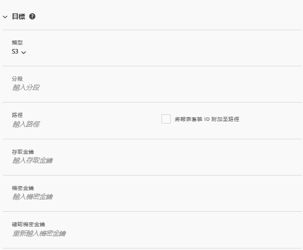

# 建立或編輯資料摘要

建立資料摘要，Adobe 就能知道要將原始資料檔案傳送至何處，以及您想在每個檔案中納入哪些資料。本頁面列出您在建立資料摘要時可自訂的各個設定。

在閱讀本頁之前，建議您先瞭解資料摘要的基本知識。請參閱[資料摘要概觀](data-feed-overview.md)，確認您符合建立資料摘要的需求。

## 摘要資訊欄位

* **名稱**: 資料摘要的名稱。在選取的報告套裝內不可重複，長度上限為 255 個字元。
* **報告套裝**: 資料摘要所在的報告套裝。如果相同報告套裝中建立了多個資料摘要，它們必須各有不同的欄定義。只有來源報告套裝支援資料摘要，虛擬報告套裝並不受支援。
* **完成時收到通知的電子郵件**: 要在摘要處理完畢時收到通知的電子郵件地址。電子郵件地址的格式必須正確。
* **摘要間隔**: 每小時的摘要包含一個小時內的資料量，每日摘要包含一整天的資料；其中包含報告套裝時區的兩個午夜之間的資料。
* **延遲處理**: 在處理資料摘要檔案之前，必須等候一段特定時間。延遲的作用在於，在行動裝置實作中讓離線裝置得以上線並傳送資料。在管理舊的已處理檔案時，它也可用於容納組織的伺服器端處理程序。多數情況下延遲並不會發生。摘要最多可延遲 120 分鐘。
* **開始和結束日期**: 開始日期指的是您想要取得資料摘要的初始日期。將此日期設為過去，系統就會立即開始處理歷史資料的資料摘要。摘要會一直處理到結束日期為止。 開始和結束日期取決於報告套裝的時區。
* **持續摘要**: 這個核取方塊會移除結束日期，使摘要無限期進行處理。當摘要完成處理歷史資料後，就會等待資料完成指定小時或當天的資料收集。一旦當前的小時或當天結束，處理程序就會在指定的延遲後開始。

## 目的地欄位

目的地欄位下可用的欄位取決於目的地類型。

### FTP

資料摘要資料可以傳送至 Adobe 或客戶託管的 FTP 位置。FTP 主機、使用者名稱和密碼為必填。請使用路徑欄位將摘要檔案置入檔案夾。資料夾必須已存在；如果指定的路徑不存在，摘要會傳回錯誤。


### SFTP

SFTP 可支援資料摘要。必須填入 SFTP 主機、使用者名和目的地站點，才能包含有效的 RSA 或 DSA 公開金鑰。建立摘要時，您可以下載相關的公開金鑰。


### S3

您可以直接傳送摘要至 Amazon S3 貯體。此目的地類型需有貯體名稱、存取金鑰ID和機密金鑰。 如需詳細資訊，請參閱 Amazon S3 文件中的 [Amazon S3 貯體命名規定](https://docs.aws.amazon.com/awscloudtrail/latest/userguide/cloudtrail-s3-bucket-naming-requirements.html)。



您為上傳資料摘要提供的使用者必須具備下列[權限](https://docs.aws.amazon.com/AmazonS3/latest/API/API_Operations_Amazon_Simple_Storage_Service.html):

* s3:GetObject
* s3:PutObject
* s3:PutObjectAcl

   >[!NOTE]
   >
   >對於每個上傳至Amazon S3儲存貯體， [!DNL Analytics]會將儲存貯體擁有者新增至BucketOwnerFullControl ACL，無論該儲存貯體是否有需要的原則。 如需詳細資訊，請參閱「[Amazon S3資料饋送的BucketOwnerFullControl設定是什麼？](df-faq.md#BucketOwnerFullControl)」

下列 16 個標準 AWS 區域有受到支援 (必要時會使用適當的簽章演算法)：

* us-east-2
* us-east-1
* us-west-1
* us-west-2
* ap-south-1
* ap-northeast-2
* ap-southeast-1
* ap-southeast-2
* ap-northeast-1
* ca-central-1
* eu-central-1
* eu-west-1
* eu-west-2
* eu-west-3
* eu-north-1
* sa-east-1

>[!NOTE]
>
>不支援 cn-north-1 區域。

### Azure Blob

資料摘要支援 Azure Blob 目的地。容器、帳戶和金鑰為必填。Amazon 會自動加密閒置的資料。下載資料時，則會自動解密。如需詳細資訊，請參閱 Microsoft Azure 文件中的[建立儲存帳戶](https://docs.microsoft.com/zh-tw/azure/storage/common/storage-quickstart-create-account?tabs=azure-portal#view-and-copy-storage-access-keys)。


>[!NOTE]
>
>您必須實作自己的處理程序，才能管理摘要目的地的磁碟空間。Adobe 不會從伺服器刪除任何資料。

## 資料欄定義

所有欄 (無論是否有資料) 皆可使用。資料摘要必須至少包含一個欄。

* **移除逸出字元**: 在收集資料時，有些字元 (例如新的行) 可能會造成問題。如果您想要從摘要檔案中移除這些字元，請勾選此方塊。
* **壓縮格式**: 使用的壓縮類型。Gzip 會輸出 `.tar.gz` 格式的檔案。Zip 會輸出 `.zip` 格式的檔案。
* **封裝類型**: 單一檔案會以單一形式輸出 `hit_data.tsv` 檔案，且可能會成為大型檔案。多個檔案會將您的資料分頁為 2GB 的大檔案 (未壓縮)。如果您選取了多個檔案，且報表回溯期的未壓縮資料少於 2GB，系統只會傳送一個檔案。Adobe 建議您在大部分資料摘要中都使用多個檔案。
* **資訊清單**：當在摘要間隔內未收集資料時，Adobe 是否應將[資訊清單檔案](c-df-contents/datafeeds-contents.md#feed-manifest)傳送到目的地。如果選擇「資訊清單檔案」，則在未收集資料時，您將收到類似於以下內容的資訊清單檔案：

```text
   Datafeed-Manifest-Version: 1.0
    Lookup-Files: 0
    Data-Files: 0
    Total-Records: 0
```

* **欄範本**: 建立多個資料摘要時，Adobe 建議您建立欄範本。選取欄範本就會自動在範本中加入指定的欄。Adobe 也提供數個預設範本。
* **可用欄**: Adobe Analytics 中所有可用的資料欄。按一下[!UICONTROL 全部新增]，將所有欄加入資料摘要中。
* **已包括的欄**: 要包括在資料摘要中的欄。按一下[!UICONTROL 全部移除]，從資料摘要中移除所有欄。
* **下載 CSV**: 下載包含所有已包括欄的 CSV 檔案。
