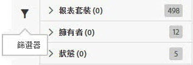

# 管理資料摘要

資料摘要管理員可讓您建立、編輯和刪除組織的資料摘要。如果您有存取資料摘要管理員的權限，就能管理所有可見報表套裝的資料摘要。

請依照下列步驟存取資料摘要管理功能:

1. 登入 [experiencecloud.adobe.com](https://experiencecloud.adobe.com)。
2. 按一下右上方的 9 格線圖示，然後按一下 [!UICONTROL Analytics]。
3. 在上方功能表中按一下[!UICONTROL 管理員] &gt; [!UICONTROL 資料摘要]。

## 使用介面

資料摘要管理員頁面的介面外觀如下:

如果尚未設定摘要，頁面會顯示[!UICONTROL 「建立新的資料摘要」]按鈕。

### 篩選與搜尋

請使用篩選和搜尋找出您要尋找的確切摘要。

在最左側，按一下篩選器圖示來顯示或隱藏篩選選項。篩選器分成不同類別。按一下 &gt; 形箭號即可收折或展開篩選類別。按一下核取方塊即可套用該篩選器。

透過搜尋來依名稱尋找摘要。

### 摘要和作業

按一下作業標籤，即可查看您的每個摘要所建立的個別作業。請參閱[管理資料摘要作業](df-manage-jobs.md)。

### 新增

在動態消息和作業標籤附近按一下 + [!UICONTROL 新增]按鈕以建立新的摘要。如需詳細資訊，請參閱[新增摘要](create-feed.md)。

### 「欄」

每個已建立的摘要會顯示數個提供相關資訊的欄。按一下欄標題，即可以遞增順序排序。再按一下欄標題，就會以遞減順序排序。如果您看不到特定欄，請按一下右上方的欄圖示。

* **摘要名稱**: 必填欄。顯示摘要名稱。
* **摘要 ID**: 顯示摘要 ID，此為唯一識別碼。
* **報表套裝**: 摘要參考資料所在的報表套裝。
* **報表套裝 ID**: 報表套裝的唯一識別碼。
* **資料欄**: 可使用於摘要中的有效資料欄。多數情況下，這種格式會顯示過多資料欄。
* **間隔**: 指出摘要是每小時還是每日傳送。
* **目的地類型**: 摘要的目的地類型。例如 FTP、Amazon S3 或 Azure。
* **目的地主機**: 檔案的放置位置。例如, `ftp.example.com`.
* **擁有者**: 建立摘要的使用者帳戶。
* **狀態**: 摘要的狀態。
   * 作用中: 摘要運作中。
   * 待核准: 在某些情況下，摘要必須先經過 Adobe 的核准，才能開始產生作業。
   * 已刪除: 摘要已刪除。
   * 完成: 摘要已完成處理。您可以編輯、中止或取消完成的摘要。
   * 擱置中: 摘要已建立，但尚未啟用。摘要只會在此狀態中維持短暫的過渡時間。
   * 非作用中: 意同於「暫停」或「中止」狀態。摘要一經重新啟動，便會從停止之處繼續傳送作業。
* **上次修改日期**: 上次修改摘要的日期。日期和時間會以報表套裝的時區顯示，並計入 GMT 時差。
* **開始日期**: 摘要產生第一個作業的日期。日期和時間會以報表套裝的時區顯示，並計入 GMT 時差。
* **結束日期**: 摘要產生最後一個作業的日期。持續的資料摘要沒有結束日期。

## 資料摘要動作

按一下資料摘要旁的核取方塊，就會顯示可用的動作。

* **作業記錄**: 檢視與此資料摘要相關聯的所有作業。您會自動前往[管理作業介面](df-manage-jobs.md)。
* **刪除**: 刪除資料摘要，並將其狀態設為[!UICONTROL 已刪除]。
* **複製**: 以現有摘要的所有設定來[建立新的摘要](create-feed.md)。您無法選取多筆資料摘要並複製為同一筆。
* **暫停**: 停止摘要的處理，並將其狀態設為[!UICONTROL 非作用中]。
* **啟用**: 僅適用於非作用中的摘要。從上次中斷的地方繼續處理資料，如有需要則會回填任何日期。
