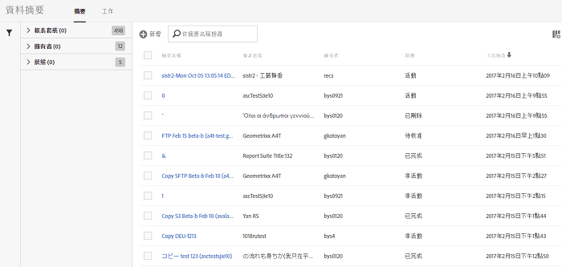
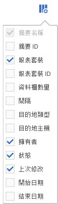

# 管理資料摘要

資料摘要管理員可讓您建立、編輯和刪除組織的資料摘要。如果您有存取資料摘要管理員的權限，就能管理所有可見報表套裝的資料摘要。

>[!BEGINSHADEBOX]

如需示範影片，請參閱 [資料摘要管理](https://video.tv.adobe.com/v/3428570?quality=12&learn=on&captions=chi_hant){target="_blank"}。

>[!ENDSHADEBOX]

## 檢視資料摘要

1. 使用您的 Adobe ID 認證登入 [experiencecloud.adobe.com](https://experiencecloud.adobe.com)。
1. 選取右上角的9個方塊圖示，然後選取&#x200B;[!UICONTROL **Analytics**]。
1. 在頂端導覽列中，移至&#x200B;[!UICONTROL **管理員**] > [!UICONTROL **資料摘要**]。

   系統會顯示您有權存取之所有報表套裝的資料摘要。 或者，如果尚未設定摘要，頁面會顯示[!UICONTROL 建立新資料摘要]按鈕。

   

## 建立資料摘要

「[!UICONTROL 新增]」按鈕可讓您建立新的摘要。 如需詳細資訊，請參閱[建立資料摘要](create-feed.md)。

## 編輯資料摘要

1. 在Adobe Analytics中，選取&#x200B;[!UICONTROL **管理員**] > [!UICONTROL **資料摘要**]。

1. 找到您要編輯的資料摘要。 若要尋找資料摘要，您可以[篩選及搜尋資料摘要清單](#filter-and-search-the-list-of-data-feeds)。

1. 在&#x200B;[!UICONTROL **摘要名稱**]&#x200B;欄中選取資料摘要。

1. 對資料摘要進行任何需要的變更。

   針對您正在編輯的資料摘要更新&#x200B;[!UICONTROL **目的地**]&#x200B;區段時，您可以在&#x200B;[!UICONTROL **帳戶**]&#x200B;和&#x200B;[!UICONTROL **位置**]&#x200B;下拉式欄位中選擇要用於新資料摘要的其他帳戶和位置。

   可以編輯帳戶和位置，如[設定雲端匯入和匯出帳戶](/help/components/locations/configure-import-accounts.md)和[設定雲端匯入和匯出位置](/help/components/locations/configure-import-locations.md)中所述。 編輯帳戶或地點會影響與該帳戶或地點相關聯的所有專案。

   舊版的資料摘要管理員可讓您建立FTP、SFTP、S3和Azure blob目的地。 無法編輯或複製在這些舊版資料摘要管理員中建立的目的地。

1. 選取「[!UICONTROL **儲存**]」。

## 篩選及搜尋資料摘要清單

1. 在Adobe Analytics中，選取&#x200B;[!UICONTROL **管理員**] > [!UICONTROL **資料摘要**]。

1. 使用搜尋或篩選來找出特定摘要。

   * 在搜尋欄位中，開始輸入摘要的名稱。 只有符合的摘要會顯示在可用摘要清單中。

   * 在最左側，按一下篩選器圖示來顯示或隱藏篩選選項。篩選器分成不同類別。您可以收合或展開篩選類別。 選取您要套用之任何篩選器旁的核取方塊。

## 檢視資料摘要工作

1. 在Adobe Analytics中，選取&#x200B;[!UICONTROL **管理員**] > [!UICONTROL **資料摘要**]。

1. 選取「[!UICONTROL **工作**]」標籤，檢視您的每個摘要所建立的個別工作。

   或

   若要檢視特定資料摘要的工作，請選取一或多個資料摘要旁的核取方塊，然後選取&#x200B;[!UICONTROL **工作歷史記錄**]。

   如需詳細資訊，請參閱[管理資料摘要工作](df-manage-jobs.md)。

## 複製資料摘要

1. 在Adobe Analytics中，選取&#x200B;[!UICONTROL **管理員**] > [!UICONTROL **資料摘要**]。

1. 選取您要複製之資料摘要旁的核取方塊，然後選取&#x200B;[!UICONTROL **複製**]。

   這會將您[使用目前摘要的所有設定來建立新的摘要](create-feed.md)。 如果選取了多個資料摘要，則此選項不會顯示。

   針對您正在複製的資料摘要更新&#x200B;[!UICONTROL **目的地**]&#x200B;區段時，您可以在&#x200B;[!UICONTROL **帳戶**]&#x200B;和&#x200B;[!UICONTROL **位置**]&#x200B;下拉式欄位中選擇要用於新資料摘要的其他帳戶和位置。

   可以編輯帳戶和位置，如[設定雲端匯入和匯出帳戶](/help/components/locations/configure-import-accounts.md)和[設定雲端匯入和匯出位置](/help/components/locations/configure-import-locations.md)中所述。 編輯帳戶或地點會影響與該帳戶或地點相關聯的所有專案。

   舊版的資料摘要管理員可讓您建立FTP、SFTP、S3和Azure blob目的地。 無法編輯或複製在這些舊版資料摘要管理員中建立的目的地。

## 暫停資料摘要

當您暫停資料摘要時，它會停止處理摘要，並將其狀態設定為[!UICONTROL 非使用中]。

當您在暫停摘要後重新啟用摘要時，系統會為回填摘要處理摘要暫停期間的資料，但不會為即時摘要處理資料。 如需詳細資訊，請參閱[啟用資料摘要](#activate-a-data-feed)。

若要暫停資料摘要：

1. 在Adobe Analytics中，選取&#x200B;[!UICONTROL **管理員**] > [!UICONTROL **資料摘要**]。

1. 選取您要暫停的資料摘要旁的核取方塊，然後選取&#x200B;[!UICONTROL **暫停**]。

## 啟用資料摘要

您可以啟動非作用中的摘要。

當摘要重新啟用時，系統可能不會在摘要停用期間自動處理資料。 是否會處理資料取決於其為回填摘要或即時摘要：

* **回填摘要** （只會處理歷史資料的摘要）會從停止的地方繼續處理資料，如有必要，可回填任何日期。

* **即時摘要**&#x200B;從啟用時起繼續處理資料。 這表示在摘要暫停至啟動期間，不會處理資料。 如果您需要此期間的資料，則必須設定回填。

若要啟用資料摘要：

1. 在Adobe Analytics中，選取&#x200B;[!UICONTROL **管理員**] > [!UICONTROL **資料摘要**]。

1. 選取您要啟動的非使用中資料摘要旁的核取方塊，然後選取&#x200B;[!UICONTROL **啟動**]。

## 刪除資料摘要

當您刪除資料摘要時，其狀態會設為[!UICONTROL 已刪除]。 資料摘要必須先處於「作用中」狀態，才能被刪除。

若要刪除資料摘要：

1. 在Adobe Analytics中，選取&#x200B;[!UICONTROL **管理員**] > [!UICONTROL **資料摘要**]。

1. 選取您要刪除之資料摘要旁的核取方塊，然後選取&#x200B;[!UICONTROL **刪除**]。

## 在資料摘要管理員中設定欄

每個已建立的摘要會顯示數個提供相關資訊的欄。選取欄標題，以遞增順序排序。 再次選取欄標題可依遞減順序排序。 如果看不到特定欄，請按一下右上方的欄圖示。

可使用下列欄：

* **摘要名稱**：必要的資料行。 顯示摘要名稱。
* **摘要 ID**: 顯示摘要 ID，此為唯一識別碼。
* **報表套裝**：摘要參考資料所在的報表套裝。
* **報表套裝識別碼**：報表套裝的唯一識別碼。
* **資料欄**: 可使用於摘要中的有效資料欄。多數情況下，這種格式會顯示過多資料欄。
* **間隔**: 指出摘要是每小時還是每日傳送。
* **目的地類型**: 摘要的目的地類型。例如，Amazon S3、GCP或Azure。
* **目的地主機**：檔案的放置位置。
* **擁有者**: 建立摘要的使用者帳戶。
* **狀態**: 摘要的狀態。
   * 作用中: 摘要運作中。
   * 待核准: 在某些情況下，摘要必須先經過 Adobe 的核准，才能開始產生作業。
   * 已刪除: 摘要已刪除。
   * 完成: 摘要已完成處理。您可以編輯、保留或取消已完成的摘要。
   * 擱置中: 摘要已建立，但尚未啟用。摘要只會在此狀態中維持短暫的過渡時間。
   * 非作用中: 意同於「暫停」或「中止」狀態。如需當非作用中摘要重新啟動時，回填摘要和即時摘要會發生什麼動作的詳細資訊，請參閱[啟動資料摘要](#activate-a-data-feed)。
* **上次修改日期**: 上次修改摘要的日期。日期和時間會以報表套裝的時區顯示，並計入GMT時差。
* **開始日期**: 摘要產生第一個作業的日期。日期和時間會以報表套裝的時區顯示，並計入GMT時差。
* **結束日期**: 摘要產生最後一個作業的日期。持續的資料摘要沒有結束日期。

