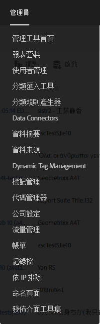
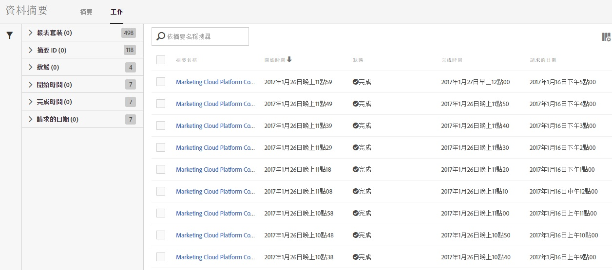
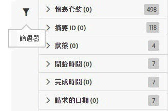
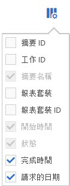

# 管理資料摘要作業

作業是指會輸出壓縮檔案的個別工作。它們係經由摘要所建立與管理。

請依照下列步驟存取資料摘要作業管理功能:

1. 登入 [experiencecloud.adobe.com](https://experiencecloud.adobe.com)。
2. 按一下右上方的 9 格線圖示，然後按一下 [!UICONTROL Analytics]。
3. 在上方功能表中按一下[!UICONTROL 管理員] > [!UICONTROL 資料摘要]。
4. 按一下頂端附近的作業標籤。

## 使用介面

資料摘要作業是 Adobe 針對指定報表回溯期所處理並輸出的單一例項。作業管理員負責提供細修過的資料檢視，以便查看個別作業的狀態。

### 篩選與搜尋

請使用篩選和搜尋找出您要尋找的確切作業。

在最左側，按一下篩選器圖示來顯示或隱藏篩選選項。篩選器分成不同類別。按一下 > 形箭號即可收折或展開篩選類別。按一下核取方塊即可套用該篩選器。

透過搜尋來依名稱尋找作業。

### 摘要和作業

按一下摘要標籤即可檢視建立這些作業的整體摘要。請參閱[管理資料摘要](df-manage-feeds.md)。

### 「欄」

每項作業都會顯示數個提供相關資訊的欄。按一下欄標題，即可以遞增順序排序。再按一下欄標題，就會以遞減順序排序。如果您看不到特定欄，請按一下右上方的欄圖示。

* **摘要 ID**: 顯示摘要 ID，此為唯一識別碼。由相同摘要建立的作業具有相同的摘要 ID。
* **作業 ID**: 作業的唯一識別碼。所有作業都有不同的作業 ID。
* **摘要名稱**: 必填欄。顯示摘要名稱。由相同摘要建立的作業具有相同的摘要名稱。
* **報表套裝**: 作業參考資料所在的報表套裝。
* **報表套裝 ID**: 報表套裝的唯一識別碼。
* **開始時間**: 作業開始的時間。日期和時間會以報表套裝的時區顯示，並計入 GMT 時差。每日摘要通常大約在報表套裝時區的午夜開始。
* **狀態**: 摘要的狀態。
   * 等待資料中: 作業正在運作，且正在收集報表回溯期的資料。
   * 處理中: 作業正在建立資料檔案及準備進行傳送。
   * 已完成: 作業完成，且無產生問題。
   * 失敗: 作業未完成。請參閱[資料摘要的疑難排解](troubleshooting.md)，以判斷失敗的原因。
   * 等待匯出中: 報表回溯期的資料尚未完全處理。
   * 無資料: 報表套裝中沒有所求報表回溯期的資料。
* **完成時間**: 作業完成的時間。日期和時間會以報表套裝的時區顯示，並計入 GMT 時差。
* **要求的日期**: 檔案的報表回溯期。每日摘要通常會顯示 00:00 到 23:59 的時間，且計入 GMT 時差，以此表示報表套裝時區為準的一整天。每小時摘要則會顯示該作業完成的當下時數。
