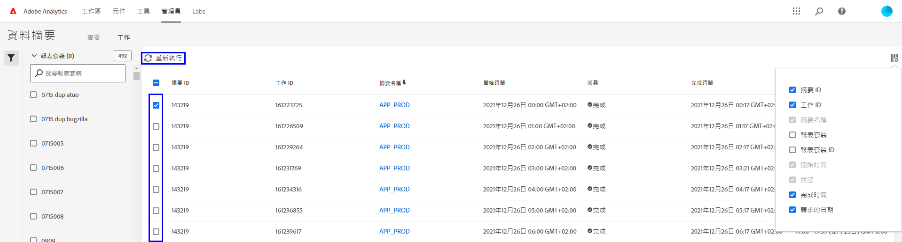

# 資料摘要的疑難排解

判斷某項工作可能無法處理或交付的可能原因。

## 針對現有的資料摘要進行疑難排解

如果您的資料摘要原本會在每小時或每天順利運作，但最近卻失敗了，請查看以下項目：

* 使用 [Adobe 狀態工具](https://status.adobe.com/en/experience_cloud)來判斷是否有任何排程的維護時段或可用性問題。 如果當時有已知問題，Adobe 會在服務恢復後自動處理已排程的資料摘要。
* 請確定 FTP 網站上有足夠的可用空間。 如果 FTP 網站的磁碟空間用完了，請從伺服器中刪除一些檔案，為新檔案騰出空間。
* 如果沒有已知問題，FTP 網站也有足夠的磁碟空間，您就可以重新傳送資料摘要。

   1. 登入 Adobe Analytics 並瀏覽至「**[!UICONTROL 管理員]** > **[!UICONTROL 資料摘要]**」。
   2. 找出所需的資料摘要，然後按一下您想要重新執行的每個資料摘要旁邊的核取方塊。
   3. 按一下「**[!UICONTROL 重新執行]**」。

  

如果您在重新執行資料摘要後還是沒有收到資料摘要檔案，請聯絡客戶服務。

## 新資料摘要的疑難排解

如果新的資料摘要傳回錯誤，請手動將測試檔案上傳到 FTP 網站來進行疑難排解。 在大多數情況下，您可以使用這些步驟來確定故障點。

1. 使用檔案總管 (Windows) 或 Finder (Mac) 登入您的 FTP 站台。請務必使用 FTP 通訊協定 (`ftp://`) 並允許 [Adobe 的 IP 位址](/help/technotes/ip-addresses.md)通過貴組織的防火牆。 如果您無法連線 FTP 網站，請洽詢 FTP 網站負責人來確定正確的目的地。

   

2. 此時會出現快顯視窗，詢問使用者名稱和密碼。請輸入您的驗證憑證。如果接受憑證，視窗會顯示 FTP 站台上的目前內容。如果認證不被接受，請洽詢 FTP 負責人，以確定使用者名稱和密碼正確無誤。 如果使用 SFTP，請務必遵循 [SFTP 指南](../ftp-and-sftp/c-sftp/ftp-sftp.md)中的每個步驟。 請注意，Adobe 不是所有 SFTP 使用案例都有支援。
3. 將檔案拖曳至已驗證的視窗，即可將檔案上傳至 FTP 站台。任何影像或文字檔案均可。如果嘗試將檔案置入 FTP 站台時發生錯誤，請與 FTP 擁有者合作，確認磁碟空間足夠，且使用者名稱具有 FTP 站台的寫入權限。
4. 確認檔案位於 FTP 站台後，您可以刪除上一步驟中上傳的檔案。

如果正確執行上述所有步驟，但還是收到 FTP 錯誤，請聯絡客戶服務。
