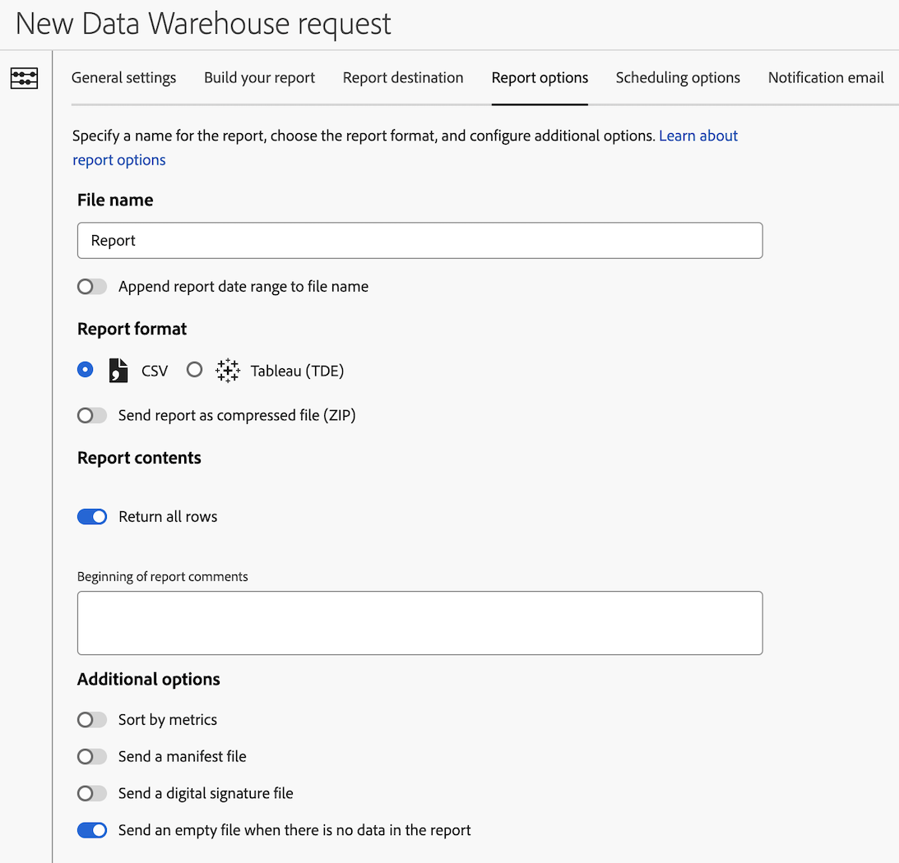

# 設定Data Warehouse請求的報表選項

建立 Data Warehouse 請求時有多種可用的設定選項。以下資訊說明如何設定請求的報表選項。

有關如何開始建立請求的資訊，以及其他重要設定選項的連結，請參閱「[建立 Data Warehouse 請求](/help/export/data-warehouse/create-request/t-dw-create-request.md)」。

若要設定Data Warehouse請求的報表選項：

1. 如果還沒有，可選取「**[!UICONTROL 工具]** > **[!UICONTROL Data Warehouse]** > [!UICONTROL **新增**]」，開始在 Adobe Analytics 中建立請求。

   有關其他詳細資訊，請參閱「[建立 Data Warehouse 請求](/help/export/data-warehouse/create-request/t-dw-create-request.md)」。

1. 在新的Data Warehouse請求頁面上，選取「[!UICONTROL **報表選項**]」標籤。

    <!-- update screenshot to include Sort by metrics -->

1. 填入下列欄位：

   | 選項 | 函數 |
   |---------|----------|
   | [!UICONTROL **檔案名稱**] | 識別報表。 
如果檔案名稱中使用了下列任何特殊字元，則無法儲存請求： <code>！ &quot; # $ &amp; &#39; ( ) * + ， / ： ； > = &lt; ？@ [ ] \ ^ &#39; { } \| ~</code> 

%字元後面必須有&quot;R&quot;、&quot;rsid&quot;或&quot;id&quot;，才能使用，如下所示： <code>%R</code>，<code>%rsid</code>，和<code>%id</code>。
 |
   | [!UICONTROL **將報表日期範圍附加至檔案名稱**] | 新增日期範圍至報表檔案名稱。 
例如，如果您請求從2024年5月1日到2024年5月7日的資料，則檔案名稱包含20240501 - 20240507日期範圍。
 |
   | [!UICONTROL **CSV**] | 傳送CSV檔案格式的報表，以供在試算表中檢視資料。 |
   | [!UICONTROL **Tableau (TDE)**] | 傳送Tableau資料擷取(TDE)檔案格式的報告，可用來在Tableau中顯示其他資料中的資料和圖層。 |
   | [!UICONTROL **以壓縮檔案(ZIP)傳送報告**] | 以壓縮(ZIP)檔案格式傳送報表。 建議在使用電子郵件做為[報告目的地](/help/export/data-warehouse/create-request/dw-request-report-destinations.md)時啟用此選項。 |
   | [!UICONTROL **傳回所有列**] | 啟用時，所有列都會納入報告中。 停用此選項以指定要包含的列數。 |
   | [!UICONTROL **報表註解開始**] | 新增您要納入報告的任何註解。 註解會顯示在報表的開頭。 |
   | [!UICONTROL **依量度排序**] | 在Data Warehouse中提供依遞減量度值排序的排名劃分報表。 依量度排序能讓您更容易解讀 Data Warehouse 報表，也更容易將那些報表與其他 Analytics 劃分報告檢視進行比較。
如需詳細資訊，請參閱[依量度排序](/help/export/data-warehouse/sorting-by-metric.md)。
 |
   | [!UICONTROL **傳送資訊清單檔案**] | 包含報表中所包含檔案的中繼資料。<!-- What kind of metadata is included in the manifest file? --> |
   | [!UICONTROL **傳送數位簽章檔案**] | 允許報表收件者確認檔案是否來自Adobe，以及檔案是否尚未變更。 |
   | [!UICONTROL **當報告中沒有資料時，傳送空白檔案**] | 即使報表不含任何資料，仍會傳送報表。 |

   {style="table-layout:auto"}

1. 繼續在&#x200B;[!UICONTROL **排程選項**]&#x200B;標籤上設定您的Data Warehouse請求。 如需詳細資訊，請參閱[設定Data Warehouse要求的排程選項](/help/export/data-warehouse/create-request/dw-request-scheduling.md)。
