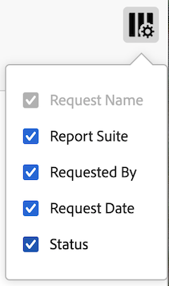

# 管理 Data Warehouse 請求

您可以檢視及管理您提出的Data Warehouse請求。 只有管理員才能檢視及管理組織中其他使用者提出的請求。

以下幾節說明管理請求時可以執行的活動。

## 檢視請求

依預設，您只能檢視您建立的請求，除非使用者已選擇讓組織中的其他人看到他們的請求(如[Data Warehouse請求一般設定](/help/export/data-warehouse/create-request/dw-general-settings.md)中所述)。 系統管理員可以檢視所有要求。

若要檢視Data Warehouse請求，請執行下列步驟：

1. 在Adobe Analytics中，選取&#x200B;[!UICONTROL **工具**] > [!UICONTROL **Data Warehouse**]。

   Data Warehouse頁面會顯示您提出的所有請求。 資料會顯示在每一欄中。 您可以[設定可看見哪些資料行](#configure-columns)。

   <!-- add screenshot of main page -->

<!-- describe columns? -->

1. （選擇性）按一下要求名稱，即可檢視顯示下列資訊的對話方塊： <!-- Check this -->

   * 當請求開始處理時

   * 比率限制：您的組織有太多正在執行的Data Warehouse請求。 請求會暫停，直到其他資料請求完成為止。

## 編輯請求

編輯請求時，請考量下列事項：

* 只能編輯已設定為依排程執行的請求。

* 並非所有與請求相關的欄位都可以編輯。 無法編輯的欄位會變暗。

* 編輯其他使用者請求的管理員必須選擇他們可以存取的新帳戶和位置。

若要編輯排程請求：

1. 在Adobe Analytics中，選取&#x200B;[!UICONTROL **工具**] > [!UICONTROL **Data Warehouse**]。

1. 在「Data Warehouse」頁面上，選取您要編輯的請求。

   

1. 選取&#x200B;[!UICONTROL **編輯**]。

1. 視需要編輯請求。 無法編輯灰色的組態選項。

   如需每個組態選項的詳細資訊，請參閱[建立Data Warehouse要求](/help/export/data-warehouse/create-request/t-dw-create-request.md)。

1. 選取&#x200B;[!UICONTROL **儲存變更**]。

## 檢視要求的歷史記錄

您可以檢視您提出的任何Data Warehouse要求的歷史記錄。

1. 在Adobe Analytics中，選取&#x200B;[!UICONTROL **工具**] > [!UICONTROL **Data Warehouse**]。

1. 在「Data Warehouse」頁面上，選取您要檢視其歷史記錄的請求。

   

1. 選取&#x200B;[!UICONTROL **檢視歷程記錄**]。

   [!UICONTROL **檢視Data Warehouse請求**]&#x200B;頁面會顯示與請求相關聯的個別報告傳遞清單。

   選取&#x200B;**設定資料行**&#x200B;圖示以隱藏預設不顯示的資料行或顯示資料行。

   

   可使用下列欄:

   | 欄 | 說明 |
   |---------|----------|
   | [!UICONTROL **建立日期**] | 建立報表的日期和時間。
這會以起始請求之使用者的時區顯示。
 |
   | [!UICONTROL **開始日期**] | 報表開始的日期和時間。
這會以起始請求之使用者的時區顯示。
 |
   | [!UICONTROL **完成日期**] | 報表完成的日期和時間。
這會以起始請求之使用者的時區顯示。
 |
   | [!UICONTROL **日期已更新**] | 報表的上次更新日期與時間。
這會以起始請求之使用者的時區顯示。
 |
   | [!UICONTROL **狀態**] | 報告傳送的狀態。 可能的狀態有：<ul><li>[!UICONTROL **已建立**]：報告已建立，但尚未處理。</li><li>[!UICONTROL **擱置中**]：報告正在等待處理。</li><li>[!UICONTROL **正在處理**]：報告目前正在處理。</li><li>[!UICONTROL **已完成**]：報告已完成，現在可以使用。</li><li>[!UICONTROL **已排程**]：報告已排程，但尚未開始。</li><li>[!UICONTROL **已取消**]：使用者已取消報告。</li><li>[!UICONTROL **錯誤 — 正在處理**：]報告發生錯誤，無法處理。</li><li>[!UICONTROL **錯誤 — 無法傳送**]：報告已成功產生，但無法傳送。 檢查目的地](/help/export/data-warehouse/create-request/dw-request-report-destinations.md)的[設定，然後重新傳送報告。</li></ul>。 |
   | [!UICONTROL **從**] | 報表中包含之整體時間範圍的開始日期。
這會以報表套裝的時區顯示。
 |
   | [!UICONTROL **結束日期**] | 報表中包含之整體時間範圍的結束日期。 
這會以報表套裝的時區顯示。
 |
   | [!UICONTROL **舊版要求識別碼**] | 此ID用於識別舊版Data Warehouse介面中的報表。 聯絡Adobe客戶服務時，可能需要此ID。 |
   | [!UICONTROL **報告ID**] | 此ID可用來識別目前Data Warehouse介面中的報表。 聯絡Adobe客戶服務時，可能需要此ID。 |

1. 選取報表傳送，然後選取下列任一選項：

   | 選項 | 函數 |
   |---------|----------|
   | [!UICONTROL **目的地詳細資料**] | 顯示與請求相關聯的帳戶和位置詳細資料。 這是先前設定的帳戶和位置，如[設定Data Warehouse要求的報表目的地](/help/export/data-warehouse/create-request/dw-request-report-destinations.md)中所述。 |
   | [!UICONTROL **取消報告**] | 取消報表。 您無法取消狀態為&#x200B;[!UICONTROL **已完成**]&#x200B;或&#x200B;[!UICONTROL **已取消**]&#x200B;的報告。 |
   | [!UICONTROL **重新執行報告**] | 使用原始傳送時的資料再次執行報表。 您可以重新執行具有以下任何狀態的報表： [!UICONTROL **已取消**]、[!UICONTROL **已完成**]、[!UICONTROL **錯誤 — 正在處理**]，或&#x200B;[!UICONTROL **錯誤 — 無法傳送**]。 |
   | [!UICONTROL **重新傳送報告**] | 重新傳送先前產生的報告檔案。 您可以重新傳送具有以下任何狀態的報表： [!UICONTROL **已完成**]&#x200B;或&#x200B;[!UICONTROL **錯誤 — 無法傳送**]。 |

## 複製請求

當您複製請求時，所有設定選項都會從原始請求複製。

1. 在Adobe Analytics中，選取&#x200B;[!UICONTROL **工具**] > [!UICONTROL **Data Warehouse**]。

1. 在Data Warehouse頁面上，選取您要複製的請求。

   

1. 選取&#x200B;[!UICONTROL **複製**]。

   複製Data Warehouse請求頁面隨即顯示。 所有組態選項都從原始請求複製。

1. 更新與請求關聯的任何設定選項。

   如需每個組態選項的詳細資訊，請參閱[建立Data Warehouse要求](/help/export/data-warehouse/create-request/t-dw-create-request.md)。

1. 選取&#x200B;[!UICONTROL **儲存變更**]。

## 取消請求

只有設定為依排程執行的請求才能取消。

若要取消排定的請求，請執行下列步驟：

1. 在Adobe Analytics中，選取&#x200B;[!UICONTROL **工具**] > [!UICONTROL **Data Warehouse**]。

1. 在「Data Warehouse」頁面上，選取您要編輯的請求。

   

1. 選取&#x200B;[!UICONTROL **取消**]。

   此請求將不再在排定的時間執行。

## 設定欄

您可以透過新增或刪除欄，設定針對每個請求顯示的資訊。

1. 選取Data Warehouse頁面右上角的&#x200B;**設定欄**&#x200B;圖示。

   

   可使用下列欄:

   | 可用欄 | 說明 |
   |---------|----------|
   | 請求名稱 | 建立請求者的名稱。 |
   | 報表套裝 | 與請求相關聯的報表套裝。 |
   | 請求者 | 建立請求的使用者。 |
   | 請求日期 | 提出請求的日期。 |
   | 狀態 | 可使用下列狀態：<ul><li>
**已完成**：要求已順利執行。
</li><li>
**已取消**：使用者已取消要求。
</li><li>
**已排程**：要求已設定為依排程執行。
</li><li>
**失敗**：要求無法完成。 如果要求持續失敗，請聯絡客戶支援。
</li></ul> |

   {style="table-layout:auto"}

1. 確定已選取您要顯示的任何欄。 選取的欄會顯示在Data Warehouse頁面上，並顯示相關資訊。

## 篩選及排序請求

1. 選取Data Warehouse頁面左側邊欄中的&#x200B;**篩選器**&#x200B;圖示。

   

1. 展開&#x200B;[!UICONTROL **報表套裝**]、[!UICONTROL **所有者**]&#x200B;或&#x200B;[!UICONTROL **狀態**]&#x200B;區段，然後選取您要如何篩選要求。

## 搜尋請求

1. 在Data Warehouse頁面頂端的搜尋欄位中，指定您要檢視的要求名稱。

   系統會依您的輸入篩選請求。