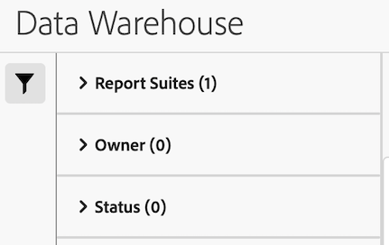

# 管理 Data Warehouse 請求

{{release-limited-testing}}

>[!NOTE]
>
>如果您的組織尚未有即將供所有客戶使用的新Data Warehouse體驗，請使用此資訊： [管理Data Warehouse請求（舊體驗）](#manage-data-warehouse-requests-old-experience) （位於本頁底部）。

您可以管理已提出的Data Warehouse請求。 以下幾節說明管理請求時可以執行的活動。 <!-- just those you have made? I think you can see other people's requests (you can filter by them). What can you do with other people's requests? Just view them?-->

## 檢視請求

1. 在Adobe Analytics中，選取 [!UICONTROL **工具**] > [!UICONTROL **Data Warehouse**].

   Data Warehouse頁面會顯示您提出的所有請求。 <!-- just those you have made? -->資料會顯示在每一欄中。 您可以 [設定哪些欄](#configure-columns) 是可見的。

   <!-- add screenshot of main page -->

<!-- describe columns? -->

1. （選擇性）按一下請求名稱，即可檢視顯示下列資訊的對話方塊： <!-- Check this -->

   * 當請求開始處理時

   * 比率限制：您的組織有太多正在執行的Data Warehouse請求。 請求會暫停，直到其他資料請求完成為止。

## 編輯請求

編輯請求時，請考量下列事項：

* 只能編輯已設定為依排程執行的請求。

* 並非所有與請求相關的欄位都可以編輯。 無法編輯的欄位會變暗。

若要編輯排程請求：

1. 在Adobe Analytics中，選取 [!UICONTROL **工具**] > [!UICONTROL **Data Warehouse**].

1. 在「Data Warehouse」頁面上，選取您要編輯的請求。

   

1. 選取 [!UICONTROL **編輯**].

1. 視需要編輯請求。 無法編輯灰色的組態選項。

   如需每個組態選項的相關資訊，請參閱 [建立Data Warehouse請求](/help/export/data-warehouse/create-request/t-dw-create-request.md).

1. 選取 [!UICONTROL **儲存變更**].

## 檢視要求的歷史記錄

您可以檢視任何已執行報表的歷史記錄。

1. 在Adobe Analytics中，選取 [!UICONTROL **工具**] > [!UICONTROL **Data Warehouse**].

1. 在「Data Warehouse」頁面上，選取您要檢視其歷史記錄的請求。

   

1. 選取 [!UICONTROL **檢視歷史記錄**].

   此 [!UICONTROL **檢視Data Warehouse請求**] 頁面會顯示個別報告傳送的清單。

   

1. 選取報表傳送，然後選取下列任一選項：

   | 選項 | 功能 |
   |---------|----------|
   | [!UICONTROL **目的地詳細資料**] | 顯示與請求相關聯的帳戶和位置詳細資料。 這是先前設定的帳戶和位置，如所述 [設定Data Warehouse請求的報表目的地](/help/export/data-warehouse/create-request/dw-request-report-destinations.md). |
   | [!UICONTROL **取消報告**] | 取消報表。 您無法取消狀態為「 」的報表 [!UICONTROL **已完成**] 或 [!UICONTROL **已取消**]. |
   | [!UICONTROL **重新執行報告**] | 使用原始傳送時的資料再次執行報表。 您可以重新執行具有以下任何狀態的報表： [!UICONTROL **已取消**]， [!UICONTROL **已完成**]， [!UICONTROL **錯誤 — 正在處理**]，或 [!UICONTROL **錯誤 — 無法傳送**]. |
   | [!UICONTROL **重新傳送報告**] | 重新傳送先前產生的報告檔案。 您可以重新傳送具有以下任何狀態的報表： [!UICONTROL **已完成**] 或 [!UICONTROL **錯誤 — 無法傳送**]. |

## 複製請求

當您複製請求時，所有設定選項都會從原始請求複製。

1. 在Adobe Analytics中，選取 [!UICONTROL **工具**] > [!UICONTROL **Data Warehouse**].

1. 在Data Warehouse頁面上，選取您要複製的請求。

   

1. 選取 [!UICONTROL **複製**].

   複製Data Warehouse請求頁面隨即顯示。 所有組態選項都從原始請求複製。

1. 更新與請求關聯的任何設定選項。

   如需每個組態選項的相關資訊，請參閱 [建立Data Warehouse請求](/help/export/data-warehouse/create-request/t-dw-create-request.md).

1. 選取 [!UICONTROL **儲存變更**].

## 取消請求

只有設定為依排程執行的請求才能取消。

若要取消排定的請求，請執行下列步驟：

1. 在Adobe Analytics中，選取 [!UICONTROL **工具**] > [!UICONTROL **Data Warehouse**].

1. 在「Data Warehouse」頁面上，選取您要編輯的請求。

   

1. 選取 [!UICONTROL **取消**].

   此請求將不再在排定的時間執行。

## 設定欄

您可以透過新增或刪除欄，設定針對每個請求顯示的資訊。

1. 選取 **設定欄** Data Warehouse圖示加以調整。

   

   可使用下列欄:

   | 可用欄 | 說明 |
   |---------|----------|
   | 請求名稱 | 建立請求者的名稱。 |
   | 報表套裝 | 與請求相關聯的報表套裝。 |
   | 請求者 | 建立請求的使用者。 |
   | 請求日期 | 提出請求的日期。 |
   | 狀態 | 可使用下列狀態：<ul><li>
**已完成**：要求已成功執行。
</li><li>
**已取消**：使用者已取消要求。
</li><li>
**已排程**：要求已設定為依排程執行。
</li><!-- Are there other statuses? Failed? --> |

   {style="table-layout:auto"}

1. 確定已選取您要顯示的任何欄。 選取的欄會顯示在Data Warehouse頁面上，並顯示相關資訊。

## 篩選及排序請求

1. 選取 **篩選** 圖示加以存取(在Data Warehouse頁面的左側邊欄中)。

   

1. 展開 [!UICONTROL **報表套裝**]， [!UICONTROL **所有者**]，或 [!UICONTROL **狀態**] 區段，然後選取您要如何篩選請求。

## 搜尋請求

1. 在Data Warehouse頁面頂端的搜尋欄位中，指定您要檢視的要求名稱。

   系統會依您的輸入篩選請求。

## 管理Data Warehouse請求（舊體驗）

>[!NOTE]
>
>下列資訊僅適用於貴組織尚未提供全新Data Warehouse體驗的情況，所有Analytics客戶很快就會有這種體驗。

「請求管理員」可讓您檢視或複製請求，以及重新排列請求的優先順序。

在 Data Warehouse 中，選取「**[!UICONTROL 請求管理員]**」標籤。

在此標籤中作業可讓您

* 依報表名稱、套用區段、要求者、要求日期及狀態，檢視最近的報表要求。
* 複製要求。按一下要求旁邊的「**[!UICONTROL 複製]**」。

  >[!NOTE]
  >
  >此動作僅會複製請求，不會複製排程或傳送詳細資料。

* 依報表名稱或請求者的登入名稱搜尋報表。
* 將報表拖放至佇列中的新位置，重新排列報表的優先順序。
* 若要查看開始處理要求的時間，請按一下計劃的要求 ID，並檢查開啟的快顯視窗。

按一下工作即可檢視該工作的個別請求。

* 比率限制：您的組織有太多正在執行的Data Warehouse請求。 請求會暫停，直到其他資料請求完成為止。