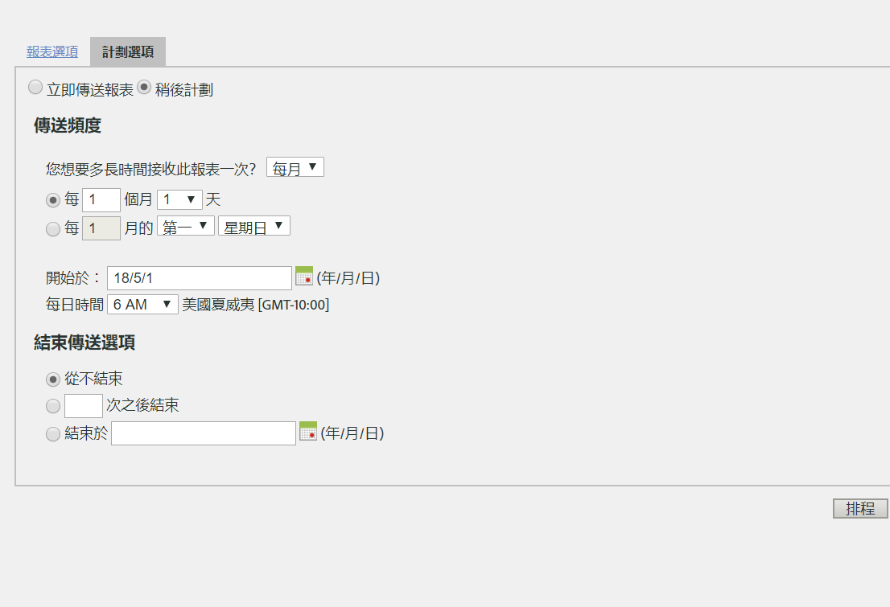

# 排程循環請求

## 排程循環請求 {#topic_8C3CE0CE8A584F80946D24B377CB51BE}

若要排程每日/每月/每年的 Data Warehouse 請求，請務必正確選取*預設*

1. 在[!UICONTROL 「報告日期」]之下，選取&#x200B;**[!UICONTROL 「預設」]**。

1. 在[!UICONTROL 「計劃傳送」]之下，點選&#x200B;**[!UICONTROL 「進階傳送選項」]**。

1. 前往「計劃選項」分頁，選取&#x200B;**[!UICONTROL 「稍後計劃」]**。
1. 在[!UICONTROL 「傳送頻度」]和[!UICONTROL 「結束傳送選項」]選取您要的設定。

   

1. 按一下&#x200B;**[!UICONTROL 「排程」]**。

