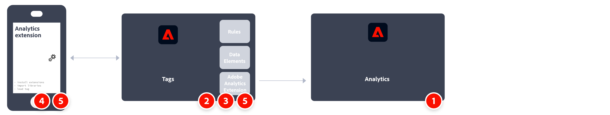

# 使用 Adobe Experience Platform Mobile SDK 實施 Adobe Analytics

Adobe Experience Platform Mobile SDK 有助於在行動應用程式中強化 Adobe 的 Experience Cloud 解決方案和服務。 它適用於 Android™、iOS 及各種跨平台開發架構。 透過 Adobe Experience Platform Data Collection 進行設定。

>[!IMPORTANT]
>
>Adobe Analytics 擴充功能也可以在 Adobe Experience Platform Data Collection 中取得。如果您安裝此擴充功能，就不會利用 XDM 或 Edge Network。

## Adobe Experience Platform SDK

實施任務的高層級概觀：

<table style="width:100%">

<tr>
<th style="width:5%"></th><th style="width:60%"><b>任務</b></th><th style="width:35%"><b>更多資訊</b></th>
</tr>

<tr>
<td>1</td>
<td>確定您<b>已定義報表套裝</b>。</td>
<td><a href="../../../admin/admin/c-manage-report-suites/report-suites-admin.md">報表套裝管理員</a></td>
</tr>

<tr>
<td>2</td>
<td><b>設定結構描述。</b>。為了標準化資料彙集以跨利用 Adobe Experience Platform 的應用程式使用，Adobe 建立了開放且公開記錄標準，即體驗資料模型 (XDM)。</td>
<td><a href="https://experienceleague.adobe.com/docs/experience-platform/xdm/ui/overview.html?lang=zh-Hant">結構描述UI總覽</a></td>
</tr>

<tr>
<td>3</td>
<td><b>設定資料流</b>。資料流代表實施 Adobe Experience Platform Web SDK 時的伺服器端設定。</td>
<td><a href="https://experienceleague.adobe.com/docs/experience-platform/edge/datastreams/configure.html?lang=zh-Hant">設定資料流<a></td> 
</tr>

<td>4</td>
<td><b>將 Adobe Analytics 服務</b>新增到您的資料流。該服務控制資料是否以及如何發送到 Adobe Analytics。</td>
<td><a href="https://experienceleague.adobe.com/docs/experience-platform/edge/datastreams/configure.html#analytics">將 Adobe Analytics 服務新增到資料流</a></td>
</tr>

<tr>
<td>5</td>
<td><b>建立行動裝置屬性</b>。屬性是個容器，您可以在其中裝入擴充功能、規則、資料元素和程式庫。</td>
<td><a href="https://developer.adobe.com/client-sdks/documentation/getting-started/create-a-mobile-property/">設定行動裝置屬性</a></tr>

<tr>
<td>6</td>
<td>在行動裝置標記屬性中<b>安裝 Adobe Experience Platform Edge Network 擴充功能</b>，並在擴充功能中設定資料流。</td>
<td><a href="https://developer.adobe.com/client-sdks/documentation/edge-network/">Adobe Experience Platform Edge Network</a>
</tr>

<tr>
<td>7</td>
<td><b>在您的應用程式中使用程式碼</b>來註冊必要的擴充功能，並載入您的標記設定。</td>
<td><a href="https://developer.adobe.com/client-sdks/documentation/user-guides/getting-started-with-platform/overview/#set-up-the-configuration">設定配置</a></td>
</tr>

<tr>
<td>8</td>
<td>在您的應用程式中使用標記的資料元素、規則、附加擴充功能和 SDK API 呼叫組合，來<b>實施和測試功能</b>。檢查、驗證和偵錯行動應用程式的資料彙集和體驗。</td>
<td><a href="https://developer.adobe.com/client-sdks/documentation/user-guides/getting-started-with-platform/overview/#use-the-sample-application">使用範例應用程式</a>
</tr>

<tr>
<td>9</td>
<td><b>先擴充和驗證您的行動應用程式實施</b>，再將其投入生產。</td>
<td></td> 
</tr>

</table>

## Adobe Analytics 擴充功能。

實施任務的高層級概觀：

<table style="width:100%">

<tr>
<th style="width:5%"></th><th style="width:60%"><b>任務</b></th><th style="width:35%"><b>更多資訊</b></th>
</tr>

<tr>
<td>1</td>
<td>確定您<b>已定義報表套裝</b>。</td>
<td><a href="../../../admin/admin/c-manage-report-suites/report-suites-admin.md">報表套裝管理員</a></td>
</tr>

<tr>
<td>2</td>
<td>在行動裝置標記屬性中<b>安裝 Adobe Analytics 擴充功能</b>，並將擴充功能設定為指向您的報表套裝。</td>
<td><a href="https://developer.adobe.com/client-sdks/documentation/adobe-analytics/">適用於行動裝置屬性的 Adobe Analytics 擴充功能</a>
</tr>

<tr>
<td>3</td>
<td><b>在您的應用程式中使用程式碼</b>來註冊必要的擴充功能，並載入您的標記設定。</td>
<td><a href="https://developer.adobe.com/client-sdks/documentation/user-guides/getting-started-with-platform/overview/#set-up-the-configuration">設定配置</a></td>
</tr>

<tr>
<td>4</td>
<td>在您的應用程式中使用標記的資料元素、規則、附加擴充功能和 SDK API 呼叫組合，來<b>實施和測試功能</b>。檢查、驗證和偵錯行動應用程式的資料彙集和體驗。</td>
<td><a href="https://developer.adobe.com/client-sdks/documentation/user-guides/getting-started-with-platform/overview/#use-the-sample-application">使用範例應用程式</a>
</tr>

<tr>
<td>5</td>
<td><b>先擴充和驗證您的行動應用程式實施</b>，再將其投入生產。</td>
<td></td> 
</tr>

</table>

## 其他資源

- [標記文件](https://experienceleague.adobe.com/docs/experience-platform/tags/home.html?lang=zh-Hant#)

- [Mobile SDK 文件](https://developer.adobe.com/client-sdks/documentation/)
