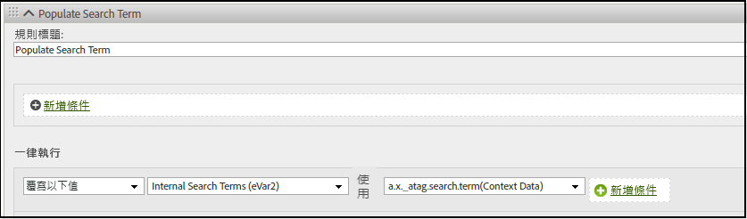

# Adobe Experience Edge中的分析變數映射

下表顯示Adobe Experience Platform邊緣網路自動映射到Adobe Analytics的變數。 如果使用這些XDM欄位路徑，則無需進行其他配置即可將資料發送到Adobe Analytics。

| XDM 欄位路徑 | 分析維度和說明 |
| --- | --- |
| `application.id` | 移動維度 [應用ID](https://experienceleague.adobe.com/docs/mobile-services/using/get-started-ug/mobile-metrics/metrics-reference.html#dimensions)。 |
| `application.isClose` | 幫助定義移動度量 [崩潰](https://experienceleague.adobe.com/docs/mobile-services/using/get-started-ug/mobile-metrics/metrics-reference.html#metrics)。 |
| `application.closeType` | 確定關閉事件是否是崩潰。 有效值包括 `close` （生命週期會話結束，並收到上一會話的暫停事件）和 `unknown` （生命週期會話結束時不會出現暫停事件）。 |
| `application.isInstall` | 移動度量 [安裝](https://experienceleague.adobe.com/docs/mobile-services/using/get-started-ug/mobile-metrics/metrics-reference.html#metrics)。 |
| `application.isLaunch` | 移動度量 [啟動](https://experienceleague.adobe.com/docs/mobile-services/using/get-started-ug/mobile-metrics/metrics-reference.html#metrics)。 |
| `application.name` | 幫助設定移動維度 [應用ID](https://experienceleague.adobe.com/docs/mobile-services/using/get-started-ug/mobile-metrics/metrics-reference.html#dimensions)。 |
| `application.launches.value` | 移動度量 [啟動](https://experienceleague.adobe.com/docs/mobile-services/using/get-started-ug/mobile-metrics/metrics-reference.html#metrics)。 |
| `application.isUpgrade` | 移動度量 [升級](https://experienceleague.adobe.com/docs/mobile-services/using/get-started-ug/mobile-metrics/metrics-reference.html#metrics)。 |
| `application.version` | 幫助設定移動維度 [應用ID](https://experienceleague.adobe.com/docs/mobile-services/using/get-started-ug/mobile-metrics/metrics-reference.html#dimensions)。 |
| `application.sessionLength` | 移動度量 [總會話長度](https://experienceleague.adobe.com/docs/mobile-services/using/get-started-ug/mobile-metrics/metrics-reference.html#metrics)。 |
| `commerce.checkouts.id` | 應用 [事件序列化](../vars/page-vars/events/event-serialization.md) 到 [簽出](../../components/metrics/checkouts.md) 度量。 |
| `commerce.checkouts.value` | 將 [簽出](../../components/metrics/checkouts.md) 按所需數量計算。 |
| `commerce.order.currencyCode` | 設定 [currencyCode](../vars/config-vars/currencycode.md) 配置變數。 |
| `commerce.order.purchaseID` | 設定 [採購ID](../vars/page-vars/purchaseid.md) 頁面變數。 |
| `commerce.productListAdds.id` | 應用 [事件序列化](../vars/page-vars/events/event-serialization.md) 到 [購物車添加](../../components/metrics/cart-additions.md) 度量。 |
| `commerce.productListAdds.value` | 將 [購物車添加](../../components/metrics/cart-additions.md) 按所需數量計算。 |
| `commerce.productListOpens.id` | 應用 [事件序列化](../vars/page-vars/events/event-serialization.md) 到 [購物車](../../components/metrics/carts.md) 度量。 |
| `commerce.productListOpens.value` | 將 [購物車](../../components/metrics/carts.md) 按所需數量計算。 |
| `commerce.productListRemovals.id` | 應用 [事件序列化](../vars/page-vars/events/event-serialization.md) 到 [購物車刪除](../../components/metrics/cart-removals.md) 度量。 |
| `commerce.productListRemovals.value` | 將 [購物車刪除](../../components/metrics/cart-removals.md) 按所需數量計算。 |
| `commerce.productListViews.id` | 應用 [事件序列化](../vars/page-vars/events/event-serialization.md) 到 [購物車視圖](../../components/metrics/cart-views.md) 度量。 |
| `commerce.productListViews.value` | 將 [購物車視圖](../../components/metrics/cart-views.md) 按所需數量計算。 |
| `commerce.productViews.id` | 應用 [事件序列化](../vars/page-vars/events/event-serialization.md) 到 [產品視圖](../../components/metrics/product-views.md) 度量。 |
| `commerce.productViews.value` | 將 [產品視圖](../../components/metrics/product-views.md) 按所需數量計算。 |
| `commerce.purchases.value` | 將 [訂單](../../components/metrics/orders.md) 按所需數量計算。 |
| `device.manufacturer` | 移動設備製造商。 |
| `device.model` | 移動維度 [設備名稱](https://experienceleague.adobe.com/docs/mobile-services/using/get-started-ug/mobile-metrics/metrics-reference.html#dimensions)。 |
| `device.modelNumber` | 移動設備型號。 |
| `device.colorDepth` | 幫助設定 [顏色深度](../../components/dimensions/color-depth.md) 維。 |
| `device.screenHeight` | 幫助設定 [監視解析度](../../components/dimensions/monitor-resolution.md) 維。 確保還設定了XDM欄位 `device.screenWidth`。 |
| `device.screenWidth` | 幫助設定 [監視解析度](../../components/dimensions/monitor-resolution.md) 維。 確保還設定了XDM欄位 `device.screenHeight`。 |
| `device.type` | 移動設備類型。 |
| `environment.browserDetails.acceptLanguage` | 幫助設定 [語言](../../components/dimensions/language.md) 維。 |
| `environment.browserDetails.cookiesEnabled` | 設定 [Cookie支援](../../components/dimensions/cookie-support.md) 維。 有效值包括 `Y` （瀏覽器接受cookie）和 `N` （瀏覽器拒絕cookie）。 |
| `environment.browserDetails.javaEnabled` | 設定 [已啟用Java](../../components/dimensions/java-enabled.md) 維。 有效值包括 `Y` （已啟用Java）和 `N` （Java已禁用）。 |
| `environment.browserDetails.userAgent` | 用作回退 [獨特的訪客](../../components/metrics/unique-visitors.md) 識別方法 通常使用 `User-Agent` HTTP請求標頭。 如果希望在報告中使用此欄位，可將其映射到eVar。 |
| `environment.browserDetails.viewportHeight` | 設定 [瀏覽器高度](../../components/dimensions/browser-height.md) 維。 |
| `environment.browserDetails.viewportWidth` | 設定 [瀏覽器寬度](../../components/dimensions/browser-width.md) 維。 |
| `environment.carrier` | 移動維度 [承運人名稱](https://experienceleague.adobe.com/docs/mobile-services/using/get-started-ug/mobile-metrics/metrics-reference.html#dimensions)。 |
| `environment.connectionType` | 幫助設定 [連接類型](../../components/dimensions/connection-type.md) 維。 |
| `environment.ipV4` | 用作回退 [獨特的訪客](../../components/metrics/unique-visitors.md) 識別方法 通常使用 `X-Forwarded-For` HTTP標頭。 |
| `environment.language` | 移動維區域設定。 |
| `environment.operatingSystem` | 移動維度 [作業系統](https://experienceleague.adobe.com/docs/mobile-services/using/get-started-ug/mobile-metrics/metrics-reference.html#dimensions)。 |
| `environment.operatingSystemVersion` | 移動維度 [作業系統版本](https://experienceleague.adobe.com/docs/mobile-services/using/get-started-ug/mobile-metrics/metrics-reference.html#dimensions)。 |
| `environment.type` | 指示事件是否來自 [可穿戴](https://experienceleague.adobe.com/docs/mobile-services/android/wearables-android/c-android-wearables--additional-notes.html) 設備。 有效值包括 `Application` （活動來自應用）, `Extension` （活動來自可穿戴應用），或 `Widget` （事件來自移動小部件）。 |
| `identityMap.ECID[0].id` | 的 [Adobe Experience Cloud身份服務ID](https://experienceleague.adobe.com/docs/id-service/using/home.html)。 |
| `marketing.trackingCode` | 設定 [跟蹤代碼](../../components/dimensions/tracking-code.md) 維。 |
| `media.mediaTimed.completes.value` | 媒體分析度量 [內容完成](https://experienceleague.adobe.com/docs/media-analytics/using/metrics-and-metadata/audio-video-parameters.html#content-complete)。 |
| `media.mediaTimed.dropBeforeStart.value` | `c.a.media.view`、`c.a.media.timePlayed`、`c.a.media.play` |
| `media.mediaTimed.federated.value` | 媒體分析度量 [聯合資料](https://experienceleague.adobe.com/docs/media-analytics/using/metrics-and-metadata/audio-video-parameters.html#federated-data)。 |
| `media.mediaTimed.firstQuartiles.value` | 媒體分析度量 [25%進度標籤](https://experienceleague.adobe.com/docs/media-analytics/using/metrics-and-metadata/audio-video-parameters.html#twenty-five-progress-marker)。 |
| `media.mediaTimed.mediaSegmentView.value` | 媒體分析度量 [內容段視圖](https://experienceleague.adobe.com/docs/media-analytics/using/metrics-and-metadata/audio-video-parameters.html#content-segment-views)。 |
| `media.mediaTimed.midpoints.value` | 媒體分析度量 [50%進度標籤](https://experienceleague.adobe.com/docs/media-analytics/using/metrics-and-metadata/audio-video-parameters.html#fifty-progress-marker)。 |
| `media.mediaTimed.pauseTime.value` | 媒體分析度量 [暫停持續時間合計](https://experienceleague.adobe.com/docs/media-analytics/using/metrics-and-metadata/audio-video-parameters.html#total-pause-duration)。 |
| `media.mediaTimed.pauses.value` | 媒體分析度量 [暫停事件](https://experienceleague.adobe.com/docs/media-analytics/using/metrics-and-metadata/audio-video-parameters.html#pause-events)。 |
| `media.mediaTimed.primaryAssetReference.`<br/>`@id` | 媒體分析維 [資產ID](https://experienceleague.adobe.com/docs/media-analytics/using/metrics-and-metadata/audio-video-parameters.html#asset-id)。 |
| `media.mediaTimed.primaryAssetReference.`<br/>`dc:title` | 媒體分析維 [視頻名稱](https://experienceleague.adobe.com/docs/media-analytics/using/metrics-and-metadata/audio-video-parameters.html#video-name)。 |
| `media.mediaTimed.primaryAssetReference.`<br/>`iptc4xmpExt:Creator[N].iptc4xmpExt:Name` | 媒體分析維 [發起方](https://experienceleague.adobe.com/docs/media-analytics/using/metrics-and-metadata/audio-video-parameters.html#originator)。 |
| `media.mediaTimed.primaryAssetReference.`<br/>`iptc4xmpExt:Episode.iptc4xmpExt:Number` | 媒體分析維 [插曲](https://experienceleague.adobe.com/docs/media-analytics/using/metrics-and-metadata/audio-video-parameters.html#episode)。 |
| `media.mediaTimed.primaryAssetReference.`<br/>`iptc4xmpExt:Genre` | 媒體分析維 [流派](https://experienceleague.adobe.com/docs/media-analytics/using/metrics-and-metadata/audio-video-parameters.html#genre)。 |
| `media.mediaTimed.primaryAssetReference.`<br/>`iptc4xmpExt:Rating[N].iptc4xmpExt:RatingValue` | 媒體分析維 [內容分級](https://experienceleague.adobe.com/docs/media-analytics/using/metrics-and-metadata/audio-video-parameters.html#content-rating)。 |
| `media.mediaTimed.primaryAssetReference.`<br/>`iptc4xmpExt:Season.iptc4xmpExt:Number` | 媒體分析維 [季](https://experienceleague.adobe.com/docs/media-analytics/using/metrics-and-metadata/audio-video-parameters.html#season)。 |
| `media.mediaTimed.primaryAssetReference.`<br/>`iptc4xmpExt:Series.iptc4xmpExt:Identifier` | 媒體分析維 [內容ID](https://experienceleague.adobe.com/docs/media-analytics/using/metrics-and-metadata/audio-video-parameters.html#content-id)。 |
| `media.mediaTimed.primaryAssetReference.`<br/>`iptc4xmpExt:Series.iptc4xmpExt:Name` | 媒體分析維 [顯示](https://experienceleague.adobe.com/docs/media-analytics/using/metrics-and-metadata/audio-video-parameters.html#show)。 |
| `media.mediaTimed.primaryAssetReference.`<br/>`showType` | 媒體分析維 [顯示類型](https://experienceleague.adobe.com/docs/media-analytics/using/metrics-and-metadata/audio-video-parameters.html#show-type)。 |
| `media.mediaTimed.primaryAssetReference.`<br/>`xmpDM:duration` | 媒體分析維 [視頻長度](https://experienceleague.adobe.com/docs/media-analytics/using/metrics-and-metadata/audio-video-parameters.html#video-length)。 |
| `media.mediaTimed.primaryAssetViewDetails.`<br/>`@id` | 媒體分析維 [媒體會話ID](https://experienceleague.adobe.com/docs/media-analytics/using/metrics-and-metadata/audio-video-parameters.html#media-session-id)。 |
| `media.mediaTimed.primaryAssetViewDetails.`<br/>`broadcastChannel` | 媒體分析維 [內容通道](https://experienceleague.adobe.com/docs/media-analytics/using/metrics-and-metadata/audio-video-parameters.html#content-channel)。 |
| `media.mediaTimed.primaryAssetViewDetails.`<br/>`broadcastContentType` | 媒體分析維 [內容類型](https://experienceleague.adobe.com/docs/media-analytics/using/metrics-and-metadata/audio-video-parameters.html#content-type)。 |
| `media.mediaTimed.primaryAssetViewDetails.`<br/>`broadcastNetwork` | 媒體分析維 [網路](https://experienceleague.adobe.com/docs/media-analytics/using/metrics-and-metadata/audio-video-parameters.html#network)。 |
| `media.mediaTimed.primaryAssetViewDetails.`<br/>`mediaSegmentView.value` | 媒體分析維 [內容段](https://experienceleague.adobe.com/docs/media-analytics/using/metrics-and-metadata/audio-video-parameters.html#content-segment)。 |
| `media.mediaTimed.primaryAssetViewDetails.`<br/>`playerName` | 媒體分析維 [內容播放器名稱](https://experienceleague.adobe.com/docs/media-analytics/using/metrics-and-metadata/audio-video-parameters.html#content-player-name)。 |
| `media.mediaTimed.primaryAssetViewDetails.`<br/>`playerSDKVersion.version` | 媒體分析維 [SDK版本](https://experienceleague.adobe.com/docs/media-analytics/using/metrics-and-metadata/audio-video-parameters.html#sdk-version)。 |
| `media.mediaTimed.primaryAssetViewDetails.`<br/>`sourceFeed` | 媒體分析維 [媒體饋送類型](https://experienceleague.adobe.com/docs/media-analytics/using/metrics-and-metadata/audio-video-parameters.html#media-feed-type)。 |
| `media.mediaTimed.primaryAssetViewDetails.`<br/>`streamFormat` | 媒體分析維 [流格式](https://experienceleague.adobe.com/docs/media-analytics/using/metrics-and-metadata/audio-video-parameters.html#stream-format)。 |
| `media.mediaTimed.progress10.value` | 媒體分析度量 [10%進度標籤](https://experienceleague.adobe.com/docs/media-analytics/using/metrics-and-metadata/audio-video-parameters.html#ten-progress-marker)。 |
| `media.mediaTimed.progress95.value` | 媒體分析度量 [95%進度標籤](https://experienceleague.adobe.com/docs/media-analytics/using/metrics-and-metadata/audio-video-parameters.html#ninety-five-progress-marker)。 |
| `media.mediaTimed.resumes.value` | 媒體分析度量 [內容簡歷](https://experienceleague.adobe.com/docs/media-analytics/using/metrics-and-metadata/audio-video-parameters.html#content-resumes)。 |
| `media.mediaTimed.starts.value` | 媒體分析度量 [介質啟動](https://experienceleague.adobe.com/docs/media-analytics/using/metrics-and-metadata/audio-video-parameters.html#media-starts)。 |
| `media.mediaTimed.thirdQuartiles.value` | 媒體分析度量 [75%進度標籤](https://experienceleague.adobe.com/docs/media-analytics/using/metrics-and-metadata/audio-video-parameters.html#seventy-five-progress-marker)。 |
| `media.mediaTimed.timePlayed.value` | 媒體分析度量 [所花費的內容時間](https://experienceleague.adobe.com/docs/media-analytics/using/metrics-and-metadata/audio-video-parameters.html#content-time-spent)。 |
| `media.mediaTimed.totalTimePlayed.value` | 媒體分析度量 [已花費的媒體時間](https://experienceleague.adobe.com/docs/media-analytics/using/metrics-and-metadata/audio-video-parameters.html#media-time-spent)。 |
| `placeContext.geo.latitude` | 移動尺寸Latitude。 |
| `placeContext.geo.longitude` | 移動維經度。 |
| `placeContext.geo.postalCode` | 的 [郵遞區號](../../components/dimensions/zip-code.md) 維。 |
| `placeContext.geo.stateProvince` | 的 [美國州](../../components/dimensions/us-states.md) 維。 |
| `productListItems[N].lineItemId` | 的 [類別](../../components/dimensions/category.md) 維。 |
| `productlistitems[N].name` | 的 [產品](../../components/dimensions/product.md) 維。 |
| `productlistitems[N].priceTotal` | 幫助確定 [收入](../../components/metrics/revenue.md) 度量。 |
| `productlistitems[N].quantity` | 幫助確定 [單位](../../components/metrics/units.md) 度量。 |
| `web.webInteraction.URL` | 的 [連結URL](../vars/config-vars/linkurl.md) 實現變數。 |
| `web.webInteraction.name` | 的 [自定義連結](../../components/dimensions/custom-link.md)。 [下載連結](../../components/dimensions/download-link.md)或 [退出連結](../../components/dimensions/exit-link.md) 維，取決於 `web.webInteraction.type` |
| `web.webInteraction.type` | 確定按一下的連結類型。 有效值包括 `lnk_o` （自定義連結）, `lnk_d` （下載連結）, `lnk_e` （退出連結）。 |
| `web.webPageDetails.URL` | 的 [頁面URL](../../components/dimensions/page-url.md) 維。 |
| `web.webPageDetails.errorPage` | 幫助確定「未找到頁面」的標誌 [尺寸](../../components/dimensions/pages-not-found.md) 和 [度量](../../components/metrics/pages-not-found.md)。 |
| `web.webPageDetails.name` | 的 [頁面](../../components/dimensions/page.md) 維。 |
| `web.webPageDetails.server` | 的 [伺服器](../../components/dimensions/server.md) 維。 |
| `web.webPageDetails.siteSection` | 的 [站點部分](../../components/dimensions/site-section.md) 維。 |
| `web.webReferrer.URL` | 的 [引用者](../../components/dimensions/referrer.md) 維。 |

{style=&quot;table-layout:auto&quot;}

<!-- `environment.browserDetails.javaScriptVersion` and `web.webPageDetails.homePage` were included in the original table, but they no longer exist in Analytics. | -->

## 將其他XDM欄位映射到分析變數

如果要向Adobe Analytics添加任何維或度量，可通過 [上下文資料變數](../vars/page-vars/contextdata.md)。 所有XDM欄位元素都作為帶有前置詞的上下文資料發送到Adobe Analytics `a.x`。 然後，可以使用 [處理規則](../../admin/admin/c-processing-rules/processing-rules.md)。 例如，如果發送以下事件：

```js
alloy("event",{
    "xdm":{
        "_atag":{
            "search":{
                "term":"Example search term"
            }
        }
    }
})
```

Web SDK將該資料作為上下文資料變數發送到Adobe Analytics `a.x._atag.search.term`。 然後，您可以使用處理規則將上下文資料變數值分配給所需的分析變數，如eVar:


