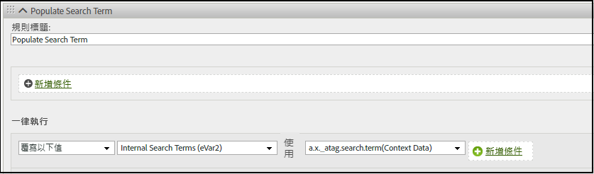

# XDM物件欄位對應到Adobe Analytics

下表顯示 Adobe Experience Platform Edge Network 自動對應到 Adobe Analytics 的 XDM 變數。如果您使用這些 XDM 欄位路徑，則不需要額外設定即可將資料傳送至 Adobe Analytics。這些欄位包含在 **[!UICONTROL Adobe Analytics ExperienceEvent 範本]**&#x200B;欄位類組中。如果您打算將資料發送至 Adobe Analytics 和 Adobe Experience Platform，建議使用這些欄位。

如果您的組織計畫轉移至 Customer Journey Analytics，Adobe 建議改為使用`data`物件直接將資料發送至 Adobe Analytics，而無需遵循結構描述。透過此策略，您的組織可以使用自己的結構描述，而不是使用 [!UICONTROL Adobe Analytics ExperienceEvent 範本] (該範本對 Customer Journey Analytics 的適用性較低)。請參閱[資料物件變數對應至 Adobe Analytics](data-var-mapping.md)，以查看類似的對應表。

## 值優先順序

此資料表中的大部分XDM物件欄位都對應至[對應的資料物件欄位](data-var-mapping.md)。 在Adobe Analytics擷取期間，值會先從XDM對應至Analytics變數。 可辨識的資料物件欄位會接著進行對應，並在對應至相同Analytics變數時覆寫先前設定的任何值。 例如，如果`data.__adobe.analytics.events`存在，則會取代原本衍生自XDM的整個事件集；事件不會跨兩個來源合併。

## XDM 物件欄位對應

此表格先前的更新內容可在本頁面的 [GitHub 提交歷史記錄](https://github.com/AdobeDocs/analytics.en/commits/main/help/implement/aep-edge/xdm-var-mapping.md)中找到。

| XDM 欄位路徑 | Analytics 變數與說明 |
| --- | --- |
| `xdm.application.isClose` | 協助定義行動生命週期量度[損毀](https://developer.adobe.com/client-sdks/home/base/mobile-core/lifecycle/metrics/)。 |
| `xdm.application.isInstall` | 協助判斷何時增加行動生命週期量度[首次啟動](https://developer.adobe.com/client-sdks/home/base/mobile-core/lifecycle/metrics/)。 |
| `xdm.application.closeType` | 判斷某個關閉事件是否損毀。有效值包括 `close` (生命週期工作階段結束，並收到上一個工作階段的暫停事件) 和 `unknown` (生命週期工作階段結束且沒有暫停事件)。幫助設定行動生命週期量度[損毀](https://developer.adobe.com/client-sdks/home/base/mobile-core/lifecycle/metrics/) 指標。 |
| `xdm.application.isInstall` | 行動生命週期量度[安裝](https://developer.adobe.com/client-sdks/home/base/mobile-core/lifecycle/metrics/)。 |
| `xdm.application.isLaunch` | 行動生命週期量度[啟動](https://developer.adobe.com/client-sdks/home/base/mobile-core/lifecycle/metrics/)。 |
| `xdm.application.name` | 協助設定行動生命週期維度[應用程式 ID](https://developer.adobe.com/client-sdks/home/base/mobile-core/lifecycle/metrics/)。 |
| `xdm.application.isUpgrade` | 行動生命週期量度[升級](https://developer.adobe.com/client-sdks/home/base/mobile-core/lifecycle/metrics/)。 |
| `xdm.application.version` | 協助設定行動生命週期維度[應用程式 ID](https://developer.adobe.com/client-sdks/home/base/mobile-core/lifecycle/metrics/)。 |
| `xdm.application.sessionLength` | 行動生命週期量度[前一個工作階段長度](https://developer.adobe.com/client-sdks/home/base/mobile-core/lifecycle/metrics/)。 |
| `xdm.commerce.checkouts.id` | 將[事件序列化](../vars/page-vars/events/event-serialization.md)套用到[結帳](/help/components/metrics/checkouts.md)量度。 |
| `xdm.commerce.checkouts.value` | 讓[結帳](/help/components/metrics/checkouts.md)量度遞增所需的金額。 |
| `xdm.commerce.order.currencyCode` | 設定 [currencyCode](../vars/config-vars/currencycode.md) 設定變數。 |
| `xdm.commerce.order.purchaseID` | 設定 [purchaseID](../vars/page-vars/purchaseid.md) 頁面變數。 |
| `xdm.commerce.order.payments[0].transactionID` | 設定 [transactionID](../vars/page-vars/transactionid.md) 頁面變數。 |
| `xdm.commerce.productListAdds.id` | 將[事件序列化](../vars/page-vars/events/event-serialization.md)套用到[購物車新增](/help/components/metrics/cart-additions.md)量度。 |
| `xdm.commerce.productListAdds.value` | 增加[購物車新增](/help/components/metrics/cart-additions.md)量度。 |
| `xdm.commerce.productListOpens.id` | 將[事件序列化](../vars/page-vars/events/event-serialization.md)套用到[購物車](/help/components/metrics/carts.md)量度。 |
| `xdm.commerce.productListOpens.value` | 增加[購物車](/help/components/metrics/carts.md)量度。 |
| `xdm.commerce.productListRemovals.id` | 將[事件序列化](../vars/page-vars/events/event-serialization.md)套用到[購物車移除](/help/components/metrics/cart-removals.md)量度。 |
| `xdm.commerce.productListRemovals.value` | 增加[購物車移除](/help/components/metrics/cart-removals.md)量度。 |
| `xdm.commerce.productListViews.id` | 將[事件序列化](../vars/page-vars/events/event-serialization.md)套用到[購物車檢視](/help/components/metrics/cart-views.md)量度。 |
| `xdm.commerce.productListViews.value` | 增加[購物車檢視](/help/components/metrics/cart-views.md)量度。 |
| `xdm.commerce.productViews.id` | 將[事件序列化](../vars/page-vars/events/event-serialization.md)套用到[產品檢視](/help/components/metrics/product-views.md)量度。 |
| `xdm.commerce.productViews.value` | 增加[產品檢視](/help/components/metrics/product-views.md)量度。 |
| `xdm.commerce.purchases.value` | 增加[訂單](/help/components/metrics/orders.md)量度。 |
| `xdm.device.model` | 行動生命週期維度[裝置名稱](https://developer.adobe.com/client-sdks/home/base/mobile-core/lifecycle/metrics/)。 |
| `xdm.device.colorDepth` | 協助設定[色彩深度](/help/components/dimensions/color-depth.md)維度。 |
| `xdm.device.screenHeight` | 協助設定[顯示器解析度](/help/components/dimensions/monitor-resolution.md)維度。 |
| `xdm.device.screenWidth` | 協助設定[顯示器解析度](/help/components/dimensions/monitor-resolution.md)維度。 |
| `xdm.device.type` | 行動裝置類型。 |
| `xdm.environment.browserDetails.acceptLanguage` | 協助設定[語言](/help/components/dimensions/language.md)維度。 |
| `xdm.environment.browserDetails.cookiesEnabled` | 設定 [Cookie 支援](/help/components/dimensions/cookie-support.md)維度。有效值包括 `Y` (瀏覽器接受 Cookie) 和 `N` (瀏覽器拒絕 Cookie)。 |
| `xdm.environment.browserDetails.javaEnabled` | 設定 [Java 已啟用](/help/components/dimensions/java-enabled.md)維度。有效值包括 `Y` (Java 已啟用) 和 `N` (Java 已停用)。 |
| `xdm.environment.browserDetails.userAgent` | 用作遞補[不重複訪客](/help/components/metrics/unique-visitors.md)識別方法。通常會使用 `User-Agent` HTTP 請求標頭填入。如果您想要在報告中使用這個欄位，可以將它對應到 eVar。 |
| `xdm.environment.browserDetails.viewportHeight` | 設定[瀏覽器高度](/help/components/dimensions/browser-height.md)維度。 |
| `xdm.environment.browserDetails.viewportWidth` | 設定[瀏覽器寬度](/help/components/dimensions/browser-width.md)維度。 |
| `xdm.environment.carrier` | 行動生命週期維度[電信業者名稱](https://developer.adobe.com/client-sdks/home/base/mobile-core/lifecycle/metrics/)。 |
| `xdm.environment.connectionType` | 協助設定[連線類型](/help/components/dimensions/connection-type.md)維度。 |
| `xdm.environment._dc.language` | 設定情境資料變數 `a.locale`。僅在 `xdm.environment.language` 未設定的情況下使用。Adobe 建議使用此欄位，而非 `xdm.environment.language`。 |
| `xdm.environment.ipV4` | 用作遞補[不重複訪客](/help/components/metrics/unique-visitors.md)識別方法。通常會使用 `X-Forwarded-For` HTTP 標頭填入。 |
| `xdm.environment.language` | 設定情境資料變數 `a.locale`。Adobe 建議改為使用 `xdm.environment._dc.language`。 |
| `xdm.environment.operatingSystem` | 行動生命週期維度[作業系統](https://developer.adobe.com/client-sdks/home/base/mobile-core/lifecycle/metrics/)。 |
| `xdm.environment.operatingSystemVersion` | 協助設定行動生命週期維度[作業系統版本](https://developer.adobe.com/client-sdks/home/base/mobile-core/lifecycle/metrics/)。 |
| `xdm._experience.analytics.customDimensions.`<br/>`eVars.eVar1`<br/>`[...]`<br/>`xdm._experience.analytics.customDimensions.`<br/>`eVars.eVar250` | 設定個別 [eVar](/help/components/dimensions/evar.md) 維度。 |
| `xdm._experience.analytics.customDimensions.`<br/>`hierarchies.hier1`<br/>`[...]`<br/>`xdm._experience.analytics.customDimensions.`<br/>`hierarchies.hier5` | 設定個別[階層](/help/components/dimensions/hierarchy.md)維度。 |
| `xdm._experience.analytics.customDimensions.`<br/>`listProps.prop1.delimiter`<br/>`[...]`<br/>`xdm._experience.analytics.customDimensions.`<br/>`listProps.prop75.delimiter` | 清單屬性分隔符號覆寫。不建議使用此欄位，因為分隔符號是根據報告套裝設定，從[流量變數管理員](/help/admin/tools/manage-rs/edit-settings/c-traffic-variables/traffic-var.md)自動擷取。使用此欄位可能會造成所使用的分隔符號與 Analytics 預期使用的分隔符號不相符。 |
| `xdm._experience.analytics.customDimensions.`<br/>`listProps.prop1.values`<br/>`[...]`<br/>`xdm._experience.analytics.customDimensions.`<br/>`listProps.prop75.values` | 字串陣列含有個別[清單流量變數](../vars/page-vars/prop.md#list-props)值。 |
| `xdm._experience.analytics.customDimensions.`<br/>`lists.list1.list[].value`<br/>`[...]`<br/>`xdm._experience.analytics.customDimensions.`<br/>`lists.list3.list[].value` | 將每個相關 `list[]` 陣列中的所有 `value` 字串都串連到其相關的[清單變數](../vars/page-vars/list.md)。分隔符號是根據[報告套裝設定](/help/admin/tools/manage-rs/edit-settings/conversion-var-admin/list-var-admin.md)中設置的值來自動選擇。 |
| `xdm._experience.analytics.customDimensions.`<br/>`props.prop1`<br/>`[...]`<br/>`xdm._experience.analytics.customDimensions.`<br/>`props.prop75` | 設定個別[流量變數](/help/components/dimensions/prop.md)維度。 |
| `xdm._experience.analytics.event1to100.`<br/>`event1.id`<br/>`[...]`<br/>`xdm._experience.analytics.event901to1000.`<br/>`event1000.id` | 套用[事件序列化](../vars/page-vars/events/event-serialization.md)至個別[自訂事件](/help/components/metrics/custom-events.md)量度。每個事件 ID 位於其 100 群組父系中。例如，若要將序列化應用於 `event678`，請使用 `xdm._experience.analytics.event601to700.event678.id`。 |
| `xdm._experience.analytics.event1to100.`<br/>`event1.value`<br/>`[...]`<br/>`xdm._experience.analytics.event901to1000.`<br/>`event1000.value` | 將個別[自訂事件](/help/components/metrics/custom-events.md)量度增加所需的數量。每個事件位於其 100 群組父系中。例如，`event567` 的欄位是 `xdm._experience.analytics.event501to600.event567.value`。 |
| `xdm.identityMap.ECID[0].id` | [Adobe Experience Cloud 身分識別服務 ID](https://experienceleague.adobe.com/tw/en/docs/id-service/using/home)。 |
| `xdm.marketing.trackingCode` | 設定[追蹤程式碼](/help/components/dimensions/tracking-code.md)維度。 |
| `xdm.media.mediaTimed.completes.value` | 串流媒體服務量度[內容完成](https://experienceleague.adobe.com/tw/en/docs/media-analytics/using/implementation/variables/audio-video-parameters#content-complete)。 |
| `xdm.media.mediaTimed.dropBeforeStart.value` | `a.media.view`、`a.media.timePlayed`、`a.media.play` |
| `xdm.media.mediaTimed.federated.value` | 串流媒體服務量度[聯合資料](https://experienceleague.adobe.com/tw/en/docs/media-analytics/using/implementation/variables/audio-video-parameters#federated-data)。 |
| `xdm.media.mediaTimed.firstQuartiles.value` | 串流媒體服務量度 [25% 進度標記](https://experienceleague.adobe.com/tw/en/docs/media-analytics/using/implementation/variables/audio-video-parameters#twenty-five--progress-marker)。 |
| `xdm.media.mediaTimed.mediaSegmentView.value` | 串流媒體服務量度[內容區段觀看次數](https://experienceleague.adobe.com/tw/en/docs/media-analytics/using/implementation/variables/audio-video-parameters#content-segment-views)。 |
| `xdm.media.mediaTimed.midpoints.value` | 串流媒體服務量度 [50% 進度標記](https://experienceleague.adobe.com/tw/en/docs/media-analytics/using/implementation/variables/audio-video-parameters#progress-marker)。 |
| `xdm.media.mediaTimed.pauseTime.value` | 串流媒體服務量度[總暫停時長](https://experienceleague.adobe.com/tw/en/docs/media-analytics/using/implementation/variables/audio-video-parameters#total-pause-duration)。 |
| `xdm.media.mediaTimed.pauses.value` | 串流媒體服務量度[暫停事件](https://experienceleague.adobe.com/tw/en/docs/media-analytics/using/implementation/variables/audio-video-parameters#pause-events)。 |
| `xdm.mediaCollection.sessionDetails.assetID` | 串流媒體服務維度[資產 ID](https://experienceleague.adobe.com/tw/en/docs/media-analytics/using/implementation/variables/audio-video-parameters#asset-id)。 |
| `xdm.mediaCollection.sessionDetails.friendlyName` | 串流媒體服務維度[影片名稱](https://experienceleague.adobe.com/tw/en/docs/media-analytics/using/implementation/variables/audio-video-parameters#video-name)。 |
| `xdm.mediaCollection.sessionDetails.originator` | 串流媒體服務維度[發起者](https://experienceleague.adobe.com/tw/en/docs/media-analytics/using/implementation/variables/audio-video-parameters#originator)。 |
| `xdm.mediaCollection.sessionDetails.episode` | 串流媒體服務維度[集數](https://experienceleague.adobe.com/tw/en/docs/media-analytics/using/implementation/variables/audio-video-parameters#episode)。 |
| `xdm.mediaCollection.sessionDetails.genre` | 串流媒體服務維度[類型](https://experienceleague.adobe.com/tw/en/docs/media-analytics/using/implementation/variables/audio-video-parameters#genre)。 |
| `xdm.mediaCollection.sessionDetails.rating` | 串流媒體服務維度[內容評級](https://experienceleague.adobe.com/tw/en/docs/media-analytics/using/implementation/variables/audio-video-parameters#content-rating)。 |
| `xdm.mediaCollection.sessionDetails.season` | 串流媒體服務維度[季節](https://experienceleague.adobe.com/tw/en/docs/media-analytics/using/implementation/variables/audio-video-parameters#season)。 |
| `xdm.mediaCollection.sessionDetails.name` | 串流媒體服務維度[內容 ID](https://experienceleague.adobe.com/tw/en/docs/media-analytics/using/implementation/variables/audio-video-parameters#content-id)。 |
| `xdm.mediaCollection.sessionDetails.show` | 串流媒體服務維度[節目](https://experienceleague.adobe.com/tw/en/docs/media-analytics/using/implementation/variables/audio-video-parameters#show)。 |
| `xdm.mediaCollection.sessionDetails.showType` | 串流媒體服務維度[節目類型](https://experienceleague.adobe.com/tw/en/docs/media-analytics/using/implementation/variables/audio-video-parameters#show-type)。 |
| `xdm.mediaCollection.sessionDetails.length` | 串流媒體服務維度[影片長度](https://experienceleague.adobe.com/tw/en/docs/media-analytics/using/implementation/variables/audio-video-parameters#video-length)。 |
| `xdm.media.mediaTimed.primaryAssetViewDetails.@id` | 串流媒體服務維度[媒體工作階段 ID](https://experienceleague.adobe.com/tw/en/docs/media-analytics/using/implementation/variables/audio-video-parameters#media-session-id)。 |
| `xdm.mediaCollection.sessionDetails.channel` | 串流媒體服務維度[內容頻道](https://experienceleague.adobe.com/tw/en/docs/media-analytics/using/implementation/variables/audio-video-parameters#content-channel)。 |
| `xdm.mediaCollection.sessionDetails.contentType` | 串流媒體服務維度[內容類型](https://experienceleague.adobe.com/tw/en/docs/media-analytics/using/implementation/variables/audio-video-parameters#content-type)。 |
| `xdm.mediaCollection.sessionDetails.network` | 串流媒體服務維度[網路](https://experienceleague.adobe.com/tw/en/docs/media-analytics/using/implementation/variables/audio-video-parameters#network)。 |
| `xdm.media.mediaTimed.primaryAssetViewDetails.`<br/>`mediaSegmentView.value` | 串流媒體服務維度[內容區段](https://experienceleague.adobe.com/tw/en/docs/media-analytics/using/implementation/variables/audio-video-parameters#content-segment)。 |
| `xdm.mediaCollection.sessionDetails.playerName` | 串流媒體服務維度[內容播放器名稱](https://experienceleague.adobe.com/tw/en/docs/media-analytics/using/implementation/variables/audio-video-parameters#content-player-name)。 |
| `xdm.mediaCollection.sessionDetails.appVersion` | 串流媒體服務維度[SDK 版本](https://experienceleague.adobe.com/tw/en/docs/media-analytics/using/implementation/variables/audio-video-parameters#sdk-version)。 |
| `xdm.mediaCollection.sessionDetails.feed` | 串流媒體服務維度[媒體摘要類型](https://experienceleague.adobe.com/tw/en/docs/media-analytics/using/implementation/variables/audio-video-parameters#media-feed-type)。 |
| `xdm.mediaCollection.sessionDetails.streamFormat` | 串流媒體服務維度[串流格式](https://experienceleague.adobe.com/tw/en/docs/media-analytics/using/implementation/variables/audio-video-parameters#stream-format)。 |
| `xdm.media.mediaTimed.progress10.value` | 串流媒體服務量度 [10％ 進度標記](https://experienceleague.adobe.com/tw/en/docs/media-analytics/using/implementation/variables/audio-video-parameters#ten--progress-marker)。 |
| `xdm.media.mediaTimed.progress95.value` | 串流媒體服務量度 [95％ 進度標記](https://experienceleague.adobe.com/tw/en/docs/media-analytics/using/implementation/variables/audio-video-parameters#ninety-five--progress-marker)。 |
| `xdm.mediaCollection.sessionDetails.hasResume` | 串流媒體服務量度[內容履歷](https://experienceleague.adobe.com/tw/en/docs/media-analytics/using/implementation/variables/audio-video-parameters#content-resumes)。 |
| `xdm.media.mediaTimed.starts.value` | 串流媒體服務量度[媒體開始](https://experienceleague.adobe.com/tw/en/docs/media-analytics/using/implementation/variables/audio-video-parameters#media-starts)。 |
| `xdm.media.mediaTimed.thirdQuartiles.value` | 串流媒體服務量度 [75％ 進度標記](https://experienceleague.adobe.com/tw/en/docs/media-analytics/using/implementation/variables/audio-video-parameters#seventy-five--progress-marker)。 |
| `xdm.media.mediaTimed.timePlayed.value` | 串流媒體服務量度[內容花費時間](https://experienceleague.adobe.com/tw/en/docs/media-analytics/using/implementation/variables/audio-video-parameters#content-time-spent)。 |
| `xdm.media.mediaTimed.totalTimePlayed.value` | 串流媒體服務量度[媒體花費時間](https://experienceleague.adobe.com/tw/en/docs/media-analytics/using/implementation/variables/audio-video-parameters#media-time-spent)。 |
| `xdm.placeContext.geo._schema.latitude` | 訪客的緯度位置。幫助設定[行動生命週期位置](/help/components/dimensions/lifecycle-dimensions.md)維度。 |
| `xdm.placeContext.geo._schema.longitude` | 訪客的經度位置。幫助設定[行動生命週期位置](/help/components/dimensions/lifecycle-dimensions.md)維度。 |
| `xdm.placeContext.geo.postalCode` | [郵遞區號](/help/components/dimensions/zip-code.md)維度。 |
| `xdm.placeContext.geo.stateProvince` | [美國州別](/help/components/dimensions/us-states.md)維度。 |
| `xdm.placeContext.localTime` | 在[資料摘要](/help/export/analytics-data-feed/c-df-contents/datafeeds-reference.md)中顯示為 `t_time_info`。 |
| `xdm.productListItems[]._experience.analytics.`<br/>`customDimensions.eVars.eVar1`<br/>`[...]`<br/>`xdm.productListItems[]._experience.analytics.`<br/>`customDimensions.eVars.eVar250` | 將[產品語法](../vars/page-vars/products.md)銷售套用至 eVars。 |
| `xdm.productListItems[]._experience.analytics.`<br/>`event1to100.event1.value`<br/>`[...]`<br/>`xdm.productListItems[]._experience.analytics.`<br/>`event901-1000.event1000.value` | 將[產品語法](../vars/page-vars/products.md)銷售套用至事件。 |
| `xdm.productListItems[].productCategories[].categoryID` | [類別](/help/components/dimensions/category.md)維度。另外請查看[產品](../vars/page-vars/products.md)頁面變數。 |
| `xdm.productListItems[].name` | [產品](/help/components/dimensions/product.md)維度。另外請查看 [產品](../vars/page-vars/products.md) 頁面變數。如果 `xdm.productListItems[].SKU` 和 `xdm.productListItems[].name` 都包含資料，則使用 `xdm.productListItems[].SKU` 中的值。 |
| `xdm.productListItems[].priceTotal` | 協助判斷[收入](/help/components/metrics/revenue.md)量度。另外請查看[產品](../vars/page-vars/products.md)頁面變數。 |
| `xdm.productListItems[].quantity` | 協助判斷[單位](/help/components/metrics/units.md)量度。另外請查看[產品](../vars/page-vars/products.md)頁面變數。 |
| `xdm.productListItems[].SKU` | [產品](/help/components/dimensions/product.md)維度。另外請查看 [產品](../vars/page-vars/products.md) 頁面變數。如果 `xdm.productListItems[].SKU` 和 `xdm.productListItems[].name` 都包含資料，則使用 `xdm.productListItems[].SKU` 中的值。 |
| `xdm.web.webInteraction.URL` | [linkURL](../vars/config-vars/linkurl.md) 實施變數。 |
| `xdm.web.webInteraction.name` | [自訂連結](/help/components/dimensions/custom-link.md)、[下載連結](/help/components/dimensions/download-link.md)或[退出連結](/help/components/dimensions/exit-link.md)維度 (視 `xdm.web.webInteraction.type` 中的值而定) |
| `xdm.web.webInteraction.type` | 判斷所點按連結的類型。有效值包括 `other` (自訂連結)、`download` (下載連結) 和 `exit` (退出連結)。 |
| `xdm.web.webPageDetails.URL` | [頁面 URL](/help/components/dimensions/page-url.md) 維度。 |
| `xdm.web.webPageDetails.isErrorPage` | 有助於判斷「找不到頁面」[維度](/help/components/dimensions/pages-not-found.md)和[量度](/help/components/metrics/pages-not-found.md)的旗標。 |
| `xdm.web.webPageDetails.name` | [頁面](/help/components/dimensions/page.md)維度。 |
| `xdm.web.webPageDetails.server` | [伺服器](/help/components/dimensions/server.md)維度。 |
| `xdm.web.webPageDetails.siteSection` | [網站區段](/help/components/dimensions/site-section.md)維度。 |
| `xdm.web.webReferrer.URL` | [反向連結](/help/components/dimensions/referrer.md)維度。 |

{style="table-layout:auto"}

<!-- `environment.browserDetails.javaScriptVersion` and `web.webPageDetails.homePage` were included in the original table, but they no longer exist in Analytics. | -->

## 將其他 XDM 欄位對應到 Analytics 變數

如果您想要將任何維度或量度新增到 Adobe Analytics，可以透過[內容資料變數](../vars/page-vars/contextdata.md)來進行。

### 隱含對應

任何未自動對應的 XDM 欄位元素將以 `a.x.` 為前置詞，作為情境資料發送至 Adobe Analytics。您可以使用[處理規則](/help/admin/tools/manage-rs/edit-settings/general/processing-rules/pr-overview.md)將此情境資料變數對應到所需的 Analytics 變數。例如，如果您傳送以下事件︰

```js
alloy("event",{
    "xdm":{
        "_atag":{
            "search":{
                "term":"Example search term"
            }
        }
    }
})
```

Web SDK 會將該資料當作內容資料變數 `a.x._atag.search.term` 傳送給 Adobe Analytics。然後您可以使用處理規則將該情境資料變數值指派給所需的 Analytics 變數，例如 `eVar`：



## 明確對應

您也可以明確對應 XDM 欄位元素為情境資料。任何明確對應的 XDM 欄位元素將使用 `contextData` 元素，作為情境資料發送至 Adobe Analytics，並且不帶前置詞。您可以使用[處理規則](/help/admin/tools/manage-rs/edit-settings/general/processing-rules/pr-overview.md)將此情境資料變數對應到所需的 Analytics 變數。例如，如果您傳送以下事件︰

```js
alloy("event",{
    "xdm":{
        "_atag":{
            "analytics": {
                "contextData" : {
                    "someValue" : "1"
                }
            }
        }
    }
})
```

Web SDK 將該資料作為情境資料變數 `somevalue` 並指定值 `1` 發送至 Adobe Analytics。然後您可以使用處理規則將該情境資料變數值指派給所需的 Analytics 變數，例如 `eVar`：


