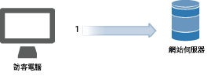
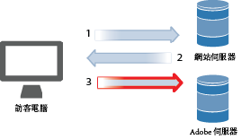
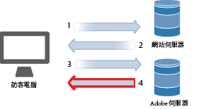
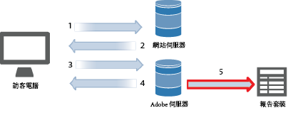
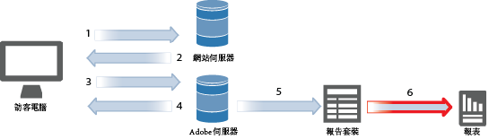
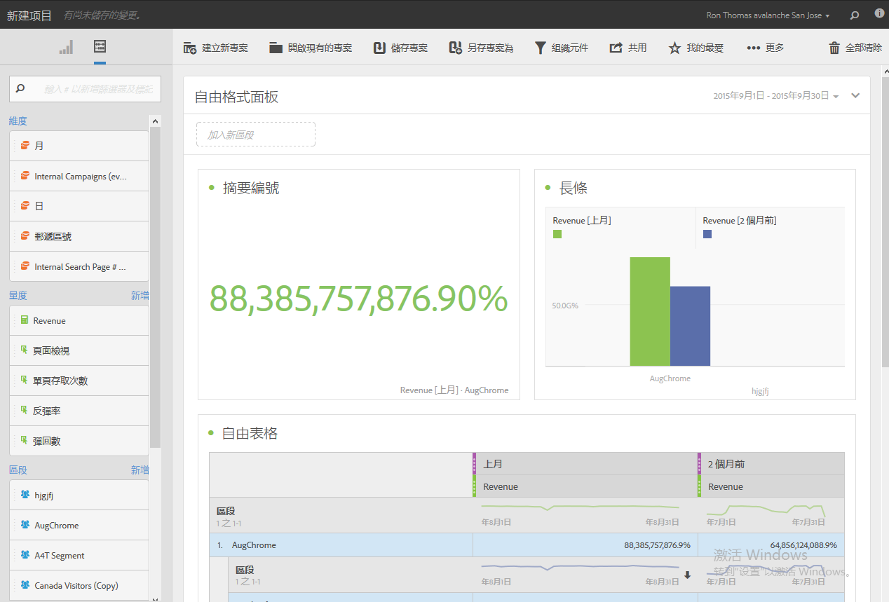

# 資料彙集

瞭解至您網站的造訪如何在 Adobe Analytics 中成為一份報告。

Analytics 資料收集是透過向 Adobe 資料收集伺服器發出特殊影像請求來完成。在大部分實施中，是在要進行追蹤的網頁中放置 JavaScript 程式碼。當標記的網頁在訪客瀏覽器中載入時，瀏覽器會執行 JavaScript 程式碼以執行邏輯，擷取訪客資訊並正確填入標記。JavaScript 處理的最後一個步驟，是向 Analytics 資料收集伺服器發出影像請求，用以收集要提交的資料並傳回小型透明影像至訪客瀏覽器。

由於瀏覽器處理的典型瓶頸是從網站伺服器下載頁面元素 (影像等) 的花費時間，因此瀏覽器執行 JavaScript 程式碼的所需時間幾可忽略。不過，訪客瀏覽器向 Adobe 資料收集伺服器發出影像請求的最後一個步驟，確實會增加頁面下載總時間。對頁面下載時間的整體影響，取決於網站訪客距離 Adobe 資料收集伺服器的鄰近程度 (通常是指網際網路躍點，而非地理距離)。

Adobe 提供多種將資料傳入 Analytics 的方式。這些方式包括即時追蹤下列項目的資訊:

* 可存取網際網路的應用程式
* 促銷活動
* 主從式應用程式
* 電子郵件
* 行動裝置
* Web 型資訊站
* 網站

<!-- 

Need to reconcile with Data Collection topics in the user guide, in this guide, and in reference. 

 -->

1. 訪客造訪您的網站時，會對您的網路伺服器送出要求。

   

1. 您的網站網路伺服器會傳送頁面程式碼資訊，且頁面會顯示於瀏覽器。

   

1. 頁面會載入，Analytics JavaScript 程式碼會運作。

   

   若 JavaScript 程式碼傳送影像要求至 Adobe 伺服器，並傳送您在您的實施中定義的變數、量度及頁面資訊。

   **JavaScript 程式碼範例:** 此 JavaScript 程式碼會置於網頁內文標記中:

   

   **影像要求範例:** 影像要求的片段與頁面名稱大要:

   

   >[!NOTE]
   >
   >每個影像要求都包含隨機數字串，用以避免瀏覽器快取確保瀏覽器能產生後續影像要求。

1. Adobe 回報空白像素影像。

   

   程式碼會自動收集額外細節 (如作業系統、瀏覽器類型、瀏覽器高度及寬度、IP 位址，以及瀏覽器使用語言)。

1. Adobe 伺服器會將網頁分析資料儲存在 *`report suites`* (您的資料存放庫) 中。

   

   [報表套裝](https://marketing.adobe.com/resources/help/en_US/reference/report_suites_admin.html)主要定義選定網站、一組網站或網頁子集如何全面且獨立地呈現報告內容。

1. 報告套裝資料會填充在您可於網路瀏覽器取得的報表。

   

   **報表範例:**

   

   JavaScript 程式碼會快速開始執行，且對頁面載入時間的影響非常有限。訪客為到達特定頁面而點擊&#x200B;**[!UICONTROL 「重新載入」]**&#x200B;或&#x200B;**「返回」]時，此方法可讓您計數頁面，因為頁面自快取中擷取時，JavaScript 也可執行。[!UICONTROL **

如需更多詳細資料，請參閱:

* [資料彙集](/help/implement/js-implementation/data-collection/query-parameters.md)
* [建立資料元素](/help/implement/c-implement-with-dtm/t-data-element.md)
* [Data Warehouse](https://marketing.adobe.com/resources/help/en_US/reference/data_warehouse.html)
* [Ad Hoc Analysis](https://marketing.adobe.com/resources/help/en_US/dsc/c_getting_started.html)
* [資料來源](https://marketing.adobe.com/resources/help/en_US/whitepapers/ftp/ftp_datasources.html)
* [Data Connectors](https://marketing.adobe.com/resources/help/en_US/whitepapers/ftp/ftp_genesis.html)
* [Analytics 資料摘要](/help/export/analytics-data-feed/data-feed-overview.md)

>[!MORELIKETHIS]
>       
>* [Experience Cloud Debugger](/help/implement/impl-testing/debugger.md)

