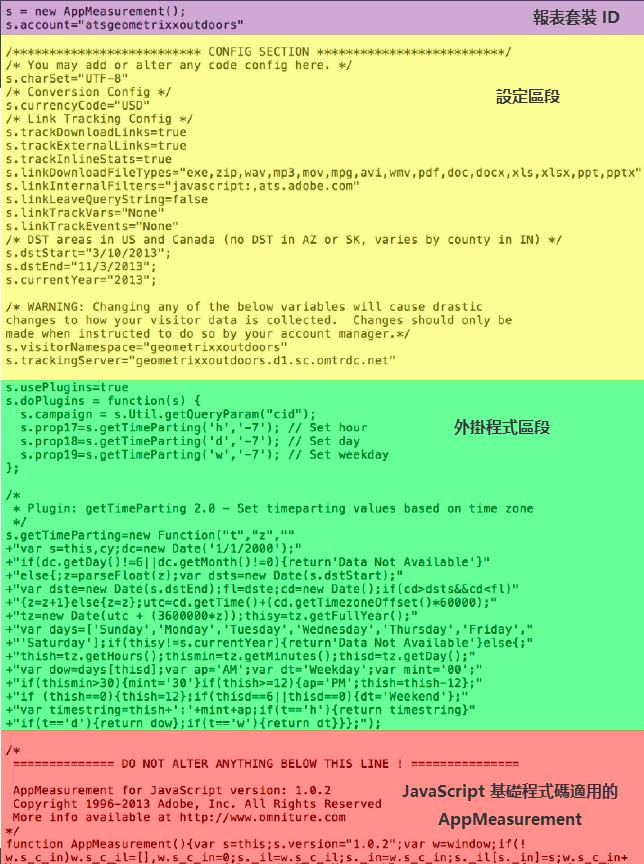

# Analytics 程式碼

資料會傳送至報表套裝，以在報表中顯示。要將資料傳送至 Analytics，使用 DTM 實施是最簡單常用的方式。若用於 JavaScript 實施，亦可輸入程式碼。

如需如何使用 [!UICONTROL Dynamic Tag Management] 建立頁首和頁尾代碼的相關資訊，請參閱[新增頁首和頁尾程式碼](/help/implement/c-implement-with-dtm/c-headers-footers/t-header-footer-code.md)。

以下是 [!DNL AppMeasurement] JavaScript 檔案顯示程式碼部分的範例:

