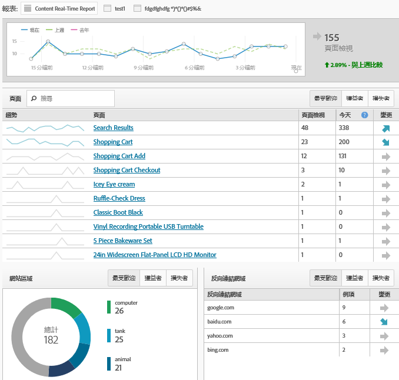

# 簡化實施模組

瞭解首次客戶實施 Adobe Analytics 的體驗。

<!-- 

https://activation.adobedtm.com/index.php?redirected=1 

 -->

新使用者可以利用此 *`Getting Started with Adobe Analytics`* 設定模組，快速建立第一個 [!DNL Analytics] 報表套裝 (資料存放庫)。接著，您可以使用 [!DNL Dynamic Tag Management] 部署 [!DNL Analytics] 程式碼。

[!DNL Dynamic Tag Management] 可讓您不需每次變更網站，即可管理 Adobe Analytics 實作情形。如要實作行動應用程式，您可以取得所需的 SDK，開始從應用程式中蒐集有用的資料。

在此過程中，您可以:

* 快速建立第一個[報表套裝](https://marketing.adobe.com/resources/help/en_US/analytics/getting-started/report-suites.html)。
* 部署 [!DNL Analytics] 和 [Identity Service](https://marketing.adobe.com/resources/help/en_US/mcvid/)。

* 執行基本頁面層級資料的相關報告。

> [!NOTE] 開始之前，請先確認Analytics已 [在Adobe Experience Cloud](https://marketing.adobe.com/resources/help/en_US/mcloud/core_services.html) （解決方案布建程式）中啟用。 如果您收到電子郵件，邀請您登入企業控制面板 (Enterprise Dashboard) 中的 Analytics，表示您已完成事前準備。

**執行簡化的實作模組**

1. Log in to the [!DNL Adobe Experience Cloud] ( [experiencecloud.adobe.com](https://experiencecloud.adobe.com)).

   存取 [!DNL Analytics] 時，系統會判斷您是否擁有報表套裝。如果沒有，系統會顯示 [!UICONTROL Adobe Analytics 快速入門]頁面。

   

   或者，您也可以按一下&#x200B;**[!UICONTROL 說明]** &gt; **[!UICONTROL 歡迎使用 Adobe Analytics]**，在 [!DNL Analytics] 中執行此設定。

1. 指定下列貴企業的相關基本資訊:

   <table id="table_1741878A1B284CB78D297D531DC703D6"> 
     <thead> 
      <tr> 
       <th colname="col1" class="entry"> 元素 </th> 
       <th colname="col2" class="entry"> 說明 </th> 
      </tr> 
     </thead>
     <tbody> 
      <tr> 
       <td colname="col1"> 
屬性類型 
 </td> 
       <td colname="col2"> 
您的實作成果是要運用於網頁、行動裝置或兩者? 
 </td> 
      </tr> 
      <tr> 
       <td colname="col1"> 
產業 
 </td> 
       <td colname="col2"> 
說明貴公司的營利方式 (產品、客戶服務、潛在客戶、品牌知名度與廣告)。 
 </td> 
      </tr> 
      <tr> 
       <td colname="col1"> 
資料層 
 </td> 
       <td colname="col2"> 
(建議) 用以儲存資訊的 JavaScript 陣列。如果使用「動態標籤管理」執行自動設定，便會使用資料層。 
 
如需資料層相關部落格，請參閱<a href="https://blogs.adobe.com/digitalmarketing/analytics/data-layers-buzzword-best-practice/">資料層: 術語與最佳實務</a>。 
 </td> 
      </tr> 
      <tr> 
       <td colname="col1"> 
資料存放庫 (報表套裝) 
 </td> 
       <td colname="col2"> 
 <a href="https://marketing.adobe.com/resources/help/en_US/analytics/getting-started/report-suites.html">報表套裝</a>為個別資料組，通常會對應至單一屬性 (網站或應用程式) 或品牌。每個報表套裝均有其專屬報表與量度組。 
 </td> 
      </tr> 
      <tr> 
       <td colname="col1"> 
時區 
 </td> 
       <td colname="col2"> 
您所在地的時區(自動偵測)。 
 </td> 
      </tr> 
      <tr> 
       <td colname="col1"> 
預計的頁面檢視次數 
 </td> 
       <td colname="col2"> 
網站每天的頁面檢視大概次數。 
 </td> 
      </tr> 
      <tr> 
       <td colname="col1"> 
基本貨幣 
 </td> 
       <td colname="col2"> 
交易地區使用的貨幣。 
 </td> 
      </tr> 
     </tbody> 
    </table>

1. 按&#x200B;**[!UICONTROL 「下一步」]**。

   系統會隨即建立報表套裝。

1. 若要開始部署，請按一下&#x200B;**[!UICONTROL 下一步]**，然後按一下下列其中一個選項:

   <table id="table_71C7F7B9677346CD8D5130519D32464B"> 
     <thead> 
      <tr> 
       <th colname="col1" class="entry"> 元素 </th> 
       <th colname="col2" class="entry"> 說明 </th> 
      </tr> 
     </thead>
     <tbody> 
      <tr> 
       <td colname="col1"> 
部署 
 </td> 
       <td colname="col2"> 
 啟動「動態標籤管理」，即可在此登入並部署 Analytics。此程序會自動實作  AppMeasurement.js 檔案與 Identity 服務 (VisitorAPI.js)。 
 
 
重要: 新的瀏覽器標籤中會顯示說明頁面，透過動態標籤管理，引導您完成 Adobe Analytics 部署。 
 
 </td> 
      </tr> 
      <tr> 
       <td colname="col1"> 
下載 
 </td> 
       <td colname="col2"> 
 下載名為 INSTALL-ME &lt;報表套裝名稱&gt;.js 的安裝檔案。此選項適用於熟悉 <a href="https://marketing.adobe.com/resources/help/en_US/sc/implement/js_implementation.html">JavaScript 實作</a>、經驗豐富的使用者。 
 
 
重要: 下載程式碼不會部署 Analytics。這需要手動部署，您必須在網站頁面上執行，或請利用 Adobe 諮詢服務。 
 
 </td> 
      </tr> 
     </tbody> 
    </table>

1. 執行報告.

   部署 Analytics 工具後，您可以在 Reports &amp; Analytics 中執行報表，確認資訊順利進入您的網站(See [Sign in and Navigate](https://marketing.adobe.com/resources/help/en_US/analytics/getting-started/analytics-navigation.html) to get familiar with the Analytics interface.)

   例如，**[!UICONTROL 網站量度]** &gt; **[!UICONTROL 即時]**&#x200B;可讓您檢視即時資料。

   >[!NOTE]
   >
   >執行[!UICONTROL 即時]報表前必須先完成幾項設定。請參閱[設定即時報表](https://marketing.adobe.com/resources/help/en_US/reference/t_realtime_admin.html)。

**即時報表範例**

