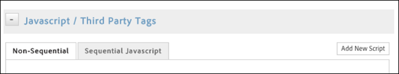

# 設定條件要觸發的動作

設定您要條件觸發的動作。

設定條件之後，您必須設定要條件觸發的動作。這些動作包括 [!DNL Analytics] 事件、第三方標籤及自訂指令檔。此範例說明如何設定指令檔或第三方標籤。

除了已整合的工具 (如 [!DNL Adobe Analytics] 和 Google Analytics)，動態標籤管理還可以在選取頁面或特定藍本中，觸發任何類型的 JavaScript 或將 HTML 插入網站。

每個規則可依需要觸發任意數目的指令檔或 HTML 插入。

>[!NOTE]
>
>Because DTM allows you to inject custom code into your page, please take care not to create cross-site scripting (XSS) vulnerabilities (see [OWASP’s guide](https://www.owasp.org/index.php/Cross-site_Scripting_(XSS)) for more info). 在指令檔內使用資料元素需要特別注意。一律假設資料元素值可能來自未受信任的來源。

**設定條件要觸發的動作**

1. Click **[!UICONTROL JavaScript / Third Party Tags]** to add a new script to your rule.

   

1. Click **[!UICONTROL Add New Script]**.

   

1. 為指令檔命名。
1. Specify how you want the script to trigger, and paste the desired content into the text area. 

1. Click **[!UICONTROL Save Code]**, and the script will be added to the queue for the rule. 

