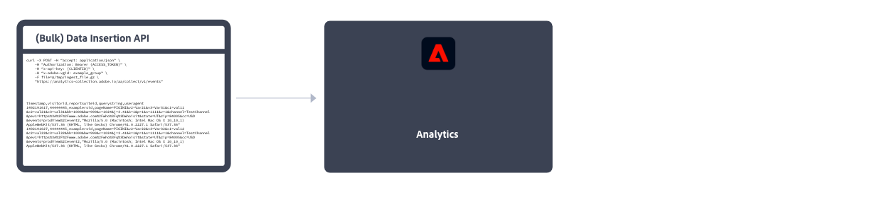

# 實作 Adobe Analytics

Adobe Analytics 需要您網站、行動應用程式或其他應用程式中的程式碼，才能將資料傳送至資料收集伺服器。實作此程式碼的方法有很多種，視平台和您組織的需求而定。

## 網站實作方法

對於您的&#x200B;**網站**，可以使用以下實作方法：

### 用戶端

* **Web SDK 擴充功能**：為新客戶實作 Adobe Analytics 的建議標準化方法。新增 **Adobe Experience Platform Web SDK 擴充功能** (在 Adobe Experience Platform Data Collection **Tags** 中)，然後在每個頁面上放置一個 Loader 標記。該標記會將資料傳送至 Adobe Experience Platform **Edge Network**，後者再將資料轉送至 Adobe Analytics。
  
請參閱[如何使用 Adobe Experience Platform Web SDK 擴充功能實作 Adobe Analytics](./aep-edge/overview.md) 以了解更多資訊。

* **Web SDK**：如果您不想使用 Adobe Experience Platform 資料彙集，可以手動將 Web SDK 程式庫載入您的網站。在每個頁面上參考 Web SDK 庫 (`alloy.js`)，並以對您組織方便使用的格式將所需的追蹤呼叫傳送到 Adobe Experience Platform **Edge Network**。Edge Network 會將該資料轉送至 Adobe Analytics。
  
請參閱[如何使用 Adobe Experience Platform Web SDK 實作 Adobe Analytics](./aep-edge/overview.md) 以了解更多資訊。

* **Analytics 擴充功能**：新增 **Adobe Analytics 擴充功能** (在 Adobe Experience Platform Data Collection **Tags** 中)，然後在每個頁面上放置一個 Loader 標記。此標記會將資料直接傳送到 Adobe Analytics。如果您需要 Tags 的便利性，但又不想使用 Edge Network 基礎結構，請使用此實作方法。
  
請參閱[如何使用 Analytics 擴充功能實作 Adobe Analytics](launch/overview.md) 以了解更多資訊。

* **舊版 JavaScript**：舊版手動實作 Adobe Analytics 的方法。在每個頁面上引用 AppMeasurement 程式庫 (`AppMeasurement.js`)，然後在 JavaScript 中設定變數和設定。
  
此實作方法對於使用自訂程式碼的實作非常實用，而且非常適合其他地方未提供的實作類型，例如 [AMP 頁面](other/amp.md)。

以下決策流程可幫助您選取用戶端實作方法：

>[!TIP]
>
>請聯絡 Adobe 帳戶團隊，以取得根據您目前情況該選擇哪種實作方法的建議和最佳實務。

### 伺服器端

若要實作 Adob&#x200B;&#x200B;e Analytics 伺服器端，您有以下選項：

* **Edge Network API**：您在使用 Adobe Experience Platform Edge Network API，透過資料流與 Adobe Analytics 進行通訊的伺服器上實作程式碼。
  
請參閱[使用 Adobe Experience Platform Edge Network API 實作 Adob&#x200B;&#x200B;e Analytics](/help/implement/aep-edge/api/overview.md)，以了解更多資訊。

* **(批次) 資料插入 API**：您可以使用 Adob&#x200B;&#x200B;e Analytics (批次) 資料插入 API，將伺服器端資料直接收集到 Adob&#x200B;&#x200B;e Analytics。
  
請參閱「[資料插入 API](../import/c-data-insertion-api/c-data-insertion-api.md)」，了解更多資訊。

## 行動應用程式實作方法

對於您的&#x200B;**行動應用程式**，可以使用以下實作方法：

* **Mobile SDK 擴充功能**：在您的行動應用程式中實作 Adobe Analytics 的建議標準化方法。使用專用的程式庫，可輕鬆將資料從行動應用程式傳送至 Adobe。新增 **Adobe Experience Platform Mobile SDK 擴充功能** (在 Adobe Experience Platform Data Collection **Tags** 中)，然後在您的應用程式中實作 Mobile SDK 程式庫。您可以使用 SDK 匯入程式庫、註冊擴充功能，以及載入標記設定。將資料傳送至 Adobe Experience Platform **Edge Network**；Edge 之後會將該資料轉送至 Adobe Analytics。
  

  有關詳細資訊，請參閱[使用 Adobe Experience Platform Mobile SDK 實作 Adobe Analytics](../implement/aep-edge/mobile-sdk/overview.md)。

* **Analytics 擴充功能**：新增 **Adobe Analytics 擴充功能** (在 Adobe Experience Platform Data Collection **Tags** 中)，並在您的應用程式中實作 Mobile SDK 程式庫。您可以使用 SDK 匯入程式庫、註冊擴充功能，以及載入標記設定。此實作方法會直接將資料傳送至 Adobe Analytics。如果您需要 Adobe Experience Platform Data Collection 的便利性，但又不想使用 Adobe 的 Experience Platform Edge Network 基礎結構，建議使用此實作方法。
  

  有關詳細資訊，請參閱[使用 Analytics 擴充功能實作 Adobe Analytics](../implement/aep-edge/mobile-sdk/overview.md)。

>[!CAUTION]
>
>若要了解 Adob&#x200B;&#x200B;e Mobile SDK 舊版的支援，請參閱「[SDK 終止支援公告](https://developer.adobe.com/client-sdks/resources/sdks-end-of-support/)」。

## 重要 Analytics 實作文章

* [負責現有的 Adobe Analytics 實作](/help/implement/prepare/existing-implementation.md)
* [Adobe Debugger](validate/debugger.md)
* [在 Experience Platform 中建立標籤屬性](launch/create-analytics-property.md)
* [AppMeasurement 更新](appmeasurement-updates.md)
* [使用 Platform Web SDK 設定 Adob&#x200B;&#x200B;e Analytics 教學課程](https://experienceleague.adobe.com/docs/platform-learn/implement-web-sdk/applications-setup/setup-analytics.html)
* [在行動應用程式教學課程中實作 Adobe Experience Cloud](https://experienceleague.adobe.com/docs/platform-learn/implement-mobile-sdk/overview.html)

## 重要 Analytics 資源

* [連絡客戶服務](https://experienceleague.adobe.com/?support-solution=Analytics#support)
* [Experience League 上的 Adobe Analytics 社群](https://experienceleaguecommunities.adobe.com/t5/adobe-analytics/ct-p/adobe-analytics-community)
* [Adobe Analytics 資源](https://experienceleaguecommunities.adobe.com/t5/adobe-analytics-discussions/adobe-analytics-resources/m-p/276666)
* [最新發行說明](../release-notes/latest.md)
