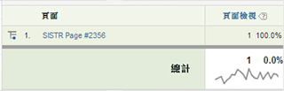

# 在變數值中使用空白字元

HTML 中有數個字元會產生空白字元。

這些字元包括空格、定位字元和歸位字元 (或換行字元)。考量下列範例:

```js
<head> 
 <title> 
   Home Page 
 </title> 
</head> 
<body> 
<script language="javascript"> 
 s.pageName=document.title 
</script> 
```

在此案例中，document.title 填入了 [!UICONTROL s.pageName]，此項目應接收的值為 "Home Page"。請留意 "Home Page" 之前的空格。並非所有的瀏覽器都會以相同方式解譯此空白字元。其結果會如同下列兩個範例之一: 

```js
s.pageName="Home Page"
```

```js
s.pageName="        Home Page"
```

第一個值正確顯示，但第二個值在文字前面出現空白字元。[!DNL Analytics] 會將它們視為 [!UICONTROL s.pageName] 變數的不同值。[!DNL Analytics] 介面會去除第二個值中的前導空白字元。此時報表會顯示如下。



此實施錯誤會導致您的變數值散落在多個明細項目間。[!DNL SAINT] 不允許在關鍵值中使用前導空白字元。這表示，若此問題影響到您的網站，您將無法使用 SAINT 對多個明細項目分組以解決問題。要解決此問題，唯一的方式是預先處理所要的變數值 (在此案例中為 document.title 屬性)，以移除任何前導 (或尾隨) 空白字元。

前述範例使用 [!UICONTROL s.pageName] 變數和 document.title 屬性。Adobe 不建議以 document.title 作為頁面名稱，而此問題也不只會影響 [!UICONTROL s.pageName] 變數。任何在其值中含有前導/尾隨空白字元的變數，都會受到影響。
