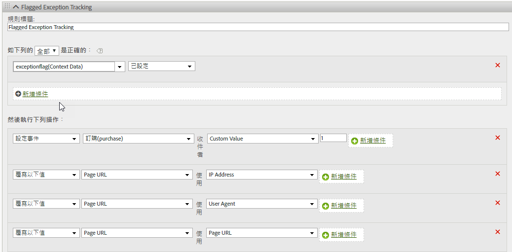

# hitGovernor

s.hitGovernor 外掛程式可在預先定義的滾動時間範圍期間，追蹤傳送的 Analytics 影像請求總數，若總數超過特定的臨界值，則可執行其他邏輯。

雖然系統可將來自機器人、編目程式、特定使用者代理，或 IP 位址特定清單的流量，識別為機器人流量或以其他方式從報表中排除，但報表套裝可能仍會擷取到不應計算的流量。例如，不合理時間內的高點擊數或頁面檢視數 (即約每秒一個請求)，可能為假性流量。

使用此外掛程式可讓系統自動封鎖該訪客剩餘期間的流量，並在報表中動態識別該流量。

## Hit Governor 外掛程式的運作方式{#section_541BC639E31442D09B1C85A2FFCDC02C}

每次影像請求傳送至追蹤伺服器時，外掛程式都會增加 Cookie 值，並在滾動時間範圍期間追蹤該請求。預設的時間範圍為 1 分鐘，但您可以覆寫時間範圍。(請參閱[下方的實施](/help/implement/js-implementation/plugins/hitgovernor.md#task_D4BDB524AA294C139AFCAE2B61FEA3F2)。)若時間範圍期間的點擊總數超過預設點擊次數臨界值 (60)，則系統會傳送最終自訂連結影像要求，以設定 *`exceptionFlag`* 內容資料變數。您也可以覆寫預設的點擊次數臨界值。

可視需要自該值起，停止收集特定訪客的流量，預設時間為 60 天。封鎖流量需要在 doPlugins 函數中，新增一行程式碼 (如下所示)。您也能調整時間範圍。此邏輯可讓時間將該訪客的 IP 位址、使用者代理，或 [!DNL Experience Cloud] 訪客 ID，包含至適當的永久例外邏輯，或在 60 天後重設逾時期間。若 60 天後，外掛程式將該流量識別為假性流量，系統會再次將該流量標記為例外，並在另一個 60 天期間停止收集該流量。

## 報表 {#section_E742F19B528041808454744DB2C7007C}

不需要設定預設變數或事件。但是，我們強烈建議您設定處理規則邏輯，據以設定變數和事件。那些自訂變數和事件可能包括:

* [!DNL Experience Cloud] 訪客 ID
* IP 位址
* 使用者代理
* 已標記的例外事件

為那些變數建立區段，可讓您建立區段和虛擬報表套裝，以檢視這些不明確點擊的整體網站影響。

我們建議使用報表中擷取的值，來更新機器人規則、DB VISTA 規則，或公司 IP 排除項目。

## 實施 {#task_D4BDB524AA294C139AFCAE2B61FEA3F2}

若要實施 hitGovernor 外掛程式:

1. 修改 AppMeasurement 程式庫。

   若要初始化外掛程式，請將此行程式碼，(以粗體字) 包含在 AppMeasurement 程式庫程式碼的 `registerPostTrackCallback` 函數中。

   >[!NOTE]
   >
   >雖然 AppMeasurement 程式庫 1.8.0+ 中包含了 `registerPostTrackCallback` 函數，但根據預設，其他自訂程式碼設定並不包含此函數。此函數會包含在 doPlugins 函數之後和&#x200B;*之外*。

   ```
    s.registerPostTrackCallback(function(){ 
    s.governor();
   }); 
   ```

   AppMeasurement 檔案的 doPlugins 區段下，包含了[外掛程式原始程式碼](/help/implement/js-implementation/plugins/hitgovernor.md#reference_76423C81A7A342B2AC4BE41490B27DE0)中的外掛程式程式碼 (如下所示)。

   您可以在外掛程式外設定這些變數 (最好使用其他設定變數)，以覆寫點擊次數限制臨界值、點擊時間臨界值，及流量排除時間範圍:

<table id="table_9959A40F5F0B40B39DB86E21D03E25FD"> 
 <thead> 
  <tr> 
   <th colname="col1" class="entry"> 變數 </th> 
   <th colname="col2" class="entry"> 語法 </th> 
   <th colname="col3" class="entry"> 說明 </th> 
  </tr> 
 </thead>
 <tbody> 
  <tr> 
   <td colname="col1"> <p>點擊次數限制臨界值 </p> </td> 
   <td colname="col2"> <p> <code> s.hl = 60; </code> </p> </td> 
   <td colname="col3"> <p>特定時間範圍期間，不應超過的點擊總數。 </p> </td> 
  </tr> 
  <tr> 
   <td colname="col1"> <p>點擊時間臨界值 </p> </td> 
   <td colname="col2"> <p> <code> s.ht = 10; </code> </p> </td> 
   <td colname="col3"> <p>記錄點擊次數時的視窗，以秒為單位。將此數字除以 6，即可確定滾動時間視窗。 </p> </td> 
  </tr> 
  <tr> 
   <td colname="col1"> <p>排除臨界值 </p> </td> 
   <td colname="col2"> <p> <code> s.he = 60; </code> </p> </td> 
   <td colname="col3"> <p>為該訪客設定之排除 Cookie 的天數。 </p> </td> 
  </tr> 
 </tbody> 
</table>

>[!NOTE]
>
>您的實施可能會使用與預設 Analytics「s」物件不同的物件名稱。若是如此，請據以更新物件名稱。

1. 設定處理規則。

   此外掛程式會在連結追蹤影像請求中，將已標記的例外項目記錄為上下文資料。因此，必須設定處理規則，才能將已標記的例外指派至適當的變數 (如下所示)。

   

1. (可選) 將流量封鎖程式碼包含在 doPlugins 中。

   系統將流量識別為例外後，若將此程式碼包含在 `doPlugins` 函數中，可以完全封鎖該訪客的任何後續點擊:

   ```
   //Check for hit governor flag 
         if(s.Util.cookieRead('s_hg')==9)s.abort=true;
   ```

   若未包含此程式碼，系統會標記該訪客的流量，但不會將其封鎖。

## 外掛程式原始程式碼{#reference_76423C81A7A342B2AC4BE41490B27DE0}

您應將此程式碼新增至 AppMeasurement 程式庫的 doPlugins 區段下方。

```
//Hit Governor (Version 0.1 BETA, 11-13-17) 
s.governor=new Function("","" 
+"var s=this;if(typeof s.hl=='undefined'){s.hl=60;}if(typeof s.ht=='u" 
+"ndefined'){s.ht=60;}if(typeof s.he=='undefined'){s.he=60;}if(s.Util" 
+".cookieRead('s_hg')==8){var i=new Date(),y=i.getFullYear(),m=i.getM" 
+"onth(),d=i.getDate(),i=new Date(y,m,d+s.he);s.Util.cookieWrite('s_h" 
+"g',9,i);return;}var f=s.Util.cookieRead('s_hc'),g=Number(s.Util.coo" 
+"kieRead('s_ht')),h=Math.floor((new Date()).getTime()),ha=f!=''?f.sp" 
+"lit('|').map(Number):[0,0,0,0,0],i=ha.reduce(function(ha,b){return " 
+"ha+b;},0),j=g==0?0:Math.floor(((h-g)/(s.ht/6))/1000);if(g==0)s.Util" 
+".cookieWrite('s_ht',h);if(i<s.hl){if(j>=1){if(j>=6){ha=[0,0,0,0,0];" 
+"}else{for(var k=0;k<j;k++){ha.unshift(0);ha.pop();}}s.Util.cookieWr" 
+"ite('s_ht',h);}}else{s.Util.cookieWrite('s_hg',8);s.linkTrackVars+=" 
+"',contextData.exceptionFlag';s.contextData['exceptionFlag']='true';" 
+"s.tl(this,'o','exceptionFlag');}ha[0]++;s.Util.cookieWrite('s_hc',h" 
+"a.join('|'));"); 
```

