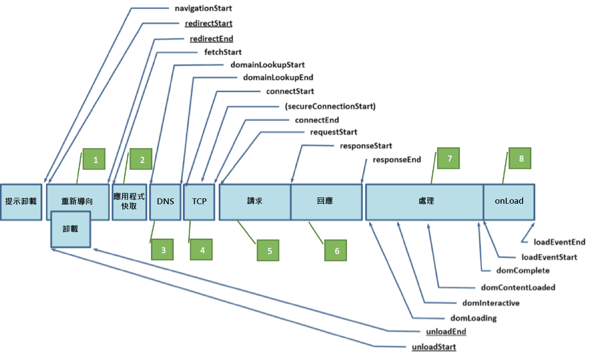

# 效能計時

此外掛程式透過使用 Navigation Timing JavaScript API 來運作，以精確量度網路上的效能。此提供一原生方法，以針對頁面載入事件及資產載入時間，取得準確且詳細的計時統計數據。先前，此類度量無不使用 JavaScript Date 物件來測量計時量度，或初步推算的 Navigation Timing 量度。兩種方法雖然都提供一些頁面載入次數的趨勢資料，卻都不夠可靠。

## 此外掛程式的用途 {#section_4E0771B959FD4F86B4B91BD18CA01DF1}

>[!IMPORTANT]
>
>此為測試版外掛程式，隨後可能有其他更新。

此外掛程式使用以下詳細事件追蹤頁面載入內的個別計時元件:

| 事件 | 名稱 | 計算自 |
|---|---|---|
| 1 | 重新導向計時 | fetchStart - navigationStart |
| 2 | 應用程式快取計時 | domainLookupStart - fetchStart |
| 3 | DNS 計時 | domainLookupEnd - domainLookupStart |
| 4 | TCP 計時 | connectEnd - connectStart |
| 5 | 請求計時 | responseStart - connectEnd |
| 6 | 回應計時 | responseEnd - responseStart |
| 7 | 處理計時 | loadEventStart - domLoading |
| 8 | onLoad 計時 | loadEventEnd - loadEventStart |
| 9 | 總計頁面載入時間 | loadEventEnd - navigationStart |
| 10 | 效能例項 | 計數器 |

以下圖形分別說明由「效能計時」及 PerformanceNavigation 介面定義的計時屬性介面，且不論有無重新導向，皆為如此。



關於 Navigation Timing 物件完整的詳細內容，請參見: 

[https://www.w3.org/TR/navigation-timing/#sec-navigation-timing-interface](https://www.w3.org/TR/navigation-timing/#sec-navigation-timing-interface)

此外，此外掛程式可選擇是否使用 performanceEntries 物件來記錄特定頁面上個別載入資產的資產名稱、資產載入開始時間，以及資產載入時間長度細節。此應用程式會記錄大量資訊，並要求啟用 DOM 儲存物件，以在頁面檢視間儲存頁面載入資訊。在啟用此功能之前，請確定貴公司的隱私權政策允許使用DOM儲存物件。 此功能亦要求使用 listVar 追蹤所有資產。

## 必要的支援外掛程式 {#section_B6447EB6548942EFBC219AEFDC245639}

* appendList
* getPreviousValue

## 外掛程式的程式碼與實施 {#section_564D77E1CF0E445586D95AD9769CE57D}

> [!NOTE]下列指示會要求您變更網站上的資料收集程式碼。此動作可能會影響到您網站上的資料收集，因此應由懂得使用及實施 Adobe Analytics 的開發人員執行。此外掛程式僅與 [!DNL AppMeasurement] 追蹤程式庫相容。

**設定區段 (於 doPlugins 前設定):**

`s.pte`: 以逗點分隔的事件清單包含 10 個您想要使用的事件，依序為個別計時事件元件 (事件 1 至 8)、總計頁面載入時間 (事件 9)，以及總計效能例項 (事件 10)。

`s.ptc`: 設定以判斷是否執行 doPlugins 中的外掛程式。請設定為 false。

*範例呼叫*

```
s.pte = 'event10,event11,event12,event13,event14,event15,event16,event17,event18,event19' 
//[--------------------------- 1 to 8 ---------------------------][-- 9 --][- 10 -] 
s.ptc = false; 
```

**doPlugins 區段:**

若要初始化外掛程式，需要在 s_code 的 `doPlugins` 區段中加入一行程式碼，最好在指定 `s.pageName` 變數後進行。若您希望在此外掛程式內利用資產載入時間功能，您必須以將使用的清單變數名稱傳遞。否則，只有效能計時項目會於您先前指定的 `s.pte` 變數事件中受到追蹤。

> [!NOTE]為使效能計時項目與您的網站頁面產生關聯，您也必須初始化 `getPreviousValue` 外掛程式。建議您將這些效能項目與上一頁的名稱或上一頁 URL 值相比較。

*範例呼叫*

```
/* Performance Timing */ 
s.eVar9 = s.getPreviousValue(s.pageName,'gpv_v9','');  //Record the previous page name in the designated eVar of your choice 
s.performanceTiming('list2')  
```

**外掛程式區段:**

最後，將此外掛程式新增至您的 JavaScript 實施。

```
/* Plugin: Performance Timing Tracking - 0.11 BETA */ 
s.performanceTiming=new Function("v","" 
+"var s=this;if(v)s.ptv=v;if(typeof performance!='undefined'){if(perf" 
+"ormance.timing.loadEventEnd==0){s.pi=setInterval(function(){s.perfo" 
+"rmanceWrite()},250);}if(!s.ptc||s.linkType=='e'){s.performanceRead(" 
+");}else{s.rfe();s[s.ptv]='';}}"); 
s.performanceWrite=new Function("","" 
+"var s=this;if(performance.timing.loadEventEnd>0)clearInterval(s.pi)" 
+";try{if(s.c_r('s_ptc')==''&&performance.timing.loadEventEnd>0){try{" 
+"var pt=performance.timing;var pta='';pta=s.performanceCheck(pt.fetc" 
+"hStart,pt.navigationStart);pta+='^^'+s.performanceCheck(pt.domainLo" 
+"okupStart,pt.fetchStart);pta+='^^'+s.performanceCheck(pt.domainLook" 
+"upEnd,pt.domainLookupStart);pta+='^^'+s.performanceCheck(pt.connect" 
+"End,pt.connectStart);pta+='^^'+s.performanceCheck(pt.responseStart," 
+"pt.connectEnd);pta+='^^'+s.performanceCheck(pt.responseEnd,pt.respo" 
+"nseStart);pta+='^^'+s.performanceCheck(pt.loadEventStart,pt.domLoad" 
+"ing);pta+='^^'+s.performanceCheck(pt.loadEventEnd,pt.loadEventStart" 
+");pta+='^^'+s.performanceCheck(pt.loadEventEnd,pt.navigationStart);" 
+"s.c_w('s_ptc',pta);if(sessionStorage&&navigator.cookieEnabled&&s.pt" 
+"v!='undefined'){var pe=performance.getEntries();var tempPe='';for(v" 
+"ar i=0;i<pe.length;i++){tempPe+='!';tempPe+=pe[i].name.indexOf('?')" 
+">-1?pe[i].name.split('?')[0]:pe[i].name;tempPe+='|'+(Math.round(pe[" 
+"i].startTime)/1000).toFixed(1)+'|'+(Math.round(pe[i].duration)/1000" 
+").toFixed(1)+'|'+pe[i].initiatorType;}sessionStorage.setItem('s_pec" 
+"',tempPe);}}catch(err){return;}}}catch(err){return;}"); 
s.performanceCheck=new Function("a","b","" 
+"if(a>=0&&b>=0){if((a-b)<60000&&((a-b)>=0)){return((a-b)/1000).toFix" 
+"ed(2);}else{return 600;}}"); 
s.performanceRead=new Function("","" 
+"var s=this;if(performance.timing.loadEventEnd>0)clearInterval(s.pi)" 
+";var cv=s.c_r('s_ptc');if(s.pte){var ela=s.pte.split(',');}if(cv!='" 
+"'){var cva=s.split(cv,'^^');if(cva[1]!=''){for(var x=0;x<(ela.lengt" 
+"h-1);x++){s.events=s.apl(s.events,ela[x]+'='+cva[x],',',2);}}s.even" 
+"ts=s.apl(s.events,ela[ela.length-1],',',2);}s.linkTrackEvents=s.apl" 
+"(s.linkTrackEvents,s.pte,',',2);s.c_w('s_ptc','',0);if(sessionStora" 
+"ge&&navigator.cookieEnabled&&s.ptv!='undefined'){s[s.ptv]=sessionSt" 
+"orage.getItem('s_pec');sessionStorage.setItem('s_pec','',0);}else{s" 
+"[s.ptv]='sessionStorage Unavailable';}s.ptc=true;"); 
/* Remove from Events 0.1 - Performance Specific,  
removes all performance events from s.events once being tracked. */ 
s.rfe=new Function("","" 
+"var s=this;var ea=s.split(s.events,',');var pta=s.split(s.pte,',');" 
+"try{for(x in pta){s.events=s.rfl(s.events,pta[x]);s.contextData['ev" 
+"ents']=s.events;}}catch(e){return;}"); 
/* Plugin Utility - RFL (remove from list) 1.0*/ 
s.rfl=new Function("l","v","d1","d2","ku","" 
+"var s=this,R=new Array(),C='',d1=!d1?',':d1,d2=!d2?',':d2,ku=!ku?0:" 
+"1;if(!l)return'';L=l.split(d1);for(i=0;i<L.length;i++){if(L[i].inde" 
+"xOf(':')>-1){C=L[i].split(':');C[1]=C[0]+':'+C[1];L[i]=C[0];}if(L[i" 
+"].indexOf('=')>-1){C=L[i].split('=');C[1]=C[0]+'='+C[1];L[i]=C[0];}" 
+"if(L[i]!=v&&C)R.push(C[1]);else if(L[i]!=v)R.push(L[i]);else if(L[i" 
+"]==v&&ku){ku=0;if(C)R.push(C[1]);else R.push(L[i]);}C='';}return s." 
+"join(R,{delim:d2})"); 
```

## 附註 {#section_131C5D97A0094880AFC3A2BBE0BC9DE4}

* 在部署至生產環境前，請務必對外掛程式安裝進行測試，以確保資料收集可如預期運作。
* 由於外掛程式所傳送的是上一頁關聯的效能資料，因此不會收集瀏覽之最後一個頁面檢視的資料。
* 若您正在追蹤資產計時，此外掛程式會仰賴於使用者網路瀏覽器設定 DOM 儲存值的能力。若使用者不接受 Cookie 且已啟動 DOM 儲存，則此應用程式不會將資料傳送至 Analytics。
* 由於瀏覽器限制，只有很小一部份的使用者不會傳送導覽計時資料，並且此外掛程式內也包含邏輯，用以確保資料最後不會產生偏差，在一小部分的行動瀏覽器中更是如此。不過，此外掛程式在 IE、Firefox、Chrome、與 Safari 中均已順利通過測試。
* [!UICONTROL 計算量度] 可以建立計算量度來協助彙總及瞭解與以下量度關聯的訪客行為:

   * 平均重新導向計時 (重新導向計時/效能計時例項)
   * 平均應用程式快取計時 (應用程式快取計時/效能計時例項)
   * 平均 DNS 計時 (DNS 計時/效能計時例項)
   * 平均 TCP 計時 (TCP 計時/效能計時例項)
   * 平均請求計時 (請求計時/效能計時例項)
   * 平均回應計時 (回應計時/效能計時例項)
   * 平均處理計時 (處理計時/效能計時例項)
   * 平均 onLoad 計時 (onLoad計時/效能計時例項)
   * 平均頁面載入計時 (總計頁面載入時間/效能計時例項)

