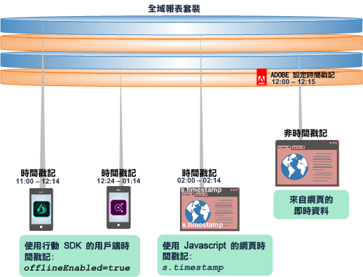
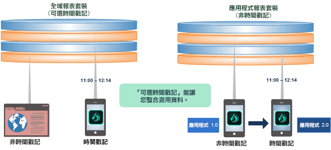
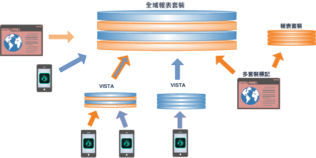
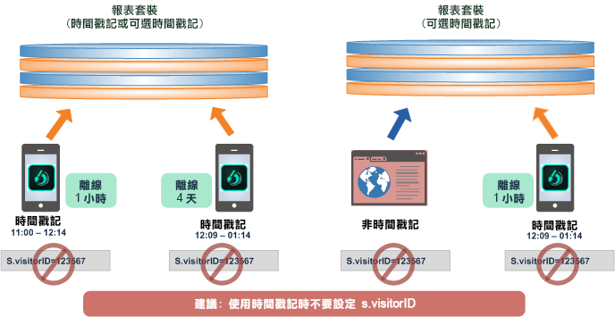
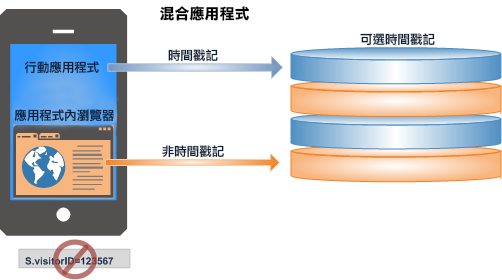

# 使用可選時間戳記

瞭解使用「可選時間戳記」設定的好處與限制。

「可選時間戳記」是所有新報表套裝的預設設定。

* 在相同的全域報表套裝中，混搭時間戳記與非時間戳記資料。
* 從行動應用程式傳送時間戳記資料至全域報表套裝。
* 升級應用程式即可使用時間戳記，無需建立新的報表套裝。

>[!NOTE]
>
>針對所有從範本產生的新報表套裝，選擇式時間戳記皆為預設設定。由現有報表套裝複製的新報表套裝，將繼承原始報表套裝的時間戳記設定。

如需其他的設定資訊，請參閱[可選時間戳記](https://marketing.adobe.com/resources/help/en_US/reference/timestamp-optional.html)。

## 可選時間戳記: 整合了時間戳記與非時間戳記資料 {#section_BF17CB593044462B993FD0D28EA56518}

使用可選時間戳記功能，您可以結合非時間戳記資料與時間戳記資料，而不會導致資料遺失。收集自行動裝置的附時間戳記離線資料可與來自網頁的即時非時間戳記資料相結合，或與使用用戶端時間戳記呼叫的平台資料相整合。

* **時間戳記資料**。Client-side timestamp data is captured and sent directly with the device data using client-side timestamp variables: Javascript on a web page, or using a Mobile SDK call ( [!DNL offlineEnabled=true]) in a mobile app.
* **非時間戳記資料**。當資料點擊收集伺服器時，Adobe 會在報表套裝中的非時間戳記資料上設定時間戳記。

報表套裝可以有下列其中一個時間戳記設定:

* 不允許時間戳記 (支援設定 visitorID)
* 必要時間戳記 (不支援設定 visitorID)
* 可選時間戳記 (支援設定 visitorID，但不適用於時間戳記的點擊上)

## 關於可選時間戳記功能 {#section_63B2FA9A2AB24B3993E84D2C2B4BF2CE}

「可選時間戳記」可讓您在多個報表套裝間進行整合與報告，無論是否包含用戶端時間戳記。透過「可選時間戳記」，您可以將應用程式更新為採用時間戳記，同時仍使用舊版應用程式的非時間戳記資料。

| 在舊版中... | 除此之外... |
|--- |--- |
| 時間戳記資料無法傳送至非時間戳記全域報表套裝。因此，從離線裝置傳送的點擊資料新增至非時間戳記報表套裝時，會被捨棄。  因此，從離線資料傳送的點擊資料新增至非時間戳記報表套裝時，會被捨棄。 | 將應用程式更新為收集和使用時間戳記，必須要採用新的報表套裝。 將應用程式更新為使用時間戳記時，您無法儲存至現有的報表套裝或整合現有資料。 |

**使用「可選時間戳記」**，您可以整合即時網站的非時間戳記資料與來自行動裝置的離線資料，或將非時間戳記應用程式更新為時間戳記應用程式。 

## 將資料合併至全域報表套裝 {#section_5BE3BDF56007402BB1F5C3144D5FE1E0}

將資料合併至全域報表套裝可透過數個方式完成，包括多套裝標記、Vista 規則以及從離線來源匯入批次檔案。

>[!IMPORTANT]
>
>仔細規劃每個元件資料集的設計，讓全域報表套裝中的組合有意義。

## 採用時間戳記的最佳實務 {#section_9436394E5D7E4F8A8B369B6D11BB2B2B}

以下為整合時間戳記與非時間戳記資料時的最佳實務，以及一些應注意的要求和限制。

* 一般來說，某個訪客或造訪的時間戳記必須依正確的時間順序送達 Adobe。

   順序錯誤的資料包括來自離線資料收集的遲到資料和遲到點擊，或離線行動裝置上的不同步時鐘。順序錯誤的資料會影響時間計算 (例如逗留時間值)、歸因 (eVar 持續性)、造訪次數/造訪計數，以及路徑報表。

   

* 不建議在設定 [s.visitorID](https://marketing.adobe.com/resources/help/en_US/sc/implement/?f=visid_custom) 時使用時間戳記。這可能會造成資料順序錯誤。

* 由應用程式 (有時間戳記的離線資料) 開啟網路瀏覽器 (非時間戳記的即時資料) 組成的混合應用程式不應使用時間戳記。這會導致錯誤報告作業階段。

   

   此外，混合應用程式也不應設定訪客 ID。
