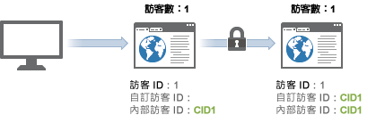

# 訪客

>[!IMPORTANT]
>
>不再建議這種識別跨裝置訪客的方法。Please refer to the [Adobe Experience Cloud Device Co-op Documentation](https://marketing.adobe.com/resources/help/en_US/mcdc/).

Analytics 會將每個唯一的有效訪客 ID 計為獨特訪客。

If you look at the [previous table](../../../implement/js-implementation/xdevice-visid/visit-example.md#concept_E3B32B8E539F4FDC8E3FA872328B87BA), this occurred 3 times: at hits 1, 9, and 10. 之所以會如此，是因為這兩個伺服器呼叫的有效[!UICONTROL 訪客 ID] 是相同的，即使訪客相隔了數小時，且使用的是不同的裝置，仍是如此。

這在跨裝置訪客身分識別啟用時，可能會增加獨特訪客的數目。訪客的同一次瀏覽可能會計數兩次: 一次是初次瀏覽時，另一次是使用者完成驗證時。

當新的訪客瀏覽您的網站時，會填入並儲存 `s_vi` Cookie。資料收集伺服器會為此訪客 ID 建立新的訪客資料，並在此資料中設定有效[!UICONTROL 訪客 ID]，以符合 Cookie。

在跨裝置訪客身分識別啟用時，若在後續的點擊 (例如在驗證之後) 中提供[!UICONTROL 訪客 ID] 變數，則會更新有效[!UICONTROL 訪客 ID] 以符合自訂值。這可能會導致有效[!UICONTROL 訪客 ID] 在驗證之後隨即變更，而產生多個訪客計數。

在初次產生關聯後，瀏覽計數會恢復正常，因為訪客是透過[!UICONTROL 訪客 ID] Cookie 產生關聯的。若訪客稍後檢視了您的網站，然後進行驗證，訪客計數並不會不實膨脹，因為有效[!UICONTROL 訪客 ID] 在驗證之後並未變更。

