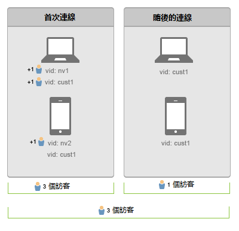

# 跨裝置連結使用者

>[!IMPORTANT]
>
>不再建議這種識別跨裝置訪客的方法。Please refer to the [Adobe Experience Cloud Device Co-op Documentation](https://marketing.adobe.com/resources/help/en_US/mcdc/).

跨裝置訪客身分識別可協助您連結多個裝置間的訪客。跨裝置訪客識別會使用訪客 ID 變數 s.visitorID，為使用者建立裝置間的關聯。

當您透過點擊而提供[!UICONTROL 訪客 ID] 變數時，系統即會檢查是否有其他訪客資料具有相符的[!UICONTROL 訪客 ID]。若有的話，則自此之後都會使用系統中已存在的訪客資料，而不再使用先前的訪客資料。

[!UICONTROL 訪客 ID] 通常會在驗證之後設定，或是在訪客執行其他特定動作而讓您可加以唯一識別 (無論使用什麼裝置) 時設定。建議您建立使用者名稱的雜湊，或使用不含任何個人識別資訊的內部 ID。

在[先前的範例](../../../implement/js-implementation/xdevice-visid/xdevice-connecting.md)中，客戶從某個裝置登入後，都會與相同的使用者個人資料產生關聯。若訪客於其後登出該裝置，關聯仍將持續運作，因為在每個裝置上的 Cookie 中所儲存的[!UICONTROL 訪客 ID] 已與相同的訪客資料產生關聯。建議您只要情況允許即應填入 [!UICONTROL s.visitorID] 變數，以備[!UICONTROL 訪客 ID] Cookie 遭刪除時使用。

## 唯一訪客和訪客數 {#section_70330AB6724C4E419A4BD0BDD54641AC}

考量兩個裝置的下列連線順序:

**在第一個資料連線上**

* 刪除重複訪客不具有可回溯性。

在膝上型電腦上進行驗證之後，Adobe Analytics 會將具有訪客 ID (`nv1` 或 `cust1`) 的點擊將視為相同個體。然而，刪除重複訪客不具有可回溯性，因此會算成 2 個唯一訪客。

在行動裝置的第一個資料連線上，無法辨識客戶，因為會算成新的唯一訪客。一旦在行動裝置驗證了使用者 (`cust1`)，Adobe Analytics 就會將 `cust1` 對應回主要網站上提供的訪客 ID，因此唯一瀏覽不再增加。

每個已驗證的新裝置或瀏覽器將 1 個唯一訪客。

**在後續的資料連線上**

在已驗證之裝置的後續資料連線上，不會增加唯一訪客。
