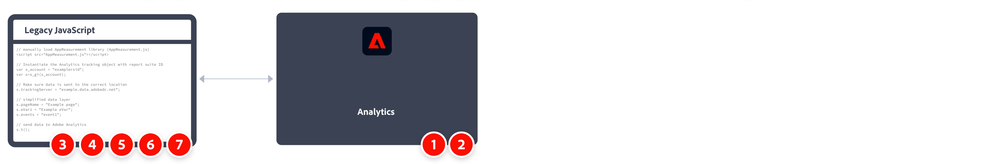

# 使用 JavaScript 適用的 AppMeasurement 實施 Adobe Analytics

JavaScript 適用的 AppMeasurement 向來是實施 Adobe Analytics 的常用方法。 但由於標記管理系統越來越熱門，所以建議使用 [Adobe Experience Platform 中的標記](../launch/overview.md)。

實施任務的高層級概觀：

。

<table>

<tr>
<th style="width:5%"></th><th style="width:75%"><b>任務</b></th><th style="width:20%"><b>更多資訊</b></th>
</tr>

<tr>
<td>1</td><td>確定您<b>已定義報告套裝</b></td><td><a href="../../admin/tools/manage-rs/report-suites-admin.md">報表套裝管理員</a></td>
</tr>

<tr>
<td>2</td><td><b>從代碼管理員下載 AppMeasurement 所需的 JavaScript 程式碼</b>。 將檔案解壓縮。</td><td><a href="../../admin/tools/code-manager-admin.md">代碼管理員</a></td>
</tr>

<tr>
<td>3</td><td><b>將 <code>AppMeasurement.js</code> 新增到您網站的範本檔案中</b>。 該程式碼包含傳送資料至 Adobe 所需的程式庫。

```html
<head>
  <script src="AppMeasurement.js"></script>
  …
</head>
```

</td><td></td>
</tr>

<tr>
<td>4</td><td><b>在 <code>AppMeasurement.js</code></b> 中定義設定變數。 當 Analytics 物件被實例化時，這些變數可確保資料彙集設定正確。

```JavaScript
// Instantiate the Analytics tracking object with report suite ID
var s_account = "examplersid";
var s=s_gi(s_account);
 
// Make sure data is sent to the correct tracking server
s.trackingServer = "example.data.adobedc.net";
```

</td><td><a href="../vars/config-vars/configuration-variables.md">設定變數</a></td>
</tr>

<tr>
<td>5</td><td><b>在網站的頁面代碼中定義頁面層級變數</b>。 這些變數會決定傳送至 Adobe 的特定維度和量度。

```js
s.pageName = "Example page";
s.eVar1 = "Example eVar";
s.events = "event1";
```

</td><td><a href="../vars/page-vars/page-variables.md">頁面變數</a></td>
</tr>

<tr>
<td>6</td><td><b>在所有頁面變數設定完成後，使用 <code>t()</code> 方法</b>將資料傳送至 Adobe。

```js
s.t();
```

</td><td><a href="../vars/functions/t-method.md">t() 方法</a></td>
</tr>

<tr>
<td>7</td><td><b>先擴充和驗證您的實施</b>，再將其投入生產。</b></td><td></td>
</tr>

</table>

## 其他資源

- [變數、函數、方法和外掛程式概觀](../vars/overview.md)
