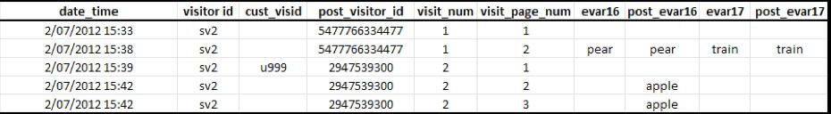

# 歸屬分配和持續性

> [!IMPORTANT]不建議您繼續使用這種跨裝置識別訪客的方法。請參 [閱「元件」使用指南](/help/components/cda/cda-home.md) 中的「跨裝置分析」。

若訪客資料在與相同的訪客 ID 變數產生關聯後合併，歷史資料集中的歸屬分配並不會變更。

* When the variable `s.visitorID` is set and sent on a hit, Adobe checks for any other visitor profiles that have a matching visitor ID.
* 如果訪客資料存在，則自此之後都會使用系統中已存在的訪客資料，而不再使用先前的訪客資料。
* 如果找不到相符的訪客 ID，則會建立新的訪客資料。

當未驗證的客戶第一次造訪您的網站時，Adobe Analytics 會指派一個訪客資料給該客戶。當建立新的訪客資料時，某個瀏覽會結束，而另一個瀏覽則會開始。

## 範例 1

下列範例說明當客戶第一次在第一部裝置上進行驗證時，如何將資料傳送至Adobe Analytics:

* `eVar16` 1 天後過期，而 `evar17` 只要瀏覽即過期。
* `post_visitor_id` 欄代表 Adobe Analytics 所維護的訪客資料。貼文欄通常會顯示在資料饋送中。 請參 [閱「匯出](/help/export/analytics-data-feed/data-feed-overview.md) 」使用指南中的資料饋送。
* `post_evar16` 和 `post_evar17` 欄顯示 eVars 的持續性。
* `cust_visid` 代表 `s.visitorID` 中設定的值。
* 每一列為一個「點擊」，此為傳送至 Adobe Analytics 資料收集伺服器的單一要求。

On the first data connection containing a previously unrecognized `s.visitorID` value (`u999` above), a new profile is created. 來自前一個訪客資料的持續性值會轉送至新的訪客資料。

* 設為瀏覽時即過期的 eVars 不會複製至已驗證的訪客資料。請注意，值 `car` 以上不會持續存在。
* 設為透過其他措施來過期的 eVars 將複製至已驗證的訪客資料。請注意，值 `apple` 持續存在。
* 對於持續存在的 eVars，不會記錄任何「例項」度量。這表示當使用交叉裝置訪客分身分識別時，可能看到 eVar 值的「唯一瀏覽」度量大於「例項」度量的報表。

> [!NOTE] 如果使用者是您網站的新手（在此裝置上從未瀏覽過），並在到達後約3分鐘內進行驗證，則驗證的描述檔不會保留任何值。

## 範例 2

下列範例說明當客戶在新裝置上進行驗證時，先前在不同裝置上進行驗證後，資料如何傳送至Adobe Analytics。

當客戶驗證時，他們會與先前的「已驗證」描述檔相符- `2947539300`。 不再使用這個瀏覽開始時使用的訪客資料 (`5477766334477`)，而且來自檔案的資料不會持續存在。

* 地域劃分資料會根據第一次的瀏覽點擊進行記錄，不會因為單一瀏覽而變更，無論使用何種裝置皆然。這表示在新裝置的後續資料連線上，通常不會包括地域劃分資料。
* 在第一次瀏覽點擊時，會記錄如瀏覽器、作業系統及顏色深度這類的技術欄。如同「地域劃分」值，這些值不會複製至銜接的描述檔。
* 行銷渠道會覆寫後續資料連線上的其他渠道，其中包含該裝置的第一個驗證。
