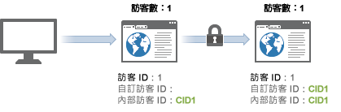

# 跨裝置訪客身份識別範例

>[!IMPORTANT]
>
>不建議您繼續使用這種跨裝置識別訪客的方法。 請參閱元件使用指南中的[跨裝置分析](/help/components/cda/overview.md)。

下列範例說明跨裝置訪客身份識別如何使用傳入常見客戶互動中的伺服器呼叫範例來運作。

| 伺服器呼叫 | 動作 | 訪客ID Cookie | 訪客ID變數 | 有效訪客ID | 造訪頁碼 | 訪問次數 |
|--- |--- |--- |--- |--- |--- |--- |
| 1 | 訪客按一下行銷電子郵件中的連結，從家用電腦造訪您的網站。 此訪客過去曾七次造訪您的網站。 | 1 | - | 1 | 1 | 8 |
| 2-8 | 造訪網站上的其他7個頁面。 | 1 | - | 1 | 2-8 | 8 |
| 9 | 在家用電腦上進行驗證。 | 1 | CID1 | CID1 | 9  (這是 CID1 的首次點擊，因此其會接管訪客 ID 1 的訪客輪廓並繼續進行)。 | 8 |
| 10 | 造訪1個額外頁面。 | 1 | CID1 | CID1 | 10 | 8 |
| 11 | 在辦公室從筆記型電腦開啟網站。 此訪客在使用此裝置之前未造訪過您的網站。 | 2 | - | 2 | 1 | 1 |
| 12 | 在筆記型電腦上進行驗證。 | 2 | CID1 | CID1 | 1 | 9 |
| 13 | 檢視1個額外頁面。 | 2 | CID1 | CID1 | 2 | 9 |

## 造訪計數

Analytics 會對出現點擊 (造訪頁面數等於 1) 的每次造訪進行計數。

使用上表，將新造訪計算了 4 次：分別於點擊 1、9、11 和 12。

## 訪客計數

Analytics 會將每個唯一的有效訪客 ID 計為不重複訪客。

使用上表，將新訪客計算了 3 次：分別於點擊 1、9 和 10。

使用跨裝置訪客身份識別功能時，看到的不重複訪客數可能會增加。 訪客的同一次造訪可能會計數兩次：一次是初次造訪時，另一次是使用者完成驗證時。

初次產生關聯後，造訪計數會恢復正常，因為訪客是透過瀏覽器 Cookie 產生關聯的。 若訪客稍後檢視了您的網站，然後進行驗證，訪客計數並不會不實膨脹，因為有效訪客 ID 在驗證之後並未變更。

識別不重複訪客時，請務必盡可能保持一致。 例如，使用者進行驗證時，請一律使用 `visitorID` 變數。
