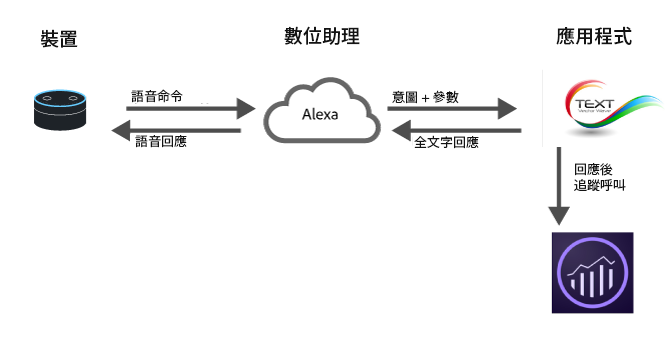

# 對數位助理實施 Analytics

由於近期雲端運算、機器學習和自然語言處理等領域突飛猛進，數位助理已成為日常生活的一部分。消費者開始與他們的裝置交談，期待裝置能像人一樣理解和回應。隨著這些平台變得愈加成熟，品牌便可以同樣真實與擬真的方式，向消費者展現其服務。舉例來說，消費者可能問這樣問：

* 「Alexa，我的車什麼時候需要換機油。」
* 「Cortana，我的支票帳戶餘額多少？」
* 「Siri，從我的銀行應用程式轉給小明 20 美元，付昨天的晚餐錢。」

本頁概略說明如何充分利用 Adobe Analytics，進而測量與最佳化這類體驗。

## 數位體驗架構概述



當今大多數的數位助理都按照類似的高階架構：

1. **裝置：**&#x200B;配備麥克風的裝置 (例如 Amazon Echo 或手機)，可讓使用者詢問問題。
1. **數位助理：**&#x200B;這個裝置再與提供數位助理技術支援的服務互動。這裡，語音被轉換成可為機器理解的意圖，進而剖析要求的詳細內容。只要理解了使用者的意圖，數位助理便將意圖和要求詳情傳遞給負責處理要求的應用程式。
1. **「應用程式」：**&#x200B;應用程式可指手機應用程式或語音應用程式。應用程式負責回應要求。應用程式向數位助理回應，而數位助理再向使用者回應。

## 適合實施 Analytics 的位置

其中一個最適合實施 Analytics 的位置是在應用程式內部。應用程式會從數位助理收到意圖和詳細資訊，然後判斷如何回應。

在執行要求期間，有兩個時機有助於將資料傳送至 Adobe Analytics。

1. 一是要求傳送至應用程式時。
1. 一是應用程式傳回回應後。

如果您只對記錄客戶行為感興趣，以便未來的最佳化作業，則在傳回回應後將要求傳送至 Adobe Analytics。這樣一來，您便擁有要求詳情和系統回應方式的完整內容。

## 新的安裝

有些數位助理會在有人安裝了新技術時 (尤其在該技術需要驗證時)，傳送通知給您。Adobe 建議您設定上下文資料變數 `a.InstallEvent=1`，以便傳送安裝事件。並非所有數位助理皆提供此功能，不過若有此功能，對於查看保留率很有幫助。以下程式碼範例中，安裝事件、安裝日期和 AppID 值皆有傳送至上下文資料變數。

```text
GET
/b/ss/examplersid1,examplersid2/1?vid=[UserID]&c.a.InstallEvent=1&c.a.InstallDate=2017-04-24&c.a.AppID=Spoofify1.0&c.OSType=Alexa&pageName=install
HTTP/1.1
Host:
<xref href="https://example.data.adobedc.net">
  example.data.adobedc.net
 Cache-Control: no-cache
</xref href="https:>
```

## 多個助理或多個應用程式

您的組織有可能需要在多個平台使用應用程式。最佳作法是在每個要求中納入應用程式 ID。這個變數可在 `a.AppID` 內容資料中加以設定。請遵照 `[AppName] [BundleVersion]` 格式，例如 Alexa 1.2 為 BigMac：

```text
GET /b/ss/examplersid1,examplersid2/1?vid=[UserID]&c.a.AppID=Spoofify1.0&c.a.Launches=1&c.Product=AmazonEcho&c.OSType=Alexa&pageName=install  HTTP/1.1
Host: example.data.adobedc.net
Cache-Control: no-cache
```

```text
GET /b/ss/examplersid1,examplersid2/1?vid=[UserID]&c.a.AppID=Spoofify2.0&c.a.Launches=1&c.Product=GoogleHome&c.OSType=Android&pageName=install  HTTP/1.1
Host: example.data.adobedc.net
Cache-Control: no-cache
```

## 使用者/訪客身分識別

Adobe Analytics 使用 [Adobe Experience Cloud Identity Service](https://experienceleague.adobe.com/docs/id-service/using/home.html?lang=zh-Hant) 來將使用時間內的互動連結在同一人身上。大部分數位助理都會傳回 `userID`，供您為不同使用者保留活動資訊。多數情況下，此值就是您當作唯一識別碼所傳遞的值。有些平台傳回的識別碼會超出允許的 100 個字元。在這些情況下，Adobe 建議您使用 MD5 或 Sha1 等標準雜湊演算法，將唯一識別碼雜湊成固定長度的值。

使用 ID 服務，您就能在對應不同裝置上的 ECID 時 (例如從網路對應到數位助理) 獲得最大的價值。如果您的應用程式是行動應用程式，請按照原樣使用 Experience Platform SDK，並使用 `setCustomerID` 方法傳送使用者 ID。不過，如果應用程式為服務，請使用服務提供的使用者 ID 做為 ECID，並在 `setCustomerID` 中進行設定。

```text
GET /b/ss/examplersid1,examplersid2/1?vid=[UserID]&pageName=[intent]  HTTP/1.1
Host: example.data.adobedc.net
Cache-Control: no-cache
```

## 工作階段

因為數位助理採對話方式運作，故通常具備作業階段的概念。例如：

**消費者:**「Ok Google，幫我叫台計程車」

**Google:**「沒問題，您希望在什麼時間搭車呢？」

**消費者:**「晚上八點半」

**Google：**「好主意，司機八點半會準時到達」

工作階段對於保留上下文資料十分重要，且有助於系統收集更多詳細資訊，讓數位助理更趨自然。若針對對話實施 Analytics，則在新工作階段開始，請執行兩項動作:

1. **存取 Audience Manager：**&#x200B;取得包含使用者的相關區段，這樣您便可自訂回應。(舉例來說，此人目前符合多管道折扣資格。)
2. **傳入新作業階段或啟動事件：**&#x200B;請在首次將回應傳入 Analytics 時納入啟動事件。通常可透過設定 `a.LaunchEvent=1` 的內容資料來傳送。

```text
GET /b/ss/examplersid1,examplersid2/1?vid=[UserID]&c.a.LaunchEvent=1&c.Intent=[intent]&pageName=[intent]  HTTP/1.1
Host: example.data.adobedc.net
Cache-Control: no-cache
```

## 意圖

每個數位助理都有演算法可偵測意圖，再將意圖傳遞至「應用程式」，讓應用程式知道要做哪些工作。這些意圖都以精簡方式表示要求。

例如，如果使用者說「Siri，從我的銀行應用程式轉給小明20美元，付昨天的晚餐錢。」目的可能類似&#x200B;*sendMoney*。

以 eVar 形式傳入各個要求，便能為對話型應用程式產生各個意圖的路徑報表。請確認您的應用程式也能處理不具意圖的要求。Adobe 建議您將「未指定意圖」傳遞至意圖內文資料變數，不要移除變數。

```text
GET /b/ss/examplersid1,examplersid2/1?vid=[UserID]&c.a.AppID=Penmo1.0&c.a.LaunchEvent=1&c.Intent=SendPayment&pageName=[intent]  HTTP/1.1
Host: example.sc.adobedc.net
Cache-Control: no-cache
```

或

```text
GET /b/ss/examplersid1,examplersid2/1?vid=[UserID]&c.a.AppID=Penmo1.0&c.a.LaunchEvent=1&c.Intent=No_Intent_Specified&pageName=[intent]  HTTP/1.1
Host: example.data.adobedc.net
Cache-Control: no-cache
```

## 參數/槽/實體

除了意圖之外，數位助理經常具備一組索引鍵/值配對，用於提供意圖的詳細資料。這組配對可稱為槽、實體或參數。舉例來說，「Siri，從我的銀行應用程式轉給小明 20 美元，付昨天的晚餐錢。」可能會具備下列參數：

* 人物 = 小明
* 數量 = 20
* 原因 = 晚餐

應用程式中，這些值的數量通常有限。若要在 Analytics 追蹤這些值，請將值傳入上下文資料變數，然後將各參數對應到 eVar。

```text
GET /b/ss/examplersid1,examplersid2/1?vid=[UserID]&c.a.AppID=Penmo1.0=1&c.a.LaunchEvent=1&c.Intent=SendPayment&c.Amount=20.00&c.Reason=Dinner&c.ReceivingPerson=John&c.Intent=SendPayment&pageName=[intent]  HTTP/1.1
Host: example.data.adobedc.net
Cache-Control: no-cache
```

## 錯誤狀態

有時數位助理所提供給應用程式的輸入值，會讓應用程式不確定要如何處理。舉例來說，「Siri，從我的銀行應用程式轉給小明 20 袋煤，付昨天的晚餐錢。」

發生這種情況時，應用程式會向您詢問明確指令。此外，系統會傳送資料到 Adobe，指出應用程式出現錯誤狀態，並附上 eVar，指定錯誤的類型。請務必將輸入值有誤的錯誤以及應用程式發生問題的錯誤皆納入其中。

```text
GET /b/ss/examplersid1,examplersid2/1?vid=[UserID]&c.a.AppID=Penmo1.0&c.Error=1&c.ErrorName=InvalidCurrency&pageName=[intent]  HTTP/1.1
Host: example.data.adobedc.net
Cache-Control: no-cache
```

## 裝置功能

雖然大部份的平台都不會公開使用者所對話的裝置，但是卻會公開裝置的功能，例如音訊、畫面、影片等。這項資訊很有幫助，因為它定義了與使用者互動時可以利用的內容類型。評估裝置功能時，最好將這些功能串連起來 (按字母排序)。

範例：`":Audio:Camera:Screen:Video:"`

開頭和結尾冒號對於建立區段很實用，例如顯示所有具有 `:Audio:` 功能的點擊。

* 使用 Amazon Alexa 的 [Amazon 功能](https://developer.amazon.com/public/solutions/alexa/alexa-skills-kit/docs/alexa-skills-kit-interface-reference)
* 使用 Actions on Google 的 [Google 功能](https://developers.google.com/actions/assistant/surface-capabilities)

## 範例

| 「人」 | 裝置回應 | 動作/意圖 | GET 要求 |
|---|---|---|---|
| 安裝 Spoofify | 無回應 | 安裝 | `GET /b/ss/examplersid1,examplersid2/1?vid=[UserID]&c.a.InstallEvent=1&c.a.InstallDate=[currentDate]&c.a.AppID=Spoofify1.0&c.OSType=Alexa&c.Intent=Install&pageName=Install  HTTP/1.1`<br>`Host: example.data.adobedc.net`<br>`Cache-Control: no-cache` |
| 播放 Spoofify | 「OK，播放 Spoofify」 | 播放 | `GET /b/ss/examplersid1,examplersid2/1?vid=[UserID]&c.a.AppID=Spoofify1.0&c.a.LaunchEvent=1&c.Intent=Play&pageName=PlayApp  HTTP/1.1`<br>`Host: example.data.adobedc.net`<br>`Cache-Control: no-cache` |
| 變換曲目 | 「OK，您要聽哪首歌？」 | ChangeSong | `GET /b/ss/examplersid1,examplersid2/1?vid=[UserID]&c.a.AppID=Spoofify1.0&c.Intent=ChangeSong&pageName= Ask%20For%20Song  HTTP/1.1`<br>`Host: example.data.adobedc.net`<br>`Cache-Control: no-cache` |
| 播放《Baby Shark》 | 「好的，播放 PinkFong 的《Baby Shark》」 | ChangeSong | `GET /b/ss/examplersid1,examplersid2/1?vid=[UserID]&c.a.AppID=Spoofify1.0&c.Intent=ChangeSong&pageName=Action%20Play%20Song&c.SongID=[012345]  HTTP/1.1`<br>`Host: example.data.adobedc.net`<br>`Cache-Control: no-cache` |
| 變換播放清單 | 「OK，您要聽哪個播放清單？」 | ChangePlaylist | `GET /b/ss/examplersid1,examplersid2/1?vid=[UserID]&c.a.AppID=Spoofify1.0&c.Intent=ChangePlaylist&pageName=Ask%20For%20Playlist  HTTP/1.1`<br>`Host: example.data.adobedc.net`<br>`Cache-Control: no-cache` |
| 播放我最愛的歌曲播放清單 | 「好的，播放您最愛的歌曲播放清單」 | ChangePlaylist | `GET /b/ss/examplersid1,examplersid2/1?vid=[UserID]&c.a.AppID=Spoofify1.0&c.Intent=ChangePlaylist&pageName=Action%20Play%20Playlist&c.Playlist=My%20Favorite%20Songs  HTTP/1.1`<br>`Host: example.data.adobedc.net`<br>`Cache-Control: no-cache` |
| 關閉音樂 | 無回應，音樂關閉 | 關閉 | `GET /b/ss/examplersid1,examplersid2/1?vid=[UserID]&c.a.AppID=Spoofify1.0&c.Intent=Off&pageName=Music%20Off  HTTP/1.1`<br>`Host: example.data.adobedc.net`<br>`Cache-Control: no-cache` |
