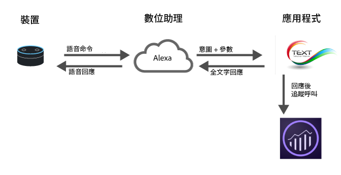

# 對數位助理實施 Analytics

隨著雲端運算、機器學習和自然語言處理技術的進步，數位助理已成為日常生活的一部分。 消費者與裝置交談並期待類似人類的回應，而品牌可以透過這些相同的體驗來展示其服務。 例如，消費者可能會問：

* 「Alexa，我的車需要換油時問我。」
* 「Google，我的支票帳戶餘額多少？」
* 「Siri，從我的銀行應用程式轉給小明 20 美元，付昨天的晚餐錢。」

本頁概略說明如何使用Adobe Analytics來測量及最佳化這些體驗型別。

## 數位體驗架構概觀



大多數的數位助理都遵循類似的高階架構：

1. **裝置**：配備麥克風的裝置（例如智慧型喇叭或手機），可讓使用者詢問問題。
1. **數位助理**：支援該助理的服務。 它將語音轉換為機器可理解的意圖並剖析請求的詳細資訊。 瞭解意圖後，助理就會將意圖和詳細資料傳遞至處理請求的應用程式。
1. **「應用程式」**：手機上的應用程式或回應要求的語音應用程式。 它會回應數位助理，然後再回應使用者。

## 如何將資料傳送至Adobe Analytics

數位助理應用程式通常會在沒有Adobe使用者端資料庫（AppMeasurement或Web SDK）的伺服器或平台上執行。 使用[資料插入API](https://developer.adobe.com/analytics-collection-apis/methods/data-insertion/)**傳送點選**&#x200B;伺服器端。 您想要測量的每個互動都會變成資料插入API要求，其查詢字串（或XML內文）會攜帶本頁所述的變數 — 通常是[內容資料變數](/help/implement/vars/page-vars/contextdata.md)，您會對應到具有[處理規則](/help/admin/tools/manage-rs/edit-settings/general/processing-rules/pr-overview.md)的eVars、props和事件。

此頁面主要說明&#x200B;*要測量的*&#x200B;專案以及如何在Analytics中建立模型。 如需端點、查詢字串和XML編碼、必要元件及回應型別，請參閱[資料插入API檔案](https://developer.adobe.com/analytics-collection-apis/methods/data-insertion/)。 以下命名的每個變數都對應到[變數參考](https://developer.adobe.com/analytics-collection-apis/methods/data-insertion/variable-reference)中的查詢字串引數和XML標籤。

## 在何處實施Analytics

實施Analytics的最佳位置之一是應用程式，可從數位助理接收意圖和詳細資訊，並決定如何回應。 請求期間有兩個時機有助於將資料傳送至Adobe Analytics：

1. 一是要求傳送至應用程式時。
1. 一是應用程式傳回回應後。

如果您有興趣記錄未來最佳化所發生的事情，請在傳回回應後傳送點選 — 您接著就會有請求的完整內容，以及系統如何回應。

## 測量內容

### 新的安裝

對於有人安裝技能時通知您的助理（特別是涉及驗證時），請設定內容資料變數`a.InstallEvent=1`以及`a.InstallDate`和應用程式ID (`a.AppID`)來傳送安裝事件。 並非每個平台都提供這項功能，但若有的話，對於保留率分析很有用。

### 多個助理或應用程式

組織通常會為多個平台建置應用程式。 在`a.AppID`內容資料變數中的每個要求上加入應用程式識別碼，使用格式`[AppName] [BundleVersion]` （例如`Spoofify 1.0`）。 新增平台或OS內容資料變數（例如`OSType`），以便在報告中區分Alexa、Google Assistant和其他平台。

### 訪客身分識別

Adobe Analytics使用[Adobe訪客ID服務](https://experienceleague.adobe.com/tw/en/docs/id-service/using/home)，將一段時間的互動連結至同一個人員。 大多數數位助理會傳回`userID`，您可將其當做唯一識別碼使用 — 將它當做訪客ID覆寫(`vid`)傳遞。 有些平台傳回的識別碼會超過允許的100個字元；在這種情況下，請使用標準演演算法（例如MD5或SHA-1）將其雜湊為固定長度的值。

使用訪客ID服務，您就能在對應跨裝置的ECID （例如從網路對應到數位助理）時，獲得最大的價值。 如果您的應用程式是行動應用程式，請使用Experience Platform Mobile SDK，並透過`setCustomerID`方法傳送使用者ID。 如果您的應用程式為服務，請使用服務提供的使用者ID做為訪客ID，並使用`setCustomerID`進行設定。 如需如何在伺服器端要求上設定識別碼，請參閱使用資料插入API的[訪客識別](../id/data-insertion.md)。

### 工作階段

由於數位助理善於交談，因此他們通常具備工作階段的概念（多圈交換）。 新工作階段開始時，Adobe會建議兩件事：

1. **請聯絡Audience Manager**&#x200B;以取得使用者所屬的區段，這樣您就可以自訂回應。
1. **設定內容資料變數`a.LaunchEvent=1`，以第一個回應傳送啟動事件**。

### 意圖

每個助理都會偵測意圖，並將其傳遞至應用程式。 意圖是請求的簡潔表示 — 例如，「Siri，從我的銀行應用程式轉給小明20美元，付昨天的晚餐錢。」可能會解析為意圖&#x200B;*sendMoney*。 將每個意圖傳送至上下文資料變數，以便您對應至eVar，進而跨意圖執行路徑報表。 請確認您的應用程式也能處理不具意圖的要求；Adobe建議您傳送`No Intent Specified`而非省略變數。

### 引數、槽和實體

除了意圖之外，助理通常會提供請求的索引鍵/值詳細資訊（稱為槽、實體或引數）。 針對「Siri，付小明20美元一頓昨天的晚餐」，引數可能是：

* 誰=約翰
* 金額= 20
* 為什麼=晚餐

每個應用程式通常會有這些的有限集合。 將其傳送至內容資料變數，並將每個變數對應至eVar。

### 錯誤狀態

有時助理會傳遞應用程式無法處理的輸入專案（例如「Siri，從我的銀行應用程式傳送20袋煤」）。 發生此情況時，請您的應用程式要求澄清並傳送指出錯誤狀態的資料 — 設定`a.Error=1`以及指定錯誤型別的eVar。 包括輸入無效的錯誤和應用程式本身發生問題的錯誤。

### 裝置功能

雖然大多數平台不會公開確切的裝置，但會公開其功能（例如音訊、畫面或視訊），而這些功能會定義您可以使用的內容型別。 在測量裝置功能時，請依字母順序以開頭和結尾冒號（例如`":Audio:Camera:Screen:Video:"`）將它們串連，以便您可以建置區段，例如「具有`:Audio:`功能的所有點選」。

* [Amazon Alexa介面參考](https://developer.amazon.com/public/solutions/alexa/alexa-skills-kit/docs/alexa-skills-kit-interface-reference)
* [Google Assistant表面功能](https://developers.google.com/actions/assistant/surface-capabilities)

## 範例請求

下列資料插入API GET要求會記錄銀行應用程式的&#x200B;*SendPayment*&#x200B;意圖，將應用程式ID、啟動事件、意圖和位置值設定為內容資料：

```text
GET /b/ss/examplersid1,examplersid2/1?vid=[UserID]&c.a.AppID=Penmo%201.0&c.a.LaunchEvent=1&c.Intent=SendPayment&c.Amount=20.00&c.Reason=Dinner&c.ReceivingPerson=John&pageName=SendPayment HTTP/1.1
Host: example.data.adobedc.net
```

如需完整的請求格式、端點和回應型別，請參閱[資料插入API檔案](https://developer.adobe.com/analytics-collection-apis/methods/data-insertion/request)。

## 測量模型範例

下表顯示音樂應用程式中的常見動作如何對應至Analytics變數。 在每個資料插入API請求上，將這些變數設為內容資料變數，然後使用處理規則將其對應至eVar和事件。

| 個人動作 | 意圖/事件 | 要設定的內容資料 |
| --- | --- | --- |
| 安裝應用程式 | 安裝 | `a.InstallEvent=1`, `a.InstallDate`, `a.AppID`, `OSType` |
| 啟動應用程式 | Launch | `a.LaunchEvent=1`, `a.AppID`, `Intent=Play` |
| 要求變更歌曲 | ChangeSong | `a.AppID`, `Intent=ChangeSong` |
| 播放特定歌曲 | ChangeSong | `a.AppID`, `Intent=ChangeSong`, `SongID` |
| 變更播放清單 | ChangePlaylist | `a.AppID`, `Intent=ChangePlaylist`, `Playlist` |
| 遇到無效的輸入 | （錯誤） | `a.Error=1`, `ErrorName` |
