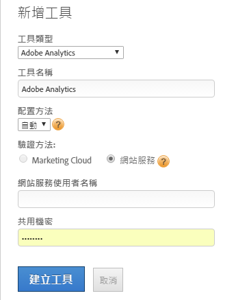

# 新增 Adobe Analytics 工具

您可以藉由建立 Adobe Analytics 工具並自動或手動設定頁面程式碼，使用 Dynamic Tag Management 來部署 Adobe Analytics。建議大多數使用者採用自動方法。

> [!NOTE] 為改善訪客追蹤，強烈建議您啟用 [Identity Service](https://marketing.adobe.com/resources/help/zh_TW/mcvid/)。

## 新增 Adobe Analytics 工具 {#section_D5066B21581B4F7F811AD0027BF44EA5}

1. 按一下 **[!UICONTROL *`Web Property Name`*]**>**[!UICONTROL &#x200B;概覽&#x200B;]**>**[!UICONTROL &#x200B;新增工具&#x200B;]**>**[!UICONTROL  Adobe Analytics ]**。

   

1. 填寫欄位：

<table id="table_1CFB53FE72E74CCB8CAA5D4E3873D286"> 
 <thead> 
  <tr> 
   <th colname="col1" class="entry"> 元素 </th> 
   <th colname="col2" class="entry"> 說明 </th> 
  </tr> 
 </thead>
 <tbody> 
  <tr> 
   <td colname="col1"> 
工具類型 
 </td> 
   <td colname="col2">工具的類型，例如 Adobe Analytics。 </td> 
  </tr> 
  <tr> 
   <td colname="col1"> 
工具名稱 
 </td> 
   <td colname="col2">此工具的描述性名稱。此名稱會顯示「概述」標籤的「已安裝工具」下。 </td> 
  </tr> 
  <tr> 
   <td colname="col1" morerows="1"> 
配置方法 
 </td> 
   <td colname="col2"> 
 <b>自動</b> (建議)：使用動態標籤管理來管理配置。此方法可讓您透過 Experience Cloud 登入或 Web 服務 ID 來自動同步 Adobe Analytics 報表套裝，並管理 AppMeasurement 程式碼。 
 
帳戶連線之後，Dynamic Tag Management 會將 Adobe Analytics 報表套裝 ID 和名稱提取至工具設定介面，讓工具部署的速度增加，並降低使用者錯誤的可能性。 
 
 
注意：如果您是 Adobe Analytics Premium 客戶，則必須選擇自動選項。 
 
 
填寫自動配置的特定欄位： 
 
    <ul id="ul_8D9797B01E444B9C85B862A9F96B447C"> 
     <li id="li_0AC84C1F37B24C658F2178E50ECCC4B0"> 
 <b>Experience Cloud</b>：(預設) 使用 Experience Cloud 單一登入。指定 Experience Cloud ID 和密碼。 
 </li> 
     <li id="li_6C80468835D04CC09F4AEC46D1300310"> 
<b>網站服務</b>：指定您的網站服務使用者名稱和共用機密。 
 
共用機密憑證位於「管理員 &gt; 公司設定 &gt; <a href="https://docs.adobe.com/content/help/zh-Hant/analytics/admin/company-settings/web-services-admin.html">網站服務」</a>中。 
 
開發人員請參閱<a href="https://marketing.adobe.com/developer/zh_TW/get-started/enterprise-api/c-get-web-service-access-to-the-enterprise-api">取得企業 API 的網站服務存取權限</a>，以獲得取得網站服務憑證的說明。 
 </li> 
    </ul> </td> 
  </tr> 
  <tr> 
   <td colname="col2"> 
 <b>手動</b>：手動管理 AppMeasurement 程式碼。您可以從「管理工具 &gt; 代碼管理員」下載 Analytics AppMeasurement 程式碼。 
 
如需如何在本機下載程式碼以複製並貼到<a href="/help/implement/other/dtm/c-aa-tool/library-management.md">程式庫管理</a>中編輯程式碼欄位的相關資訊，請按一下 <a href="https://marketing.adobe.com/resources/help/en_US/sc/implement/appmeasure_mjs.html">JavaScript (新增)</a>。 
 
填寫手動配置的特定欄位: 
 
    <ul id="ul_CFB6CE78AEB743EF8B47BAAC42E2DB0A"> 
     <li id="li_5B7046CD95AB416F8C113B381A264D91"> 
<b>生產帳戶 ID：</b>(必要) 您用於資料彙集的生產帳戶。對於 Analytics，這是您的報表套裝 ID。Dynamic Tag Management 會自動在生產與中繼環境中安裝正確的帳戶。 
 </li> 
     <li id="li_14E840FD79A0451BABEDD15DC0584768"> 
<b>測試帳戶 ID：</b>(必要) 用於您的開發或測試環境。對於 Analytics，這是您的報表套裝 ID。中繼帳戶可讓您將測試資料與生產資料分開。 
 </li> 
     <li id="li_69E6C6A41F5240E1ABE8ABE0B9D151FC"> 
<b> 追蹤伺服器：</b>指定追蹤伺服器的資訊。 
 
追蹤伺服器和 SSL 追蹤伺服器變數用於第一方 Cookie 實施，以指定影像要求和 Cookie 寫入所在的網域。如需詳細資訊，請參閱<a href="https://helpx.adobe.com/tw/analytics/kb/determining-data-center.html">正確填入 trackingServer 和 trackingServerSecure 變數</a>一文。 
 </li> 
     <li id="li_1A7271C68205428F8CA5548A96CACBEC"> 
<b>SSL 追蹤伺服器：</b>指定 SSL 追蹤伺服器的資訊。 
 </li> 
    </ul> </td> 
  </tr> 
 </tbody> 
</table>

1. 按一下&#x200B;**[!UICONTROL 「建立工具」]**&#x200B;來建立工具，並顯示它以便進行編輯。

   工具會顯示在[!UICONTROL 「概述」]標籤的[!UICONTROL 「已安裝工具」]下。

1. (有條件) 視需要進一步配置工具，方法是遵循以下連結中的指示：[!UICONTROL 「一般] > [!UICONTROL 程式庫管理] > [!UICONTROL 全域變數] > [!UICONTROL 頁面檢視與內容] > [!UICONTROL 連結追蹤] > [!UICONTROL 反向連結與促銷活動] > [!UICONTROL Cookie] > [!UICONTROL 自訂頁面程式碼」]。

如需此工具的其他相關資訊，請參閱[Adobe Analytics 工具常見問答集](/help/implement/faq.md)。

## 編輯現有的 Adobe Analytics 工具 {#section_148B16AF429B4949B06238D90635B726}

您可以編輯現有的 Adobe Analytics 工具以變更其配置設定。

1. 在概述[!UICONTROL  標籤中按一下已安裝工具旁的 ] 圖示。
1. 視需要編輯欄位。

   下表僅包含與您建立 Analytics 工具時可用的元素不同的那些元素，如以上所述。不過，您可以變更頁面上的任何元素，如這兩個表格中所述。

<table id="table_2B60CD109CFF4839AB7F91D61125EDFF"> 
 <thead> 
  <tr> 
   <th colname="col1" class="entry"> 元素 </th> 
   <th colname="col2" class="entry"> 說明 </th> 
  </tr> 
 </thead>
 <tbody> 
  <tr> 
   <td colname="col1"> 
啟用自動配置 
 </td> 
   <td colname="col2"> 
啟用此設定會將手動配置實施變更為自動設定方法，如設定方法所述。 
 
此選項允許 Dynamic Tag Management 自動擷取您 Adobe Analytics 帳戶的設定。 
 
會使用最新可用的 AppMeasurement 程式碼，並在新版本可用時顯示升級通知以供選擇。如有需要 (例如基於相容性原因)，您也可以復原到先前的 AppMeasurement 版本。最多會顯示五個先前的版本。 
 </td> 
  </tr> 
  <tr> 
   <td colname="col1"> 
更新憑證 
 </td> 
   <td colname="col2"> 
重新整理 API，例如，將報表套裝更新為與使用者產生關聯。 
 </td> 
  </tr> 
 </tbody> 
</table>

1. (有條件) 視需要進一步配置工具，方法是遵循以下連結中的指示：[!UICONTROL 「一般] > [!UICONTROL 程式庫管理] > [!UICONTROL 全域變數] > [!UICONTROL 頁面檢視與內容] > [!UICONTROL 連結追蹤] > [!UICONTROL 反向連結與促銷活動] > [!UICONTROL Cookie] > [!UICONTROL 自訂頁面程式碼」]。
1. 按一下&#x200B;**[!UICONTROL 儲存變更]**。
