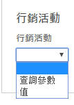

# 反向連結與促銷活動

在 Adobe [!DNL Analytics] 中部署 [!UICONTROL Dynamic Tag Management] 時，[!UICONTROL Dynamic Tag Management] 中用於反向連結與促銷活動選項的欄位說明。

**[!UICONTROL *`Property`*]**>**[!UICONTROL &#x200B;編輯工具&#x200B;]**>**[!UICONTROL &#x200B;反向連結與促銷活動&#x200B;]**

<table id="table_09AE3BFF0F12442F9C19CD96451F93E4">
 <thead>
  <tr>
   <th colname="col1" class="entry"> 元素 </th>
   <th colname="col2" class="entry"> 說明 </th>
  </tr>
 </thead>
 <tbody>
  <tr>
   <td colname="col1"> 反向連結覆寫 </td>
   <td colname="col2"> 
覆寫 s.referrer 變數中所設定的值，該變數通常是由瀏覽器中設定的反向連結填入。 
 
請參閱 [referrer](../../../vars/page-vars/referrer.md)。 
 </td>
  </tr>
  <tr>
   <td colname="col1"> 促銷活動 </td>
   <td colname="col2"> 
變數，可識別用以吸引訪客進入網站的促銷活動。促銷活動的值通常取自查詢字串參數。 
 
請參閱 [campaign](../../../vars/page-vars/campaign.md)。 
 </td>
  </tr>
 </tbody>
</table>

使用 DTM 介面來選擇您要使用查詢字串或值 (可能從資料元素提取):

您可以在介面中輸入您的查詢字串，或是如果您有追蹤促銷活動的其他方法，則可以參考個別的資料元素。
