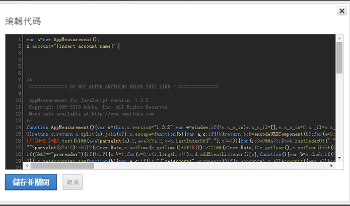

# 插入核心 AppMeasurement 代碼

在 Adobe Analytics 中手動部署動態標籤管理時插入 AppMeasurement 代碼。

1. 在 [!DNL Adobe Analytics] 工具頁面上，展開&#x200B;**[!UICONTROL 一般]**區段，然後按一下**[!UICONTROL &#x200B;開啟編輯器]**。
1. 在[部署 Adobe Analytics](/help/implement/other/dtm/t-analytics-deploy.md)中，將您下載的 [!DNL AppMeasurement_JavaScript*.zip] 檔案解壓縮。

   如果您選擇使用自訂程式庫，當您開啟視窗，該視窗即會顯示最新的代碼版本。不需從管理主控台下載 zip。
1. 在文字編輯器中開啟 [!DNL AppMeasurement.js]。
1. 將內容複製並貼到&#x200B;**[!UICONTROL 編輯程式碼]**視窗中。

   

1. Adobe 建議在此區段上新增下列代碼 *`Do Not Alter Anything Below This Line`*:

   ```
   var s_account="INSERT-RSID-HERE"
   var s=s_gi(s_account)
   ```

   >[!IMPORTANT]
   >
   >如果您新增此程式碼，建議您也在整體程式庫設定中選取&#x200B;**[!UICONTROL 使用以下的自訂程式碼設定報表套裝]**核取方塊。

1. 按一下&#x200B;**[!UICONTROL 儲存並關閉]**。

   如果您要使用媒體模組、整合模組或實施外掛程式，也可以將之複製到代碼區域。動態標籤管理中的受管理代碼完全可以像傳統實施中的 JavaScript 檔案一樣來設定。

