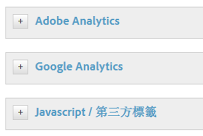
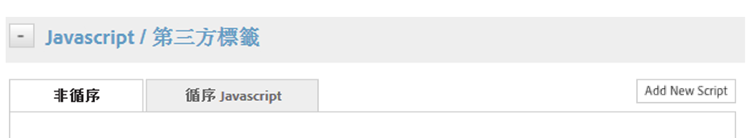
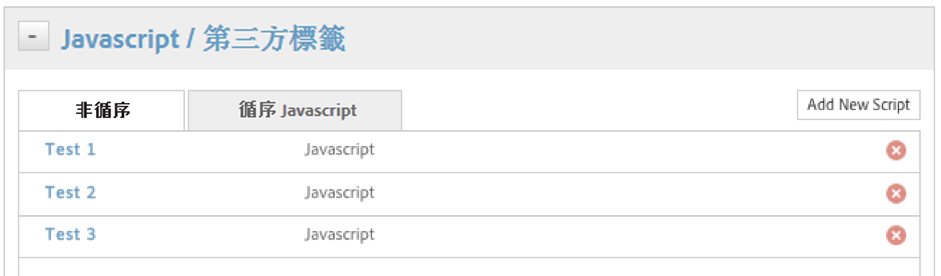

# 設定條件要觸發的動作

設定您要條件觸發的動作。

設定條件之後，您必須設定要條件觸發的動作。這些動作包括 [!DNL Analytics] 事件、第三方標籤及自訂指令碼。此範例說明如何設定指令碼或第三方標籤。

除了已整合的工具 (如 [!DNL Adobe Analytics] 和 Google Analytics)，Dynamic Tag Management 還可以在選取頁面或特定藍本中，觸發任何類型的 JavaScript 或將 HTML 插入網站。

每個規則可依需要觸發任意數目的指令碼或 HTML 插入。

> [!NOTE] 由於 DTM 可讓您將自訂程式碼插入頁面中，請注意不要在當中建立跨網站指令碼 (XSS) 漏洞 (如需詳細資訊，請參閱 [OWASP 的指南](https://www.owasp.org/index.php/Cross-site_Scripting_(XSS)))。在指令碼內使用資料元素需要特別注意。一律假設資料元素值可能來自未受信任的來源。

**設定條件要觸發的動作**

1. 按一下 **[!UICONTROL JavaScript / 第三方標籤]**，以將指令碼新增至規則。

   

1. 按一下&#x200B;**[!UICONTROL 新增指令碼]**。

   

1. 為指令碼命名。
1. 指定您要如何觸發指令碼，並將所需內容貼到文字區域中。

1. 按一下&#x200B;**[!UICONTROL 儲存程式碼]**，如此便會將指令碼新增至規則的佇列中。

