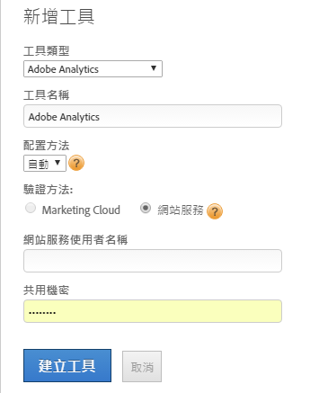

# 手動實施 Adobe Analytics (舊版)

使用 [!UICONTROL Dynamic Tag Management] 建立用於部署的 Adobe Analytics 工具。此程序說明手動 (舊版) 實施方式。

如需自動實施管理的更多資訊，請參閱[新增 Adobe Analytics 工具](/help/implement/other/dtm/c-aa-tool/analytics-dtm.md)。

如果您想要將手動配置變更為自動，請編輯工具並按一下&#x200B;**[!UICONTROL 啟用自動配置]**。

1. 下載 Analytics 測量代碼：
   1. 在 Analytics 中，按一下&#x200B;**[!UICONTROL 「管理員****> 代碼管理器」]**。
   1. 按一下 **[!UICONTROL JavaScript (新)]** 將程式碼下載到本機。
1. 在 [!UICONTROL Dynamic Tag Management] 中，[建立 Web 屬性](/help/implement/other/dtm/t-create-web-property.md)。

   

   建立 Web 屬性之後，您便可在[!UICONTROL 控制面板]的[!UICONTROL Web 屬性]標籤上加以編輯。不需要啟動 Web 屬性。

1. 將「Analytics」工具新增至屬性:
   1. 在 **[!UICONTROL Web 屬性]**&#x200B;標籤上按一下「屬性」。
   1. 在&#x200B;**[!UICONTROL 概覽]**&#x200B;標籤上按一下&#x200B;**[!UICONTROL 「新增工具」]**。
   1. 從&#x200B;**[!UICONTROL 工具類型]**&#x200B;功能表中選取 **[!UICONTROL Adobe Analytics]**。

      

   1. 設定下列欄位:

      | 元素 | 說明 |
      |---|---|
      | 工具類型 | Experience Cloud 解決方案，例如 Analytics、Target、Social 等。 |
      | 工具名稱 | 此工具的名稱。此名稱會顯示在[!UICONTROL 「已安裝工具」]下的[!UICONTROL 概述]標籤上。 |
      | 生產帳戶 ID | 進行資料收集時，您要使用之生產帳戶的代表數字。Dynamic Tag Management 會自動在生產與中繼環境中安裝正確的帳戶。 |
      | 測試帳戶 ID | 在開發或測試環境中使用的數字。中繼帳戶可讓您將測試資料與生產資料分開。 |

1. 按一下&#x200B;**[!UICONTROL 建立工具]**。

   已安裝的工具便會顯示在[!UICONTROL 概述]標籤上。

1. 若要設定此程式碼，按一下&#x200B;**[!UICONTROL 設定]** ()。

   至少按一下 **[!UICONTROL Cookie]**，然後設定您的追蹤伺服器和 SSL 追蹤伺服器。

1. 按一下&#x200B;**[!UICONTROL 一般]**&#x200B;和[插入核心 AppMeasurement 程式碼](/help/implement/other/dtm/c-aa-tool/t-appmeasurement-code.md)。
1. 定義[頁面載入規則](/help/implement/other/dtm/c-rules/t-rules-create.md)以收集 [!DNL Analytics] 資料。

   您現在可以開始定義規則以收集分析資料。您可能需要先定義幾個資料元素。有了資料元素，您便可擷取頁面中的資料，以便用來設定規則。若要開始，您可以定義一個不含任何條件的頁面載入規則，以便收集每個頁面上的 [!DNL Analytics] 資料。
1. [在內嵌標籤上新增頁首與頁尾代碼](/help/implement/other/dtm/c-headers-footers/t-header-footer-code.md)。

   在測試環境中，您可以保留預設的 Amazon 託管選項。在首度發行到生產環境之前，您可以視需要變更此選項。
1. (選用) 按一下選項標籤上的&#x200B;**[!UICONTROL 「設定」]** ，然後設定 Adobe Analytics 程式碼。

   >[!NOTE]
   >
   >[!UICONTROL Adobe Analytics] 頁面上的設定 (一般、Cookie 等等) 會覆寫您在 `s_code` 中的設定。如果您的 `s_code` 中已有這些設定存在，則無需在此處重申。

