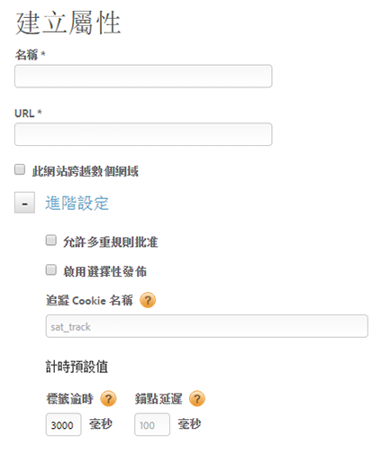

# 建立 Web 屬性

Web 屬性可為一或多個具備規則資料庫 (包含在內嵌代碼中) 之網域和子網域的任意分組。

> [!NOTE]只有具備管理員權利的使用者才能建立屬性。如需角色的相關詳細資訊，請參閱 Dynamic Tag Management 產品文件中的[在 DTM 中建立及管理群組](https://marketing.adobe.com/resources/help/zh_TW/dtm/groups.html)。

您可以透過 DTM 管理及追蹤這些資產。例如，假設您有多個網站是根據同一個範本，且想要追蹤這所有網站上的相同資產。您可以將一個 Web 屬性套用到多個網域。

如需有關 Web 屬性和最佳實務的一般資訊，請參閱Dynamic Tag Management 產品文件中的 [Web 屬性](https://marketing.adobe.com/resources/help/zh_TW/dtm/web_property.html)。

1. 導覽至您的公司頁面，然後按一下&#x200B;**[!UICONTROL 新增屬性]**。

   

1. 填寫欄位：

   <table id="table_376D72251C4D4C4CA878D10C18D2532C"> 
    <thead> 
    <tr> 
    <th colname="col1" class="entry"> 元素 </th> 
    <th colname="col2" class="entry"> 說明 </th> 
    </tr> 
    </thead>
    <tbody> 
    <tr> 
    <td colname="col1">  名稱 </td> 
    <td colname="col2"> 
屬性的名稱。 
 </td> 
    </tr> 
    <tr> 
    <td colname="col1">  URL </td> 
    <td colname="col2"> 
屬性的基礎 URL。 
 </td> 
    </tr> 
    <tr> 
    <td colname="col1">  此網站涵蓋多個網域  </td> 
    <td colname="col2"> 
如果您要保存網域之間的訪客資料，您可以新增與移除網域。若選取此選項，則造訪的資料會在保存在子網域之間。 
 
此設定可讓您指定如何追蹤流量在關聯的子網域或網域間的移動。系統會將子網域的連結視為對外連結。系統會個別追蹤子網域的造訪。 
 </td> 
    </tr> 
    </tbody> 
    </table>

1. (可選) 設定[!UICONTROL 進階設定]。

   <table id="table_6E687FBE6ACC4301BCCD837F4DCBB9C9"> 
    <thead> 
    <tr> 
    <th colname="col1" class="entry"> 元素 </th> 
    <th colname="col2" class="entry"> 說明 </th> 
    </tr> 
    </thead>
    <tbody> 
    <tr> 
    <td colname="col1">  允許多重規則批准 </td> 
    <td colname="col2"> 
允許一次批准此屬性的多個規則。預設僅允許批准單一規則。 
 </td> 
    </tr> 
    <tr> 
    <td colname="col1">  啟用選擇性發佈 </td> 
    <td colname="col2"> 
指定是否允許使用者選取已發佈的批准規則。此為預設選項。 
 </td> 
    </tr> 
    <tr> 
    <td colname="col1">  追蹤 Cookie 名稱 </td> 
    <td colname="col2"> 
覆寫預設的追蹤 Cookie 名稱。您可以自訂 Dynamic Tag Management 在追蹤您對於接收其他 Cookie 的意願狀態時，所使用的名稱。 
 </td> 
    </tr> 
    <tr> 
    <td colname="col1">  標籤逾時 </td> 
    <td colname="col2"> 
指定逾時和取消標籤要求前，Dynamic Tag Management 等待標籤引發的時間長度。 
 
 由於 Dynamic Tag Management 的運作方式，無須擔心這會是很高的數字。DTM 具有確保緩慢標籤不會影響到使用者體驗的有效方法。 
 </td> 
    </tr> 
    <tr> 
    <td colname="col1">  錨點延遲 </td> 
    <td colname="col2"> 
指定在移到下一頁之前，Dynamic Tag Management 會等待標籤在已點按連結上引發的時間長度。預設值為 100 毫秒。 
 
較長的延遲可改善追蹤準確性。Adobe 建議使用 500 毫秒或以內的延遲，使用者對此時間長度不會有感覺。 
 
Dynamic Tag Management 將等候到指定的時間，但如果信標引發更快速，則會將延遲縮短。(也就是說，使用者不會一律等候到延遲的完整時間長度。) 
 </td> 
    </tr> 
    </tbody> 
    </table>

1. 按一下&#x200B;**[!UICONTROL 建立屬性]**。
