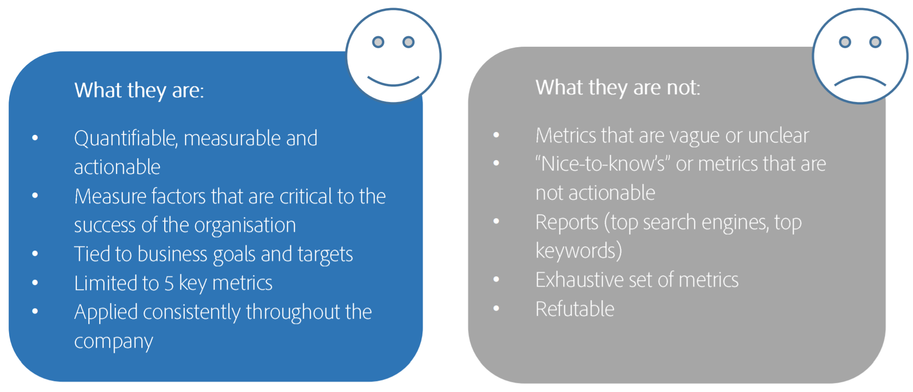

# 定義您的前 5 大 KPI

您根本無法衡量所有事情，如果優先考慮測量對業務最重要的事情，您的Adobe Analytics實施將會是最成功的作業。 與您的業務負責人合作，定義對您的業務最有影響的關鍵績效指標 (KPI)。 然後集中一切在支持這些 KPI 的度量和變數上。

## &#x200B;1. 瞭解您的業務目標

首先了解業務目標，這樣您便可以選擇對業務最重要的 5 大 KPI。 這些 KPI 可以是營收之類的量度、單次造訪收入等計算量度；量度中也可以使用變數。 不要隨便從其他公司或業界標準複製KPI — 這些可能不會符合您的業務目標。

## &#x200B;2. 提出重要問題

自問：如果我的執行總裁被困在島上，你可以告訴她有關業務健全的 5 件事，那些事情會是什麼？ 如果您告訴她，您花在網頁上的平均時間是1:30，這對她完全沒有幫助。 但是，如果您告訴她，您的每次瀏覽平均收入是 2.00 美元，且您有 200 萬瀏覽次數，這可為她提供業務成功的真實指標。

## &#x200B;3. 記住KPI是什麼且不是什麼

## &#x200B;4. 定義您的KPI

填寫您自己的圖表，類似於這個：

| 業務目標 | 度量和維度 |
| --- | --- |
| 通過數位頻道增加銷售額 | 每次瀏覽的收入 |
| 提升品牌認知度 | 訪客 |
| 推動更深層次和更持久的客戶關係 | 登入數、點擊數 |
| 網站轉換 | CTA 點按數/總頁面檢視 |
| 網站參與度 | 每位不重複訪客的頁面檢視次數、平均訪客的網站逗留時間 |

## &#x200B;5. 定期審視您的KPI

至少每六個月重新整理一次您的 KPI - 記住，業務需求會經常變化！
