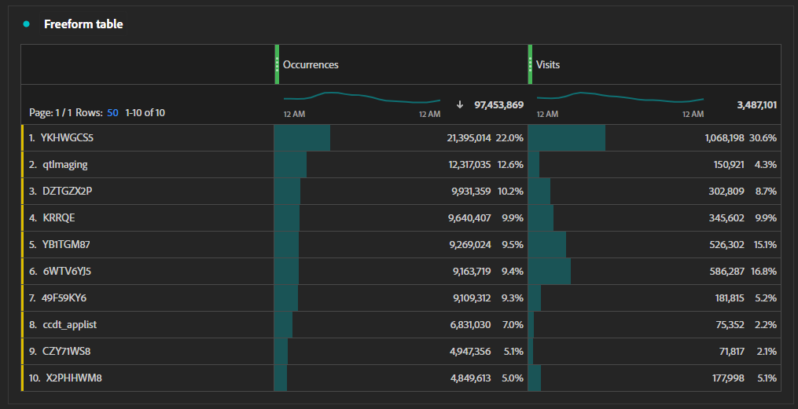

# 行銷活動追蹤工作流程

如果貴組織想要追蹤行銷工作的績效和點進率，您可以使用下列程式。 以下每個步驟都有專屬章節，其中包含更多詳細資訊。

1. [建立追蹤程式碼產生程式](#establish-a-tracking-code-generation-process)
1. [將所需的追蹤代碼新增至電子郵件](#add-the-desired-tracking-code-to-the-email)
1. [設定或調整您的Adobe Analytics實作，加入追蹤程式碼資料](#include-campaign-variables-in-your-implementation)
1. [在Analysis Workspace中檢視報表](#view-the-reports-in-analysis-workspace)

[Adobe Campaign](https://business.adobe.com/products/campaign/adobe-campaign.html) 有助於簡化這些步驟，讓行銷工作發揮最大效益。 如需詳細資訊，請連絡您的Adobe銷售代表。

## 建立追蹤程式碼產生程式

每個組織對追蹤程式碼的需求都不同。 有些組織可能有最少的需求，而手動建立的追蹤代碼已足夠。 其他組織可能想要對追蹤有更多控制權，並且已部署多個系統以建立所需的追蹤代碼。 如果貴組織除了使用Adobe Analytics以外還使用Google Analytics，則貴組織可能已有 `utm` 建立追蹤程式碼模型。

無論您選擇如何建立或產生追蹤代碼，只要部署一致的系統，貴組織就能更輕鬆地將追蹤代碼群組在一起以製作報表。 一致的結構化追蹤程式碼可讓您建立 [分類規則](/help/components/classifications/crb/classification-rule-builder.md) 這樣你就能對分類表現有所了解。

## 將所需的追蹤程式碼新增至URL

一旦您擁有所需的追蹤代碼值，就可以將其新增至您線上張貼的任何連結，例如廣告、社交媒體或電子郵件。 新增這些追蹤程式碼通常會發生在連結的查詢字串中。 您使用的查詢字串參數取決於貴組織的追蹤需求；常見的查詢字串參數為 `cid` （促銷活動ID的簡稱）。 有些組織也使用Google Analytics，可能已有多個促銷活動查詢字串參數，例如 `utm_source`, `utm_medium`、等。

將查詢字串新增至電子郵件中的連結看起來類似下列：

```text
https://example.com?cid=EM989027
```

## 在實作中加入促銷活動變數

Adobe Analytics [追蹤程式碼](/help/components/dimensions/tracking-code.md) 維度，您可使用此維度測量組織內的各種行銷工作。 不過，不同的組織可能有不同的追蹤需求。 請務必參考貴組織的 [解決方案設計檔案](../prepare/solution-design.md) 以一致地追蹤正確變數中的正確值。

如果貴組織尚未設定促銷活動追蹤，您可以調整實施以設定 [`campaign`](/help/implement/vars/page-vars/campaign.md) 變數。 請參閱 [`getQueryParam`](/help/implement/vars/plugins/getqueryparam.md) 方法，了解如何收集組織實施特有的查詢字串參數值。

如果貴組織收集 `utm` 查詢字串，您可以選擇下列任一項：

* 全部傳送 `utm` 以串連值的形式將查詢字串輸入「追蹤代碼」維度中。 然後，您就可以使用 [分類規則](/help/components/classifications/crb/classification-rule-builder.md) 建立以 `utm` 參數。 此方法的學習曲線較為複雜，但不使用任何額外的eVar。
* 傳送 `utm` 查詢字串 [eVar](/help/components/dimensions/evar.md). 此方法整體實作較為簡單，但需要使用額外的eVar。

## 在Analysis Workspace中檢視報表

在您正確設定實施以收集追蹤程式碼資料後，即可在Analysis Workspace中檢視報表。

1. 登入 [Adobe Experience Cloud](https://experience.adobe.com) 選取 [!UICONTROL Adobe Analytics].
1. 建立 [工作區專案](/help/analyze/analysis-workspace/build-workspace-project/freeform-overview.md).
1. 在左側的元件清單中，拖曳 [追蹤程式碼](/help/components/dimensions/tracking-code.md) 維度。
1. 拖曳所需的量度，例如 [瀏覽](/help/components/metrics/visits.md) 或 [訂購](/help/components/metrics/orders.md) 右側。


