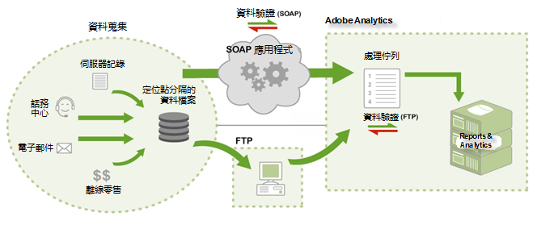

# 資料來源運作方式

關於如何使用 Adobe 的資料來源的資訊。

> [!NOTE] 透過「資料來源」提交後，匯入的資料與您透過其他方法方法 (如 JavaScript、ActionSource、資料插入 API 等) 收集的報表資料就沒有差別。一旦匯入資料便「無法」移除。

提交資料的兩種方法:

* [FTP](/help/import/c-data-sources/datasrc-how-data-sources-works.md#section_0E70022648F94061AF5B4AD6C7145243)
* [API](/help/import/c-data-sources/datasrc-how-data-sources-works.md#section_65DACC9CE00C437BBFDD02D19C25A4BD)

## FTP {#section_0E70022648F94061AF5B4AD6C7145243}

您可透過行銷報表建立和管理 FTP 型資料來源，行銷報表利用 FTP 檔案傳輸將資料檔案匯入資料來源。建立資料來源後，Adobe 會提供 FTP 位置給您，讓您可用以上傳「資料來源」檔案。上傳後，資料來源會自動找到檔案並處理它們。處理完成之後，資料就可以在行銷報表中使用。

## API{#section_65DACC9CE00C437BBFDD02D19C25A4BD}

Adobe 提供資料來源 API，讓您以程式將您的應用程式連結至資料來源。這麼做不需要中間媒介的 FTP 伺服器，而是透過 HTTP、SOAP、REST 傳輸資料。

請參閱[資料來源 API 文件](https://github.com/AdobeDocs/analytics-1.4-apis/tree/master/docs/data-sources-api)。
