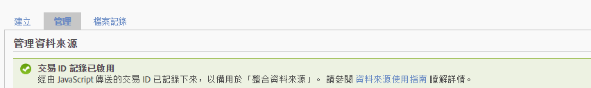

# 交易與客戶整合

「資料來源」提供另外兩種方式，可將離線發生的事件整合到您的線上資料中。

* [啟用交易 ID 記錄](/help/import/c-data-sources/datasrc-integrating-offline-data.md#section_30D6D47AEC0F4A36B87EBFE4C858F20C)
* [交易整合](/help/import/c-data-sources/datasrc-integrating-offline-data.md#section_B3F281CEFF9B47E9A07F9851D61D415D)
* [客戶整合](/help/import/c-data-sources/datasrc-integrating-offline-data.md#section_9F4AAD710D2543BDA834090A98115FBF)

這些整合將離線資料與特定線上交易或線上訪客關聯。

## 啟用交易 ID 記錄 {#section_30D6D47AEC0F4A36B87EBFE4C858F20C}

交易 ID 可以透過 UI 啟用/停用，而且無須使用 ClientCare:

前往&#x200B;**[!UICONTROL 「管理]** > **[!UICONTROL 報表套裝]** > 選取報表套裝&#x200B;**[!UICONTROL > 編輯設定]** > **[!UICONTROL 一般]** > **[!UICONTROL 一般帳戶設定」]**。

<!-- 

When contacting Customer Care, be prepared to provide the following information: 
 
<ul id="ul_C425C7A074484650AFCCF0425E8E3F47"> 
 <li id="li_7640C0C4DF0C49749A3C37E5461DC22F">Report Suite ID of the data source for which you need transaction ID recording enabled. 
In Data Sources, the report suite ID is the first part of the login appended by a random number that identifies the specific data source that was set up. For example, <code> RSID-drmossdev5 Login-drmossdev5_0001343430</code>. 
 </li> 
 <li id="li_4FB0E3EC7BE94A2DBEE9063365A71C9C">The Transaction ID expiration window (described in <a href="/help/import/c-data-sources/datasrc-tid-visitor-profile.md"  > Transaction ID and Visitor Profiles</a>). By default this is 90 days, but it can be extended to up to 2 years. </li> 
</ul>

 -->

若想查看交易 ID 記錄是否已啟用，請導覽至「**[!UICONTROL 分析]** > **[!UICONTROL 管理員]** > **[!UICONTROL 資料來源]**」。

「[!UICONTROL 管理]」標籤會顯示交易 ID 記錄的狀態。

## 客戶整合 {#section_9F4AAD710D2543BDA834090A98115FBF}

客戶 ID 是用於指定客戶的離線活動，並將其連結至線上活動。下列情況應使用客戶 ID:

* 將客戶 ID 填入到&#x200B;*`visitorID`* 變數中。
* 客戶活動離線動作沒有指定的點，如銷售機會提交或購買。

若要設定此類型的資料來源，請參閱[訪客 ID](/help/import/c-data-sources/c-datasrc-types/datasrc-visitorid.md)

## 交易整合 {#section_B3F281CEFF9B47E9A07F9851D61D415D}

交易 ID 是用於記錄某一時間點的訪客狀態。交易 ID 應該用於有特定時間點的情況，通常是客戶從線上使用變成離線使用的時候，例如:

* 提交銷售機會，要銷售人員連絡客戶。
* 進行線上購物，日後有可能退回店舖。
* 購買產品，日後可能來電尋求支援。

從線上變為離線的客戶通常是匿名。

交易ID事件不包含在「瀏覽參與率」量度中（顯示於行銷報表中的量度）。 這是因為交易ID資料與瀏覽無關（因為離線事件通常不屬於線上事件），但與訪客相關。

請參閱[交易ID](/help/import/c-data-sources/c-datasrc-types/datasrc-transactionid.md)。
