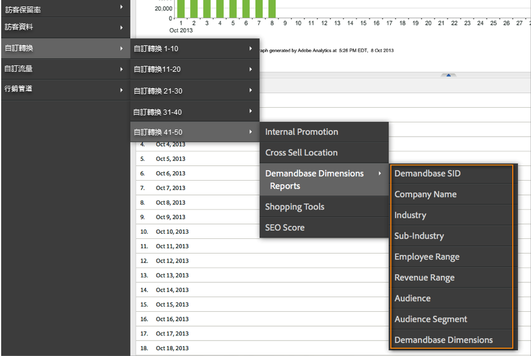
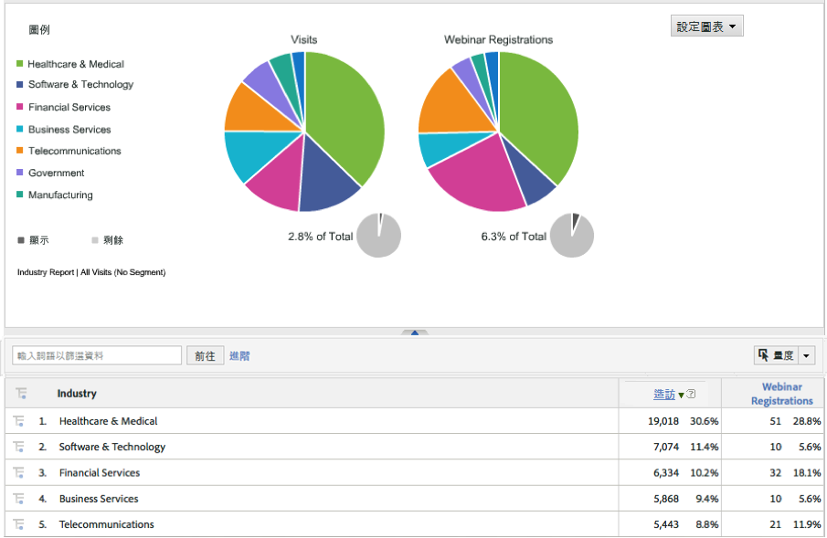

# 部署整合{#deploying-the-integration}

部署這項整合是一項簡單的程序，需要執行下列動作。

## 完成 Adobe 整合精靈{#completing-the-adobe-integration-wizard}

若要啟用整合，您必須在 Data Connectors 介面中完成設定精靈。

1. 導覽至 Adobe Experience Cloud 中的 Data Connectors (前身為 Genesis) 區域。
1. 啟動 Demandbase 2.0 整合精靈。
1. 選擇所需的報表套裝，並替整合提供名稱。
1. 設定下列項目：

<table id="table_8D60DC7C48C144DC9934749E7F9F65FF"> 
 <thead> 
  <tr> 
   <th colname="col1" class="entry"> 項目 </th> 
   <th colname="col2" class="entry"> 說明 </th> 
  </tr>
 </thead>
 <tbody> 
  <tr> 
   <td colname="col1"> 電子郵件地址 </td> 
   <td colname="col2"> 主要連絡人的電子郵件地址。 </td> 
  </tr> 
  <tr> 
   <td colname="col1"> 說明 </td> 
   <td colname="col2"> (選用) 此整合設定的說明。 </td> 
  </tr> 
  <tr> 
   <td colname="col1"> Demandbase API 金鑰 </td> 
   <td colname="col2"> 您可以向 Demandbase 代表取得此資訊。 </td> 
  </tr> 
  <tr> 
   <td colname="col1"> 自訂 Demandbase 維度 #N </td> 
   <td colname="col2"> 這些是 8 個選用維度的 ID。如需詳細資訊，請參閱 Demandbase 自訂維度。 </td> 
  </tr> 
  <tr> 
   <td colname="col1"> 傳送至 Adobe Target </td> 
   <td colname="col2">如果為「true」，系統也會使用隱藏的 mbox 將 Demandbase 維度傳送至 Adobe Target。 <p>注意：必須在網頁上實施已設定的 mbox.js 檔案，才能收集維度。 </p> </td> 
  </tr> 
 </tbody> 
</table>

1. 設定下列變數對應項目：

   | 項目 | 說明 |
   |---|---|
   | Demandbase 維度 | 從報表套裝中選擇可用的 eVar 變數。 |
   | Demandbase 自訂維度 (選用) | 從報表套裝中選擇可用的 eVar 變數。 |

1. 設定自訂維度的名稱 (如果適用)。

   1. 如果您選擇在步驟 4 中納入自訂維度，並在步驟 5 中對應選用的 eVar，則必須為這些維度提供易記名稱。例如，如果您選擇輸入「stock_ticker」作為「自訂維度 1」，則應將包含「維度 1」的方塊變更為「股票代號」。
   1. **不可**&#x200B;修改 8 個標準維度的名稱 (即 Demandbase SID、公司名稱、行業等等)。

1. 核取方塊，讓系統自動為您建立 Demandbase 整合控制面板 (建議)。
1. 檢閱所有設定項目，然後按一下&#x200B;**[!UICONTROL 「立即啟用」]**。

## 部署整合代碼{#deploying-the-integration-code}

完成整合精靈後，您必須將整合代碼部署至 Adobe Analytics 部署代碼 (s_code)。

> [!NOTE] 如果您使用 Adobe TagManager 或 Dynamic Tag Management 來部署 Adobe Analytics，則可使用其中一種工具來輕鬆新增整合代碼。

1. 前往&#x200B;**[!UICONTROL 「支援」]**&#x200B;標籤，從整合的「資源」區域下載並儲存 `integration code v2_0_1` 資源。

1. 如果適用，請對代碼進行任何必要的修改。如需詳細資訊，請參閱「修改整合代碼」(在本頁)。
1. 如果您的 Adobe Analytics 部署代碼中尚未包含整合模組，請將其納入。
1. 使用下列其中一種方法部署代碼：

   * 使用 Adobe TagManager 或 Dynamic Tag Management 來新增代碼。
   * 或者，將代碼傳遞至負責更新 Adobe Analytics 部署代碼的組織資源。

>[!IMPORTANT]
>
>請務必先在開發/中繼環境中測試這項整合的部署，然後再將它部署至生產環境。

## 修改整合代碼{#modifying-the-integration-code}

在大多數情況下，您不需要對 Data Connector 精靈產生的整合代碼進行任何修改。

不過，如果您確實需要進行調整，以下說明部分代碼設定。

<table id="table_5405A73CEFD44466B3C39559F4A037C9"> 
 <thead> 
  <tr> 
   <th colname="col1" class="entry"> 代碼設定 </th> 
   <th colname="col2" class="entry"> 說明 </th> 
  </tr>
 </thead>
 <tbody> 
  <tr> 
   <td colname="col1"> s.maxDelay </td> 
   <td colname="col2">Adobe Analytics 影像要求在引發 Analytics 收集伺服器之前，等待 Demandbase 資料的毫秒數上限。 <p>注意：此設定適用於所有可能透過整合模組執行的整合。 </p> </td> 
  </tr> 
  <tr> 
   <td colname="col1"> _db._key </td> 
   <td colname="col2"> 您的 Demandbase API 金鑰。 </td> 
  </tr> 
  <tr> 
   <td colname="col1"> _db._apiURL </td> 
   <td colname="col2"> Demandbase API 的 URL 範本。 </td> 
  </tr> 
  <tr> 
   <td colname="col1"> _db._delim </td> 
   <td colname="col2"> 分隔符號，用於在將 Demandbase 維度值傳送至 Adobe Analytics 時分隔這些值。變更此設定可能會導致預設分類規則無法正確運作。 </td> 
  </tr> 
  <tr> 
   <td colname="col1"> _db._setTnt </td> 
   <td colname="col2">如果為 true，則整合代碼會嘗試使用隱藏的 mbox，將 Demandbase 維度以描述檔參數的形式傳送至 Adobe Target。 <p>注意：這需要頁面上存在 mbox.js 代碼。 </p> </td> 
  </tr> 
  <tr> 
   <td colname="col1"> _db._tntVarPrefix </td> 
   <td colname="col2"> 會先在每個 Demandbase 維度名稱前面加上此字串，再傳送至 Adobe Target。例如，如果此設定的值為「db_」，則維度「industry」會以「db_industry」的形式傳送至 Adobe Target。 </td> 
  </tr> 
  <tr> 
   <td colname="col1"> _db._dimensionsArray </td> 
   <td colname="col2"> 傳送至 Adobe Analytics 的標準 Demandbase 維度。建議您不要修改此設定。「max_size」屬性是維度在截斷之前允許的字元數。 </td> 
  </tr> 
  <tr> 
   <td colname="col1"> _db._dimensionsArrayCustom </td> 
   <td colname="col2"> 傳送至 Adobe Analytics 的自訂 Demandbase 維度。「max_size」屬性是維度在截斷之前允許的字元數。 </td> 
  </tr> 
  <tr> 
   <td colname="col1"> _db._cName </td> 
   <td colname="col2"> 用於保留 Demandbase API 通訊之狀態的工作階段 cookie 名稱。 </td> 
  </tr> 
  <tr> 
   <td colname="col1"> _db._contextName </td> 
   <td colname="col2"> 用來將標準維度傳送至 Adobe Analytics 的 contextData 變數名稱。建議您不要修改此設定。 </td> 
  </tr> 
  <tr> 
   <td colname="col1"> _db._contextNameCustom </td> 
   <td colname="col2"> 用來將自訂維度傳送至 Adobe Analytics 的 contextData 變數名稱。建議您不要修改此設定。 </td> 
  </tr> 
 </tbody> 
</table>

## 包括整合模組{#including-the-integrate-module}

整合代碼需要整合模組存在於您的 Adobe Analytics 部署中。

如果您尚未將整合模組納入您的部署，請根據您的實施類型完成下列步驟。

### 針對 AppMeasurement v1.0+ {#section-f28d090bf2404cabaae34cd9c66fc575}

1. 將您從&#x200B;**[!UICONTROL 「Analytics]** > **[!UICONTROL 管理員]** > **[!UICONTROL CodeManager」]**&#x200B;下載的 AppMeasurement zip 檔案解壓縮。

1. 開啟名為 [!DNL AppMeasurement_Module_Integrate.js] 的檔案。
1. 將此檔案的內容複製並貼上您的主要 [!DNL AppMeasurement.js] 檔案中。

   >[!NOTE]
   >
   >將它貼上檔案中「DO NOT ALTER ANYTHING BELOW THIS LINE」的註解之前。

### 針對舊版代碼 (H代碼) {#section-bba8ad8c715e4f97883e7de3269f681a}

1. 從 Data Connectors UI 的「資源」區域 (在「支援」標籤下) 下載整合模組。

   

1. 將該檔案的內容複製並貼上您的 [!DNL s_code] 檔案中。

   >[!NOTE]
   >
   >將它貼上檔案中「DO NOT ALTER ANYTHING BELOW THIS LINE」的註解之前。

## 驗證整合{#verifying-the-integration}

檢查即時追蹤和報表，以驗證整合是否成功擷取資料。

### 即時追蹤 {#section-9c20e8ff6b404ae09387ee07d675c9e2}

使用 DigitalPulse 除錯工具，以驗證 Demandbase 維度資料是否正傳送至 Adobe Analytics。刪除您的 cookie 後，在已部署整合代碼的網站上重新載入頁面。假設您目前的 IP 對應至 Demandbase 所識別的組織，您應該會看到類似下列的結果。

**「報表與分析」(前身為 SiteCatalyst) 包含兩個 Demandbase 上下文資料變數：**


**Target Mbox 包含 Demandbase 描述檔參數：**&#x200B;只有在頁面上實施 Target，且已針對 Adobe Target 設定這項整合時，您才會看到這個項目：請參閱 Adobe 整合精靈中的步驟 4。


### 報表 {#section-1792fe75dc3249d0ad063dfd87a89162}

使用透過 Adobe 整合精靈自動為您建立的「控制面板」(步驟 7)，在 Adobe Analytics 中檢閱 Demandbase 報表。

或者，您也可以導覽至 Adobe Analytics 功能表結構內的 Demandbase 報表：請參閱下方的螢幕擷取畫面。

> [!NOTE] 這項資料應會在成功部署後 24 到 48 小時內顯示。





### 常問的問題 {#section-d926b160a2ef4f07b43ea1bc67ac2a0a}

**「[n/a]」代表什麼意思？**

Demandbase Data Connector 會設定此預設值，以指出屬性為「不可用」。設定為預設時有兩種常見情境：

* Demandbase 會偵測訪客來自不屬於公司的 IP 位址。
* 會使用「帳戶監看」屬性 (以「watch_list」開頭)，但公司不在您的「帳戶監看」清單中。

**為什麼「`[n/a]`」對於特定屬性的顯示頻率較高？**

Demandbase 會分類所有 IP 位址，並提供 audience_segment 屬性，即使訪客並非來自公司 IP。當觀眾傳回「住宅」、「無線」和「旅館業」等值時，其他屬性可能無法使用。

有時，訪客的對象是「中小型企業」，但其他屬性將顯示「`[n/a]`」。這表示 Demandbase 能夠將訪客分類為小型企業，但無法使用完整的公司設定檔。這通常發生在最小的公司，當多個小型企業使用相同的服務提供者或 IP 位址區塊時。

### 開發人員考量事項 {#section-d33fff55bc4b4db99f82dee418ef1bc2}

如果您需要調整實施中的預設值，請更新此行：

```
_db._nonOrgMatchLabel = "[n/a]";
```
