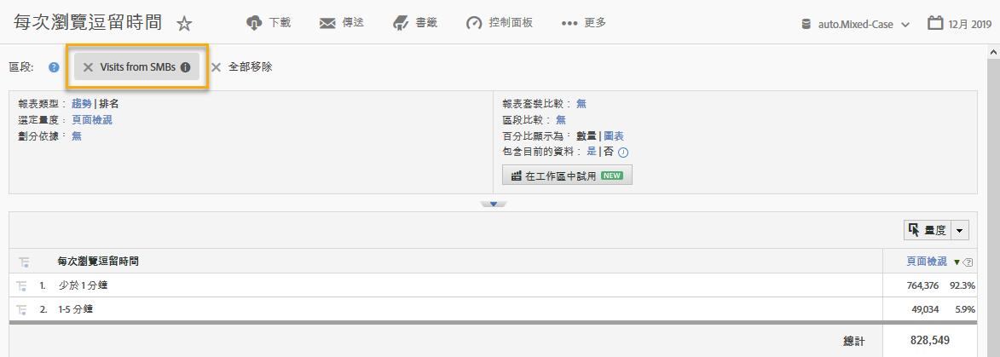

# 使用整合{#using-the-integration}

一旦部署整合後，您就可以開始使用其提供的其他功能。

> [!NOTE] 您可能需要 24 到 48 小時，才能開始在 Adobe Analytics 報表中看到部分 Demandbase 資料。

您可以採取下列動作，以透過這項整合從 Adobe Analytics 中獲得價值：

## 依 Demandbase 維度檢視流量和轉換量度{#viewing-traffic-and-conversion-metrics-by-demandbase-dimension}

這項整合提供新的維度，可作為 Adobe Analytics 報表使用。

以下報表是分析「造訪」和轉換量度 (網路研討會註冊) 的範例，這些內容已依對象類型然後依產業劃分。

## 依 Demandbase 維度分段{#segmenting-by-demandbase-dimensions}

此項整合的主要功能，是能夠根據 Demandbase 維度建立 Adobe Analytics 區段。

例如，您可以建立只包含來自中小型企業組織之造訪的區段。您可將此稱為「來自中小型企業的造訪」。其定義會是：

對象等於中小型企業。

如需如何建立區段的詳細資訊，請參閱 [Analytics 分段指南](https://marketing.adobe.com/resources/help/zh_TW/analytics/segment/)。

然後，此區段便可套用至幾乎任何報表，其中一個範例是此處顯示的「每次瀏覽逗留時間報表」：
