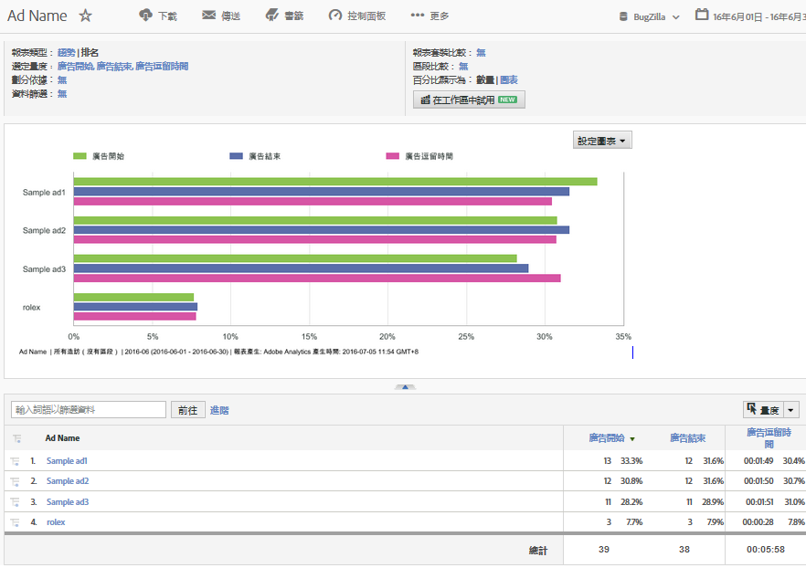

# 使用 DFA 資料的分析報表{#analytics-reports-using-dfa-data}

在 DFA 與 Adobe® 收集伺服器可相互通訊後，您即可在「報告與分析」中產生包含 DFA 資料的報表。

預先封裝的 DFA 報表包含下列項目:

**管道**: 顯示將橫幅廣告與其他線上廣告選項 (例如付費搜尋和電子郵件) 相比較的資料。

**傳送工具**: 顯示將 DoubleClick for Advertisers 與其他線上廣告服務相比較的資料。

**網站名稱**: 顯示將出現 DFA 橫幅的網站相比較的資料。

**頁面名稱**: 顯示將出現 DFA 橫幅的個別網頁相比較的資料。

**廣告名稱**: 顯示將特定 DFA 橫幅廣告相比較的資料。

**促銷活動**: 顯示將不同的 DFA 廣告促銷活動相比較的資料

若要產生 DFA 報表:

1. 登入 Adobe Experience Cloud。
1. 移至&#x200B;**[!UICONTROL 「分析」]**>**[!UICONTROL 「報告與分析」]**。請確定您已選取 DFA 整合安裝所在的報表套裝。

1. 在左側導覽中，選取會擷取 DFA 點進資料的轉換變數，然後選取所需的 DFA 報表。
1. 按一下&#x200B;**[!UICONTROL 「新增量度」]**。這會開啟 Metric Selector 對話方塊。
1. 在&#x200B;**[!UICONTROL 「可用量度」]**&#x200B;清單中勾選「曝光數」和「點按」量度，然後按一下&#x200B;**[!UICONTROL 「套用」]**。

   產生的報表會顯示「曝光數」、「點按」和「收入」資料，讓您得以檢視您的 DFA 服務轉化為實際收入的情形。例如，DFA 廣告名稱報表會顯示可直接歸因於您目前的 DFA 廣告促銷活動之中特定橫幅廣告的曝光數、點按和收入資料:

   

此報表具有下列重要功能:

* 報表標題 (標示為 DFA_Ad 名稱報表) 會顯示報表期間 (2009 年 2 月)，並指出這是採用水平長條格式的排名報表。
* 圖形本身會會報表中的每個 DFA 廣告顯示三個量度 (曝光數、點按和收入)。
* 圖形會以量度總計的百分比形式顯示每個量度的資料，而不是使用每個量度的實際數值。您可以在&#x200B;**[!UICONTROL 「設定報表」]**&#x200B;對話方塊中變更此設定。
* 在圖形下方，DFA_Ad 名稱報表會列出每個 DFA 廣告的報表詳細資料，並顯示廣告效益的數值和百分比資料。
* 選取特定 DFA 廣告名稱可開啟選項功能表，以取得更多關於特定 DFA 廣告的資訊。
* 每個量度欄都包含一個顏色索引鍵，分別與量度在圖形中的指定顏色相對應。
* 報表會以「收入」量度排序，收入最高的廣告位於最上方。您可以按一下不同的欄 (量度) 標籤，以變更報表排序。
