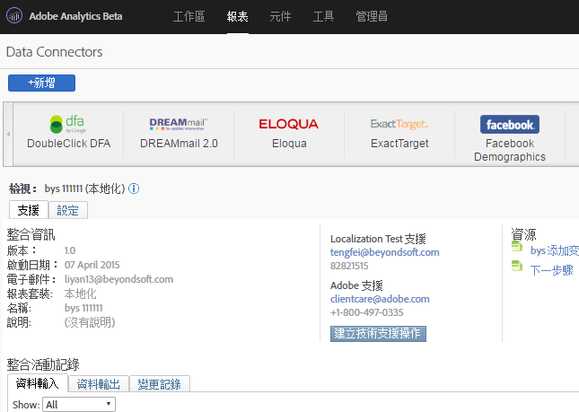
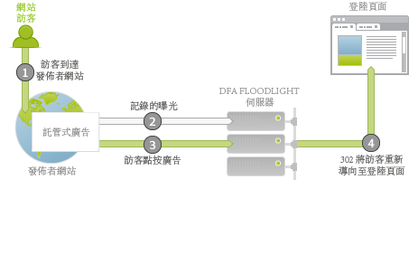
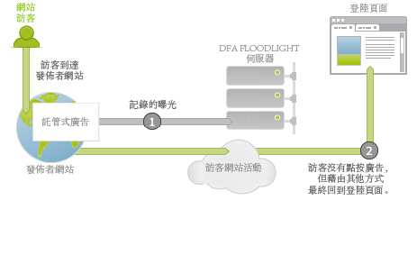
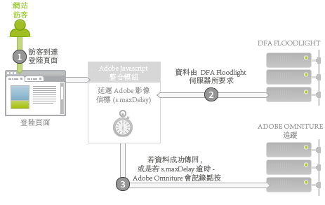
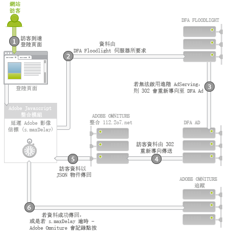

# DFAAdobe Analytics 的 Data Connectors{#dfa-data-connector-for-adobe-analytics}

在現今日益複雜且競爭激烈的線上市場中，線上廣告商和廣告公司必須不斷提升他們對線上行銷環境的瞭解，以及廣告支出的報酬率。 雖然廣告主、代理商和發佈者都各有其工具可協助他們達成這些目標，但要手動從完全不同的資料系統和程序中彙整資料，可能會嚴重影響到線上行銷活動的效益，而造成促銷活動效益不盡理想、資料不相符和混淆。

DoubleClick for Advertisers (DFA) 整合可以解決此問題。它採用 Adobe® Data Connectors™，讓 DoubleClick DFA 能夠自動將資料傳送至「報告與分析」。

**[!UICONTROL Analytics]** &gt;管 **[!UICONTROL 理]** &gt;資料 **[!UICONTROL 連接器]**

## 主要優點{#key-benefits}

Data Connectors 的主要好處 - DFA 整合包括:

* **更理想的轉換**: 取得定向深入資訊，以根據點按後的訪客行為和喜好最佳化廣告促銷活動的版面和站上轉換。
* **資料的共用位置**: 透過「報告與分析」結合 DoubleClick DFA 點進和閱覽資料，以提升跨組織的共同作業效能和目標決策能力。
* **具附加價值的分析**: DFA 和「Adobe 報告與分析」之間的自動整合，可讓廣告主和代理商縮短處理資料的時間，而將心力投注於分析報表和採取動作。
* **更深入的客戶洞察**: 更深入地瞭解訪客來自於何處，以及他們在您的網站上做了什麼。
* **期限內效益量度**: 估計您的贏取促銷活動在整個訪客生命週期內的有效性。
* **整合的報告**: 自動同步 DFA 與「報告與分析」之間的資料，以精簡業務程序和報告作業。
* **期限內訪客分析**: 以多個使用者定義的成功事件和期限值衡量促銷活動的有效性。
* **成本量度**: 比較單一系統中的成本數據與這些成本所產生的收入，以達到最高的投資報酬率。

## 廣告服務整合概述{#ad-serving-integration-overview}

此整合可透過數種方式擷取關於廣告驅動型訪客的資料。第一種方式是透過點按廣告以進入加上標記的著陸頁面，我們稱之為點進:

訪客進入代管廣告的發行者網站。 此廣告具有唯一識別碼，名為廣告 ID。廣告包括「位置」加上「創意」，可說明廣告在「發佈者」網站上的位置，以及對訪客顯示的內容。 當訪客從 DFA 內容伺服器提取此廣告、版面或創作時，此訪客的曝光數將會被追蹤記錄到 DFA Floodlight 伺服器 (1)。

如果訪客點按廣告 (2)，則會查詢 Floodlight 伺服器 (這會計為一次點按)，然後將訪客 302 重新導向 (3) 至著陸頁面。當訪客進入著陸頁面時，即完成所謂的點進。此頁面包含 Adobe 追蹤代碼，會查詢 DFA Floodlight 伺服器中的資料。

如果訪客在 Floodlight 伺服器追蹤點按之後並未實際進入著陸頁面，則不算是點進。有些廣告和實作實際上可能不會導致訪客的瀏覽器遵循302重新導向。 有關此主題的進一步討論，請參閱協調 [度量差異](../dfa-data-connector-analytics/dfa-reconciling-metric-discrepancies.md)。

此整合會在訪客接收到廣告曝光數、未加以點按但在後續的某個時間點經由其他途徑進入著陸頁面時，擷取下一個量度。

我們將此情景稱為閱覽。此情景與點進情景的差異在於，訪客並未點按廣告，而是在繼續進行其他活動後進入著陸頁面 (2)。最簡單的情況是，訪客在瀏覽器中輸入著陸頁面的URL。 其他情況則包括，訪客繼續進行瀏覽，但後續使用了搜尋引擎，而將訪客導向至著陸頁面。無論是哪種情況，使用者都會進入著陸頁面。

## Adobe 整合: 即時資料收集{#adobe-integration-real-time-data-collection}

下圖說明資料收集的運作方式。

Adobe 整合的資料收集部分會在訪客進入著陸頁面時展開 (1)。在著陸頁面上執行的 Adobe 資料收集代碼，並不知悉訪客在提供的廣告方面有何歷史記錄。Google DFA 團隊協調出一項執行於 DFA Floodlight 伺服器的服務，可讓 Adobe 代碼查詢與目前在網站上的訪客有關的廣告資訊 (2)。在取得這項資料時，會暫時延遲 Adobe 影像信標，並要求 Floodlight 伺服器中的資料。

在資料送達，或是執行時間過久時，將會對 Adobe 追蹤伺服器引發點擊 (3)。

整合模組是一個特殊核心 Adobe JavaScript 模組，它會使 Adobe 影像信標延遲，而在特定的時間長度內 (`s.maxDelay`)。`s.maxDelay` 定義在將影像標籤觸發至訪客瀏覽器之前，Integrate模組會等候DFA Floodlight伺服器資料的時間長度。 藉由此行為，即使在 DFA Floodlight 伺服器關閉或負載過重時，仍可收集基本訪客資料，因此這項行為是很重要的。如果 Floodlight 資料在`s.maxDelay`到期之前送達，將會立即引發 Adobe 追蹤資料，且其中會包含其他 DFA 資料。

如果發生逾時，頁面代碼可以將 Adobe 報告與分析事件指定作為逾時事件。在診斷整合方面的問題時，此事件將有其用處，或是，在調整 `s.maxDelay`. 如果太常發生逾時，請增加 `s.maxDelay`. `s.maxDelay` 但是，在此情況下，訪客可能會在計時器到期前離開網 `s.maxDelay` 站。.

有時候，Floodlight 伺服器在回應時會出現關於訪客的錯誤。此錯誤通常是發生在 Floodlight 伺服器因訪客尚未檢視任何廣告，或沒有 DFA 訪客 cookie，而對訪客一無所知的情況下。頁面代碼可指定一個自訂轉換變數 (eVar)，用來收集這些錯誤，以及協助您進行實施問題的疑難排解，或指出 Google 交易方面的問題。最常見的錯誤是「沒有歷史記錄」、「沒有 cookie」、「查詢錯誤」和「已退出」，如下表所說明:

| 錯誤 | 名稱 | 說明 |
|---|---|---|
| nh | 沒有歷史記錄 | 訪客並未檢視或點按任何廣告。 |
| nc | 沒有 cookie | 訪客沒有 DFA 訪客 cookie。 |
| qe | 查詢錯誤 | 查詢 Floodlight 伺服器的資料時發生錯誤。 |
| oo | 已退出 | 訪客已退出 Google 曝光/點按追蹤。 |

## Adobe 整合: 夜間資料匯入{#adobe-integration-nightly-data-import}

整合的資料收集部分，會收集關於網站訪客的點進和閱覽資料。為了取得 DFA 點按、曝光數和成本量度，Google 與 Adobe 合作開發出夜間程序，可將這項額外的資料匯入至整合的報表套裝中。這些量度會透過資料來源匯入，這表示，這些量度只會以彙整的形式提供，而不會以造訪層級提供。

## 版本差異{#version-differences}

DFA 整合目前有三個版本: 1.0 版、1.5 版和 2.0 版。

下表摘錄了各個整合版本的功能。

| 功能 | 1.0 版 | 第 1.5 版 | 2.0 版 |
|---|---|---|---|
| DFA 點按和曝光數的夜間量度 | 是 | 是 | 是 |
| 點進和閱覽追蹤 | 是 | 是 | 是 |
| 整合可接收廣告主層級的資料 | 無 | 是 | 是 |
| 整合可接收 Floodlight 設定層級的資料 | 無 | 無 | 是 |
| 成本量度 | 無 | 無 | 是 |
| 創作量度 | 無 | 無 | 是 |
| 超過 2k 位元組的查詢字串 | 無 | 是 | 是 |
| 使用整合模組進行最理想的第三方資料收集 | 無 | 是 | 是 |
| 逾時和錯誤追蹤 | 無 | 是 | 是 |
| 不需要交涉的客戶端 ID | 無 | 無 | 是 |

### 關於 1.5 版 {#section-b5a3e967cfa141ea8f740612336181be}

1.5 版的整合在著陸頁面 Java Script 中導入了整合模組。整合模組可支援對 DFA 廣告伺服器 (ad.doubleclick.net) 發出固定大小的要求，這解決了舊版整合最多只能使用 2K 要求的問題。它也導入了可設定的逾時  *`s.maxDelay`*, to continue collecting Adobe visitor data when network outages occur. 錯誤和逾時資料皆可擷取至 Analytics 變數中。

下圖說明著陸頁面在 1.5 版中的網路互動情形。

在 1.5 版中，整合模組 (2) 會要求 Floodlight 伺服器 (3) 中的資料。Floodlight 伺服器會重新導向至 DFA 廣告伺服器，繼而以等同於 1.0 版的方式傳回訪客的相關資料。它將會 302 重新導向 (4) 至 integrate.112.2o7.net 上的特殊轉譯器服務，而此服務會將回應結構轉換為 JSON 物件。整合模組會取用此 JSON 物件，並將資訊傳送至 Adobe 追蹤 (5)。

要從 1.0 版的整合移轉至 1.5 版，必須要進行 JavaScript 變更。若要取得此 JavaScript，請登入您的 Adobe Online Marketing Suite 帳戶、選擇 Genesis 產品、在您的 DFA 整合上按一下「編輯」，然後繼續執行精靈。如果先前已指派客戶網站 ID，當您儲存整合之後，將會立即透過電子郵件收到新的 JavaScript 代碼。取得此代碼後，您也將需要具有整合模組的新版 核心 s_code。您可以透過帳戶管理員或實施顧問取得此代碼。

新版 JavaScript 代碼的重要功能之一，是 1.5 版與 2.0 版之間不需要實施變更。

### 關於 2.0 版 {#section-afd56de0c56c4489bb5ddc5798d6709a}

最新版的 DFA 整合可將整個 Floodlight 設定的資料移至整合中。在 2.0 版之前，個別的整合會分別繫結至一個 DFA 廣告主。透過這項變更，整個 Floodlight 設定的點按、曝光數和成本量度，都會包含在整合的報表套裝中。如果有兩個網站位於相同的 Floodlight 設定中，您也可以追蹤跨網站的閱覽。

自 2.0 版的整合起，也開始提供「媒體成本」量度。若要為整合啟用媒體成本量度，您必須在 Genesis 精靈中選擇媒體成本的「報告與分析」事件，並指定量度數據在 DFA 介面中所採用的貨幣。

在使用 2.0 版整合時，由於已移除了 302 重新導向的關係，我們預期逾時次數將會降低。移除這些躍點應可減少逾時次數，並增加您可以整合的 DFA 資料量。

如果 Floodlight 設定是 DFA 中的共用設定，則從 1.5 到 2.0 版的升級，將會使 Floodlight 設定內所有共用廣告主的轉換資料都包含在報表套裝中。

### 升級至 2.0 版 {#section-f0bf90b9a7a1434ab1540b6c0999f4c7}

下表列出移轉至新版整合之作業的擁有者:

| 移轉 | 擁有者 | 工作 |
|---|---|---|
| 1.0 版至 1.5 版 | 客戶 | 實施具有整合模組的 1.5 版 JavaScript |
| 1.5 版至 2.0 版 | 客戶 | 客戶開始與 Google 討論關於升級時程的事項。經核准後，Google 即會啟用「進階廣告服務」。 |
