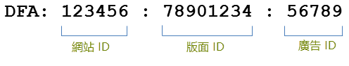
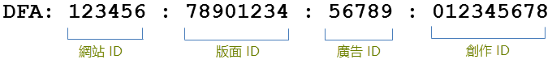

# 整合功能{#integration-features}

Data connectors DFA 整合在啟動之後，將可為您的 Adobe Analytics 報表提供下列量度:

* 檢視次數
* DFA點按次數
* 印象
* （選用）DFA成本資料
* （可選）DFA查詢錯誤、逾時

>[!NOTE] 此整合並未提供點按追蹤 (前身為點按命令) 的支援。點按追蹤器可用來記錄在網站上文字連結、電子郵件訊息中的連結或其他硬式編碼元素上的點按次數。

資料連接器DFA整合會自動從DFA傳回的資料建構DFA追蹤代碼。 這些追蹤代碼的建構是為了唯一識別廣告及其相關的位置和創意。 以下概述追蹤程式碼的結構，視整合版本而定。 1.5版的外觀如下：

2.0版的外觀如下：

這些ID是Genesis和DFA之間的共用金鑰，可關聯正確的分類和量度。

| 網站 ID | 裝載廣告的第三方網站。 「網站名稱」分類提供此網站ID的描述性名稱。 |
|---|---|
| 廣告 ID | 傳遞給使用者之商業訊息的ID。 「廣告名稱」分類包含由您的組織在DFA系統中定義的廣告名稱。 例如: `Hybrid Coup Textlink - Build`。 |
| 版面 ID | 在您的DFA帳戶中表示您購買廣告空間的網站、網站的一部分或網站群組。 |
| 創作 ID | 要向訪客顯示的影像、Flash SWF或其他資源。 「創作名稱」分類包含您在DFA介面中提供給此創作人員的名稱。 |

其他兩個分類：「傳送工具」（廣告商的DoubleClick）和「頻道」（橫幅廣告），對於任何DFA促銷活動都有相同的值，並有助於區分DFA匯入的資料。

## SearchCenter重複資料消除 {#section-f809b3bb5e5142aa8ff89bcd5f0d0e49}

Adobe SearchCenter 現在已可辨識 DFA 整合。透過 Data Connectors 精靈啟用 SearchCenter 重複資料刪除，搜尋驅動的訪客將不會從 DFA 的 Floodlight 伺服器提取資料，而且 DFA 將不會填入 *`s.campaign`*，以便 SearchCenter 能夠填入資料。此外，DFA和SearchCenter現在會將重複資料消除值填入每個產品的變數中。

下列清單概述啟用SearchCenter重複資料消除時啟用的邏輯：

如果 **[!UICONTROL DFA]** 在 **[!UICONTROL SearchCenter deduplication]** 嚮導中選擇了>:

* 在 DFA 點進的案例中，整合會將字串 &quot;DFA Clickthrough&quot; 填入至已設定的 SCM eVar。
* 在 DFA 閱覽的案例中，整合會將字串 &quot;DFA Viewthrough&quot; 填入至 SCM eVar。

如果 **[!UICONTROL SearchCenter]** 在 **[!UICONTROL DFA deduplication]** 嚮導中選擇了>:

* 在 DFA 閱覽的案例中，整合會將字串 &quot;DFA Viewthrough&quot; 填入至 SCM eVar。

>[!NOTE] 如果啟用了「SearchCenter」>「DFA 重複資料刪除」，並設定了 SearchCenter 查詢字串參數，在進行 DFA 處理時將不會考量造訪。這表示，SearchCenter 查詢字串參數應不同於 DFA 點進參數，且不應有「顯示」廣告設定 SearchCenter 查詢字串參數。

