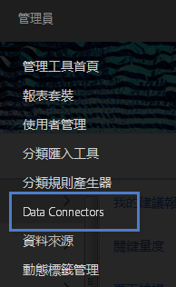
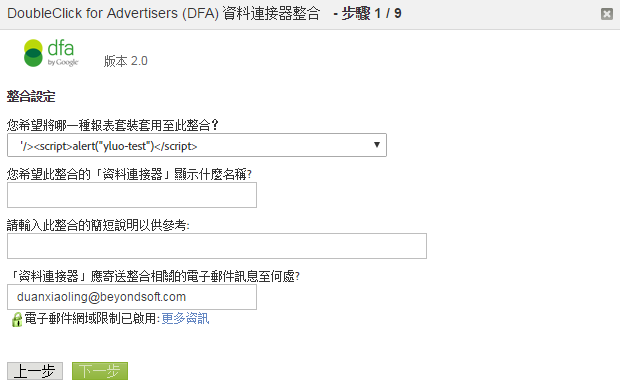

# DFA 整合{#dfa-integration}

要設定 DFA 整合，必須執行下列工作:

## 設定 DFA 整合{#configure-the-dfa-integration}

逐步執行DFA資料連接器整合。

設定頁面提供整合的概觀，以及更多資訊的實用連結。 此整合有Adobe和DoubleClick的相關費用。 請連絡這兩個組織的適當銷售代表，並確定您瞭解費用結構。

1. 登入 [!DNL Adobe Analytics]。
1. 按一下 **[!UICONTROL Admin]** > **[!UICONTROL Data Connectors]**.

   

1. 找到 **[!UICONTROL DoubleClick DFA]**，然後按一下 **[!UICONTROL Add New]**。

   

   在「整合精靈」的每個頁面上，提供必要的資訊，然後按一下 **[!UICONTROL Next]**。 下表說明您透過精靈完成整合所需的資訊。

<table id="table_8F6F7F304C36431DA5FD6E5D54F60FC0"> 
 <thead> 
  <tr> 
   <th colname="col1" class="entry"> 精靈頁面# </th> 
   <th colname="col2" class="entry"> 欄位 </th> 
   <th colname="col3" class="entry"> 說明 </th> 
  </tr> 
 </thead>
 <tbody> 
  <tr> 
   <td colname="col1"> 1 </td> 
   <td colname="col2"> 整合名稱 </td> 
   <td colname="col3"> Genesis 在報表套裝的「作用中的整合清單」中顯示的整合名稱。 </td> 
  </tr> 
  <tr> 
   <td colname="col1"> 1 </td> 
   <td colname="col2"> 整合電子郵件地址 </td> 
   <td colname="col3"> 接收與此整合相關之所有通知的電子郵件地址。 </td> 
  </tr> 
  <tr> 
   <td colname="col1"> 2 </td> 
   <td colname="col2"> 用戶名 </td> 
   <td colname="col3"> 要與此整合搭配使用的DFA API使用者名稱。 若要啟用使用者進行API登入，請在DFA介面中檢查API屬性。 啟用API登入後，會出現密碼欄位，以提供使用者的密碼。 此密碼與用戶名一起輸入到嚮導中以進行驗證。 </td> 
  </tr> 
  <tr> 
   <td colname="col1"> 2 </td> 
   <td colname="col2"> 密碼 </td> 
   <td colname="col3"> DFA API密碼。 </td> 
  </tr> 
  <tr> 
   <td colname="col1"> 2 </td> 
   <td colname="col2"> 廣告商ID </td> 
   <td colname="col3"> <p>DFA廣告商ID或父Floodlight設定ID。 資料連接器使用此ID來識別要追蹤的DFA廣告商（整合的1.5版）。 此廣告主 ID 無法用於 2.0 版的整合 - 將會查閱並使用父項 Floodlight 設定 ID。請參閱螢幕上的指示 </p> </td> 
  </tr> 
  <tr> 
   <td colname="col1"> 3 </td> 
   <td colname="col2"> DFA廣告變數 </td> 
   <td colname="col3"> 接收DFA促銷活動屬性、印象和點按資料的Analytics eVar。 通常，這是追蹤代碼eVar( <span class="varname"> s.campaign </span>)，但您可以選擇任何可用的eVar。 資料連接器也會將下列DFA相關分類新增至選取的eVar: <p><b>促銷活動</b>:提供給多個網站的廣告集合，這些網站會傳送常見訊息。 </p> <p><b>網站名稱</b>:提供廣告的網站。 </p> <p><b>廣告名稱</b>:廣告名稱，如您的DFA帳戶中所定義。 </p> <p><b>網站位置名稱</b>:提供廣告的網站和頁面。 </p> <p><b>傳送工具</b>:DoubleClick for Advertisers。 </p> <p><b>渠道</b>:橫幅廣告。 </p> <p><b>成本結構</b>:CPM、CPC或「固定」，根據廣告的成本結構。 </p> <p><b>創意名稱</b>:與廣告／位置／創意ID相關的創意作品名稱。 </p> <p><b>DFA &gt; SearchCenter重複資料刪除</b>:指定當發生DFA點進或檢視時，DFA應將值放在Searchcenter變數中。 </a> 。 </p> </td> 
  </tr> 
  <tr> 
   <td colname="col1"> 4 </td> 
   <td colname="col2"> 印象 </td> 
   <td colname="col3"> 接收DFA印象量度資料的自訂事件。 曝光次數表示廣告的服務次數。 </td> 
  </tr> 
  <tr> 
   <td colname="col1"> 4 </td> 
   <td colname="col2"> 點擊次數 </td> 
   <td colname="col3"> 選取接收DFA點按量度資料的自訂事件。 點按會指出訪客點按廣告的次數，如 DFA 的重新導向所計算。點按量度會與 Analytics 點進量度相關連。 <p>注意：由於收集資料的方式有所差異，DFA 點按和 Analytics 點進可能不會完全相同。  </a> </p> </td> 
  </tr> 
  <tr> 
   <td colname="col1"> 5 </td> 
   <td colname="col2"> 檢視變數 </td> 
   <td colname="col3"> <p>接收DFA檢視資料的Analytics eVar。 「閱覽」變數可協助您瞭解閱覽對網站轉換率的影響。 </p> <p>資料連接器會將與DFA廣告變數相同的DFA相關分類新增至此eVar（請參閱上文）。 </p> </td> 
  </tr> 
  <tr> 
   <td colname="col1"> 5 </td> 
   <td colname="col2"> 自上次檢視以來的時間（檢視時段變數） </td> 
   <td colname="col3"> 自上次檢視以來接收DFA時間的Analytics eVar。 「自上次檢視以來的時間」會指出自上次廣告檢視以來已失效的時間量。 </td> 
  </tr> 
  <tr> 
   <td colname="col1"> 5 </td> 
   <td colname="col2"> 檢視次數 </td> 
   <td colname="col3"> 接收DFA檢視次數量度資料的自訂事件。 使用具有閱覽變數的閱覽事件，可檢視哪些促銷活動並未直接促成點進，但在後續某個時間點對於網站流量的衍生具有一定的貢獻。 <p>Data connectors 會將選取的自訂事件重新命名為「閱覽」。 </p> </td> 
  </tr> 
  <tr> 
   <td colname="col1"> 6 </td> 
   <td colname="col2"> DFA查詢失敗 </td> 
   <td colname="col3"> （選用）接收任何已報告DFA查詢失敗訊息代碼的Analytics eVar。 可能的DFA訊息代碼包括： 
    <ul id="ul_85FC7FB19F7F4ADF83ABCA6DDB44CE19"> 
     <li id="li_0A3181DED5A149588A0D3F1584E2FE8B"><b>nc</b>:無DoubleClick Cookie。 </li> 
     <li id="li_D397AA73AD5E4086A18B87F271E4EC14"><b>oo</b>:使用者已選擇退出。 </li> 
     <li id="li_5AC1D0C8049340B4AD857D88E275CBD6"><b>nh</b>:沒有促銷活動記錄。 </li> 
     <li id="li_73A8C5E905C54E2BB531A1FCDBC6AA1A"><b>量化寬鬆</b>:查詢錯誤（超時、伺服器關閉等） </li> 
    </ul> </td> 
  </tr> 
  <tr> 
   <td colname="col1"> 6 </td> 
   <td colname="col2"> 逾時事件 </td> 
   <td colname="col3"> <p>會在每次  <span class="varname"> s.maxDelay </span> 計時器到期、而未接收到來自 DFA 伺服器的回應時增量的 Analytics 計數器事件。使用此事件可設定 <span class="varname"> s.maxDelay </span> 變數調整 s.maxDelay </a>。) </p> </td> 
  </tr> 
 </tbody> 
</table>

## DFA 整合的網站更新{#web-site-updates-for-the-dfa-integration}

在 Genesis 為您設定 DFA 整合的分析報表套裝後，您必須執行下列作業設定您的網站和 DFA 環境，以支援整合:

### 驗證網域上的 Cookie 空間{#verify-cookie-space-on-the-domain}

DFA的「資料連接器」整合需要您在頁面的網域上設定Cookie。

雖然很少，但某些網域已達到某些網頁瀏覽器的Cookie容量上限。 為避免影響到訪客在您網站上的瀏覽體驗，請洽詢您的網路操作、開發團隊或工程部門，以確認在用於 DFA 整合之頁面的網域上新增另一個 cookie，並不會影響到使用者體驗。您將必須選取 cookie 的名稱。

### 更新您的 DFA 查詢字串參數{#update-your-dfa-query-string-parameter}

如果您在DFA整合之前已使用Adobe Analytics追蹤廣告促銷活動，則所有促銷活動（電子郵件、搜尋或橫幅）都可能使用相同的查詢字串參數來識別著陸頁面上的反向連結促銷活動ID。

若要瞭解何時從DFA廣告促銷活動的DFA資料要求檢視和點進資料，資料連接器需要識別訪客何時點按了DFA促銷活動橫幅廣告。 為此，您必須將有所區分的查詢字串參數新增至 DFA 廣告促銷活動的登陸頁面 URL，使 Data connectors 能夠區分 DFA 廣告促銷活動頁面，與您在網站上可能會有的其他廣告促銷活動頁面。DFA 的 JavaScript 外掛程式中的 `dfa_overrideParam`。

>[!CAUTION]
>
>雖然促銷活動變數可用於其他促銷活動，但請勿將其用於 DFA 促銷活動。如果您將促銷活動變數設定為DFA促銷活動登陸頁面，Adobe無法將印象和點按次數連結至DFA促銷活動點進次數。 每次瀏覽一次，Adobe收集伺服器會檢查DFA伺服器上是否有先前的點進或檢視。 因此，請僅於登陸頁面上納入 DFA 外掛程式代碼，以避免可能減緩頁面載入速度的非必要重新導向，對於網際網路連線速度較慢的使用者，更是如此。

## 更新網站的資料收集代碼{#update-your-web-site-s-data-collection-code}

DFA 的 Genesis 整合採用 DFA Floodlight 設定 ID (dfa_SPOTID)，這可以提升 DFA 與 Adobe 資料收集系統之間的報表一致性。

>[!NOTE] 在近期的 Google DFA 版本中，Spotlight 一詞已變更為 Floodlight。JavaScript 參數 `dfa_SPOTID` 是根據 Spotlight 術語而命名的，但用於兩個版本中。

若要在您的網站上啟用DFA整合，您必須新增下列項目來更新您的JavaScript資料收集代碼：

* DFA 的整合模組
* 新增您的收集代碼

### DFA 的整合模組 {#section-fa00e42a732a4e27a4ab3dfcfeae1a5b}

DFA 整合採用 Adobe Experience Cloud 整合模組，可在您的核心 JavaScript 資料收集代碼 (`s_code.js`) 中新增功能。當您從「代碼管理器」下載「JavaScript 適用的 AppMeasurement」代碼時，整合模組會作為 .zip 檔案的一部分。請在您需要進一步協助尋找時，再聯絡您的 Adobe 顧問。

在您網站之 `s_code.js` 檔案的 `Modules` 區段中，插入整合模組代碼。

### 新增至您的收集代碼 {#section-8f98c727f1ba414fb8b4f02d696b8791}

Data connectors 會根據您在整合精靈中啟動 DFA 整合時所做的選取，產生對您 JavaScript 資料收集代碼的自訂新增項目，並透過電子郵件傳送給您。請在 `s_code.js` 檔案的主要區段中插入此代碼 (而不是插入至 `doPlugins` 函數或任何其他函數)。

以下范常式式碼僅供圖示；使用在完成「資料連接器整合精靈」後以電子郵件寄送給您的程式碼。

收集代碼包含下列元件：

* DFA整合設定
* 整合所需的增效模組

**DFA整合設定**

```
/************************** DFA VARIABLES **************************/ 
var dfaConfig = { 
   CSID:              "1234567", 
   SPOTID:            "29876543", 
   tEvar:             "eVar17", 
   errorEvar:         "eVar59", 
   timeoutEvent:      "event76", 
   requestURL:         "http://fls.doubleclick.net/ 
json?spot=[SPOTID]&src=[CSID]&var=[VAR]&host=integrate.112.2o7.net%2 
Fdfa_echo%3Fvar%3D[VAR]%26AQE%3D1%26A2S%3D1&ord=[RAND]", 
 
   maxDelay:          "1500", 
   visitCookie:       "s_dfa", 
   clickThroughParam: "CID", 
   searchCenterParam: "s_kwcid", 
   newRsidsProp:      undefined 
}; 
/************************ END DFA Variables ************************/ 
```

DFA整合設定區塊會設定DFA整合所需的變數。 這些變數的值來自下列來源：

**CSID**:用戶端ID。 在您完成整合精靈後，由DFA產生。 資料連接器會以您的DFA CS ID預先填入此變數，並在您完成整合精靈後，在設定電子郵件中傳送此值。 若您的帳戶已啟用「進階廣告服務」，則不需要此變數。

**SPOTID**:Floodlight設定（先前稱為Spotlight ID）。 資料連接器會根據您在整合精靈中指定的DFA帳戶資訊，以您的DFA Floodlight設定ID預先填入此變數。

**tEvar**:傳輸變數。 「資料連接器」會在整合精靈中，以您為「檢視」變數指定的Analytics變數名稱預先填入此變數。 若未與Adobe工程或工程服務進行仔細協調，請勿變更此值。

**errorEvar**:錯誤變數。 「資料連接器」會在「整合精靈」中，以您為「DFA查詢失敗」變數指定的Analytics變數名稱預先填入此變數。

**timeoutEvent**:逾時事件。 資料連接器會在整合精靈中，以您為「逾時事件」變數指定的Analytics變數名稱預先填入此變數。

**requestURL**:要查詢廣告資訊的遠端DFA主機。 除非Adobe另有指示，否則請勿變更此值。

**maxDelay**:指定JavaScript資料收集程式碼等待DFA Floodlight伺服器回應的時間長度（以毫秒為單位）。 Adobe 建議您根據自己的網站流量，使用此值試驗出最適合的值。例如，增加此值通常會收集更多DFA資料，但會增加訪客在延遲期間離開網站時遺失基本訪客資料的風險。 降低此值可降低遺失點擊資料的風險，但可降低隨Adobe點擊資料傳送的DFA資料量。

**visitCookie**:用來將DFA呼叫限制為每次瀏覽一次的Cookie名稱。

**clickThroughParam**:查詢字串（通常包含在所有廣告中），會通知「整合」模組點按剛發生。 查詢字串中出現此參數會導致DFA Floodlight伺服器發生請求，無論訪客是否在過去30分鐘內被查詢。

**newRsidsProp**:（可選）對應至未使用的流量屬性變數。 DFA整合會收集此值並儲存在瀏覽Cookie中，以識別為特定訪客收集資料的報表套裝。 只有Adobe工程服務的自訂實作才需要此屬性。

**整合所需的增效模組**

「收集代碼」新增功能包含其他增效模組，可改善DFA整合的運作：

* 將DFA查詢限制為每次瀏覽一次
* 提供Cookie名稱的彈性。 雖然大部分組織都使用s_dfa，但您可以對DFA整合使用任何有效的Cookie名稱。
* 消除不必要的重新導向。 由於檢視資料是即時收集的，Adobe收集伺服器和DFA可能會在每個頁面檢視上交換資料。 外掛程式會在不需要資訊時封鎖這些資料交換。

>[!CAUTION]
>
>外掛程式用來消除非必要 DFA 查詢的機制之一，是網域型造訪 cookie。如果訪客在 DFA 有所影響的閱覽或點進執行之後跨越了多個網域，跨越多個網域的整合報表套裝將會誇大點進和閱覽資料。

## 確認成功的 DFA 整合{#confirming-a-successful-dfa-integration}

在您完成所有必要的網站更新後，您可以使用 Charles*、Chrome Developer Tools 或 Firebug* 等網路流量檢視器，來確認 DFA 正在與 Adobe 收集伺服器通訊。

在您部署具有 DFA 功能的 `s_code.js` 檔案後，請使用網路流量檢視器來檢視 DFA 與 Adobe 資料收集伺服器之間的要求，並尋找下列項目:

* 對 DFA 的 `fls.doubleclick.net/json` 服務的要求。此服務會根據您使用的DFA版本，以不同方式回應。 使用DFA整合1.5版：

   * 以 [!DNL ad.doubleclick.net] 為目標的 HTTP 302 重新導向。這將會在回應時傳送一個「位置:」標記，其中包含廣告訪客的相關資訊。
   * 此「位置」標記會導致以 [!DNL integrate.112.2o7.net/dfa_echo] 為目標的重新導向。此服務會將廣告訪客的相關資訊轉譯為JSON（JavaScript物件附註）編碼字串。 傳回此資料時會有200 OK HTTP回應。

* 在DFA整合2.0版（啟用進階廣告服務）中：

   * [!DNL fls.doubleclick.net] 會直接以「200 確定」回應。

在這兩種情況下，成功的要求都會導致對包含vX參數的Adobe資料收集伺服器提出要求，其中X是您的檢視次數eVar編號。 此參數值的形式如下：DFA-XXXX-XXXX-XXXX-XXXX-XXXX-XXXX-XXXX-XXXX-XXXX。 此字串包含目前訪客上次點按和最後印象的相關資料。

## 調整 s.maxDelay{#tuning-s-maxdelay}

要達到成功的 DFA 實施，必須針對您的網站將 s.maxDelay 最佳化。

一般而言，提高或降低 *`s.maxDelay`* 的決策，需在取得更多 DFA 訪客資料與危及 Adobe 訪客資料的收集之間作取捨。提升 *`s.maxDelay`* 將可取得較多 DFA 訪客資料，但 (若設定得太高) 可能會妨礙到 Adobe 訪客資料的收集。降低 s.maxDelay 可確保能夠收集 Adobe 訪客資料，但可能會失去 DFA 訪客資料。

*`s.maxDelay`*&#x200B;所包含的不僅止是連絡 DFA 時的網路通訊時間；它也代表瀏覽器在引發及評估這些通訊所依據之 JavaScript 時的延遲。這是因為，整合模組在將 HTML 元素插入 DOM (會從 DFA Floodlight 伺服器提取資料) 之後，就會開始 *`s.maxDelay`* 計時器。根據此新HTML元素，瀏覽器實際啟動HTTP要求所花的時間，會因同時載入的其他影像或JavaScript檔案、訪客電腦的速度，以及特定瀏覽器實作而異。 此外，當從DFA Floodlight伺服器擷取JSON資料時，瀏覽器必須評估JavaScript。 這同樣完全由瀏覽器控制，如果同時執行大量JavaScript程式碼或執行許多非同步JavaScript要求，則可能會延遲。

With this in mind, *`s.maxDelay`* needs to be set dependent up on the complexity of the landing page plus the amount of network delay with DFA. 在某些網站上，降低複雜性的一種可能方式是在頁面載入時提前觸發Adobe收集程式碼，如此在要求Floodlight伺服器時，瀏覽器就不會發生任何問題。

調整時絕對需要Timeout變數， *`s.maxDelay`*&#x200B;因為每次達到s.maxDelay逾時時，Timeout變數都會遞增。 在決定是否要提升或降低 *`s.maxDelay`* 時，我們建議依照此程序：

1. 收集 *`s.maxDelay`* 設為特定值的數天份資料。
1. 對時間範圍執行 [!DNL Daily Unique Visitors Report]。
1. 執行 [!DNL Timeout Event Report]，以查看已發生的逾時次數。請記住，每位訪客只會收集一次逾時。

現在掌握了圖形，計算

```
Timeout Percentage = [Step 3] / [Step 2] * 100
```

請注意，「逾時百分比」實際上會考慮網站的所有訪客。 有些訪客根本不會系結至DFA，因此逾時會產生誤導。 為了改良此計算，另一種分析設定了 `clickThroughParam` (例如 `?CID=1`)，而僅考量造訪頁面的獨特訪客。這將顯示出更精確的效果。

如果「逾時百分比」非常低，請考慮降低 *`s.maxDelay`*。 如果很高，請增加 *`s.maxDelay`*.降低 *`s.maxDelay`* 時，您將需要重新執行 [!DNL Timeout Report] 以確定逾時次數並未急遽增加。提升 *`s.maxDelay`* 時，請執行 [!DNL Page Views Report] 以確保頁面檢視不會因資料遺失而流失。每次 *`s.maxDelay`* 有所變更時，請觀察資料數日，以確定資料代表的是趨勢，而不只是日常波動。

*`s.maxDelay`* 的最佳設定，是逾時百分比盡可能最小，而頁面檢視次數並未下降的平衡點。

當您移至2.0版整合時，逾時次數預計會減少，因為302重新導向已被抵銷。 測試版用戶端的初步發現顯示，逾時次數會一致減少，因此會收集更多DFA資料
