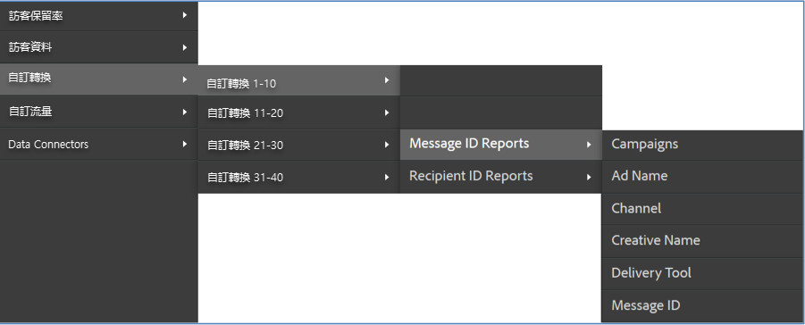
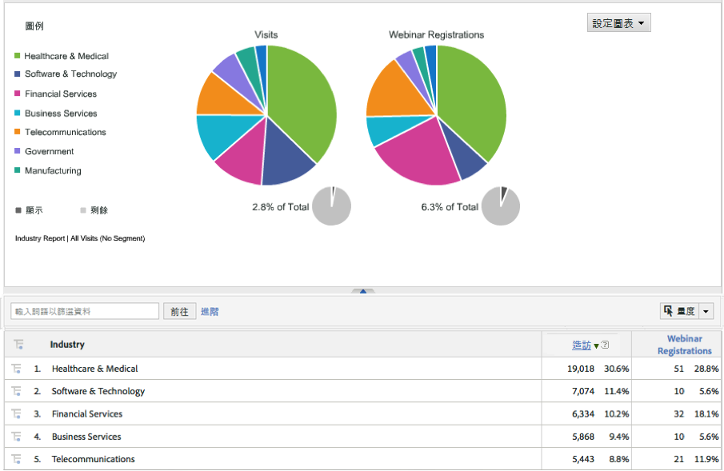

# 部署整合{#deploying-the-integration}

部署這項整合是一項簡單的程序，包括完成 Adobe 整合精靈並驗證整合。

## 完成 Adobe 整合精靈{#completing-the-adobe-integration-wizard}

在 Data Connectors 介面中完成整合精靈的步驟。

1. 導覽至 Adobe Experience Cloud 中的 Data Connectors (前身為 Genesis) 區域。
1. 啟動 Dynamic Signal 整合精靈。
1. 選擇所需的報表套裝，並替整合提供名稱。
1. 設定下列項目：

   | 項目 | 說明 |
   |---|---|
   | 電子郵件地址 | 主要連絡人的電子郵件地址。 |
   | 說明 | (選用) 此整合設定的說明。 |
   | 社群 ID | 您可以向 Dynamic Signal 代表取得此 ID。 |

1. 設定下列&#x200B;**[!UICONTROL 變數對應]**&#x200B;項目：

   | 項目 | 說明 |
   |---|---|
   | 追蹤代碼 | 從報表套裝中選取可用的 eVar 變數。 |

1. 檢閱將針對這項整合建立的分類。
1. 核取該方塊以建立 Dynamic Signal 整合控制面板 (選用，但強烈建議使用)。
1. 檢閱所有設定項目，然後按一下&#x200B;**[!UICONTROL 「立即啟用」]**。
1. **重要**：在您完成精靈後，必須通知 Dynamic Signal 代表，以便他們啟用 VoiceStorm 平台上的整合作業。

## 驗證整合{#verifying-the-integration}

在 Adobe Experience Cloud 中檢視 Dynamic Signal VoiceStorm 整合設定的步驟

1. 在整合活動記錄中檢視您的 Dynamic Signal 整合設定。
   1. 在 Adobe Experience Cloud 中，導覽至&#x200B;**[!UICONTROL 「支援]** > **[!UICONTROL 整合活動記錄」]**。

      

   1. 尋找&#x200B;**[!UICONTROL 「成功匯入分類資料」]**&#x200B;這類項目。這些項目應會在成功部署後 24 小時內顯示。
1. 使用透過 Adobe 整合精靈自動為您建立的「控制面板」(步驟 7)，在 Adobe Analytics 中檢閱 Dynamic Signal 報表。或者，您也可以導覽至 Adobe Analytics 功能表結構內的 Dynamic Signal 報表；請參閱下列螢幕擷取畫面。

   **注意**：這項資料應會在成功部署後 24 到 48 小時內顯示。

   

   
