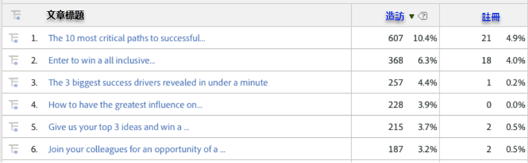
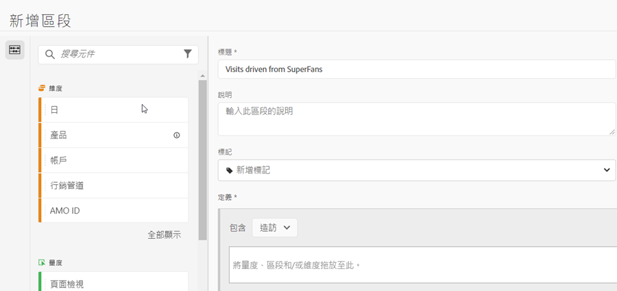
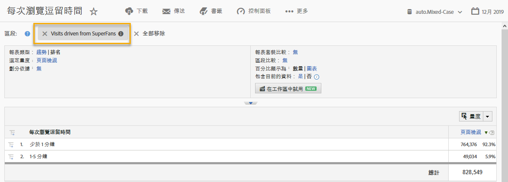

# 使用整合{#using-the-integration}

部署後，您就可以開始使用此整合提供的其他功能。

**注意**:您可能需要24-48小時，才能開始在Adobe Analytics報告中看到部分動態信號資料。

以下動作會從Adobe Analytics中的這項整合中增加價值。

## 依動態訊號維度檢視流量和轉換量度{#viewing-traffic-and-conversion-metrics-by-dynamic-signal-dimensions}

Adobe Analytics中報表的範例。

此整合提供新維度，可做為Adobe Analytics報表使用。 以下報表是分析瀏覽和轉換量度（註冊）的範例，這些量度已依文章標題細分。

## 動態信號維數的分割{#segmenting-by-dynamic-signal-dimensions}

基於動態信號尺寸的區段範例。

此項整合的主要功能是能夠根據整合的報表維度建立Adobe Analytics區段。 例如，您可以建立區段，僅包含源自特定VoiceStorm社群的瀏覽。 您可將此稱為「來自SuperFans的瀏覽」。 此區段定義可能如下所示。

## 整合的報表維度{#integrated-reporting-dimensions}

列出此整合中包含的動態信號報告維度。

| 維度 | 說明 |
|---|---|
| 渠道類型 | 使用者分享社群貼文的社交網路（或部落格平台）。 使用者可以在多個管道上分享貼文。 點按次數和其他活動會依每個通道分段。 此欄位會顯示Facebook、Twitter等。 以便您查看哪個渠道類型在驅動活動。 |
| 文章ID | 文章ID可唯一識別動態訊號社群中的每個內容。 |
| 來源類型 | 此欄位指出貼文是由「會員」還是「品牌」建立。 請注意，無論是哪種情況，內容都可以在應用程式中手動建立或從外部饋送匯入。 |
| 使用者名稱 | 在其社交網路上分享貼文，產生您網站點進次數的使用者。 |
| 來源ID | 來源ID可唯一識別共用貼文的建立者（或作者）。 這通常是特定成員或外部饋送。 |
| 使用者 ID | 用戶ID可唯一地識別動態信號社群中的用戶（即成員）。 在此情況下，使用者是在其社交網路上分享貼文的分享者。 |
| 來源名稱 | 來源是共用貼文的建立者（或作者）。 在大多數情況下，此為社群成員或外部動態消息。 |
| 文章標題 | 產生點按回您網站之共用貼文的標題。 |
| 社群名稱 | 動態訊號社群的名稱。 |

